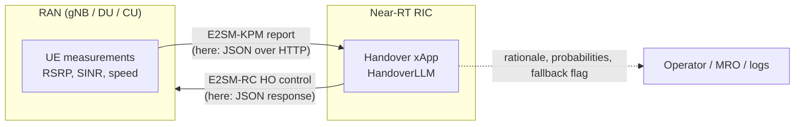
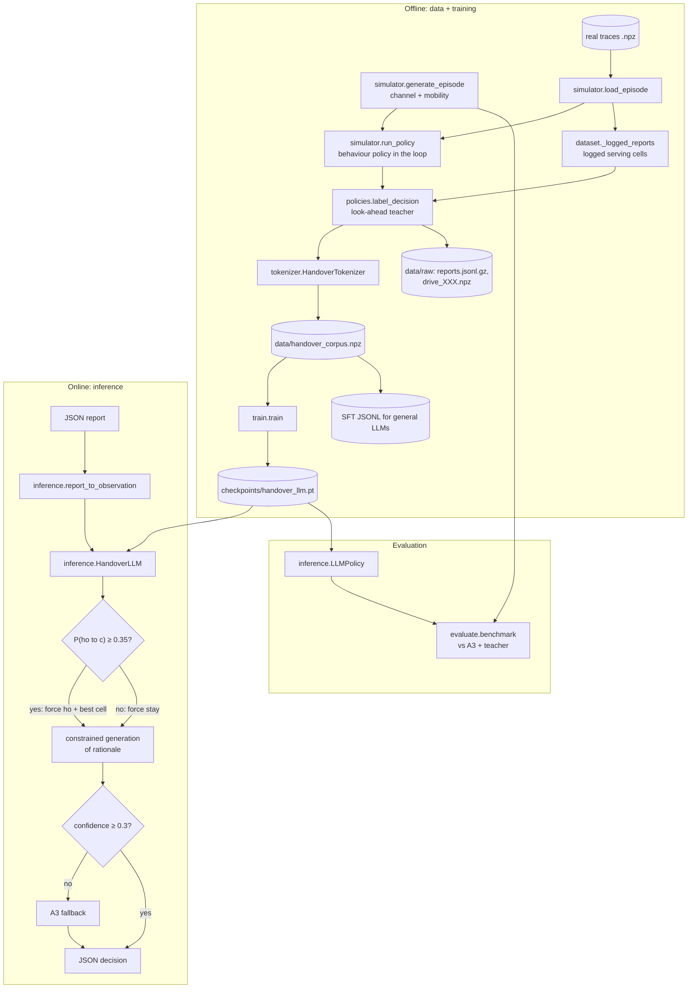
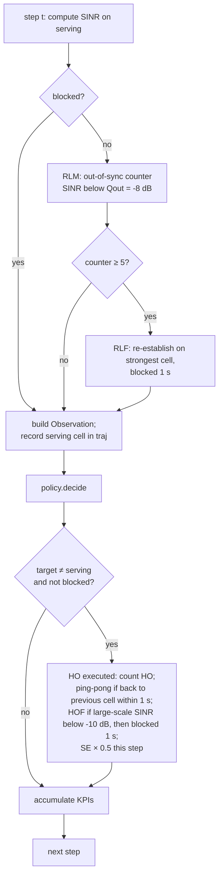
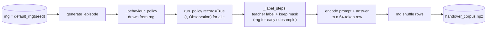
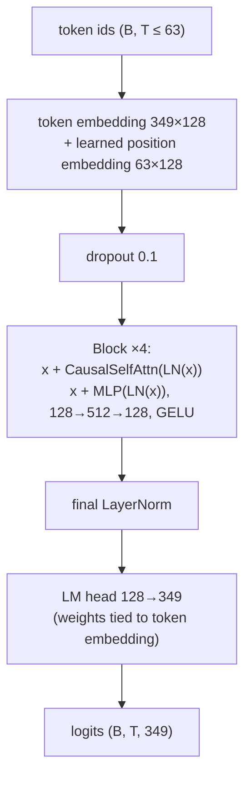
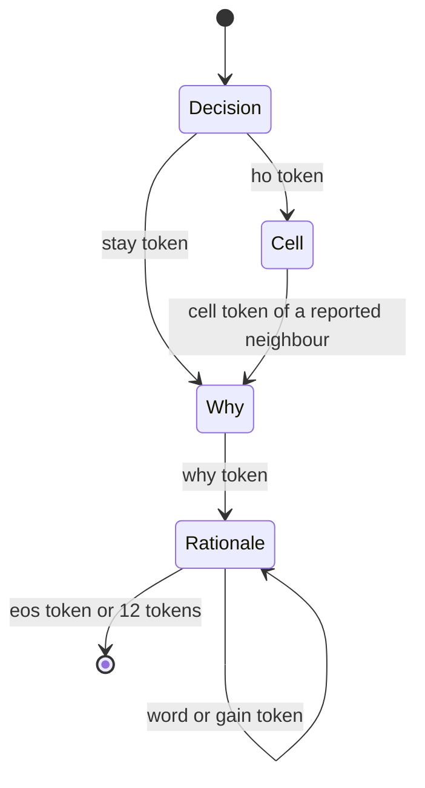
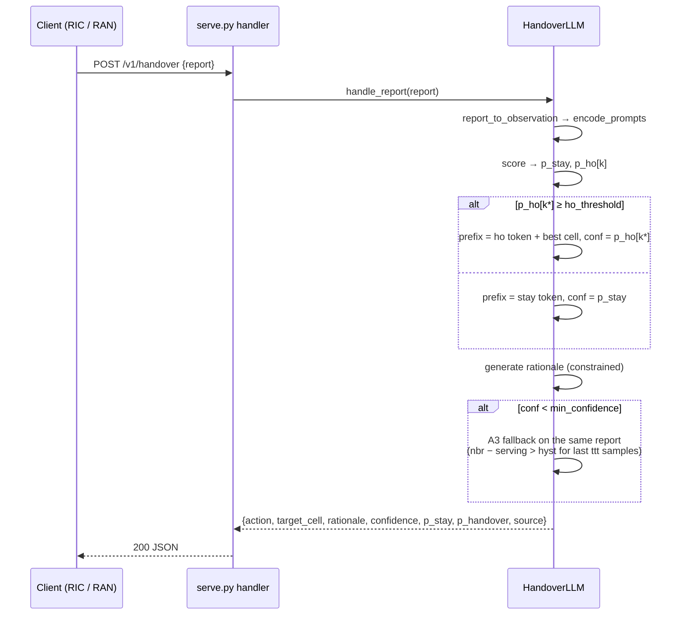

# HandoverLLM — Design, Implementation and Development Record

This document explains the `AI-RAN-LLM` repository end to end: what it does, why it
is built the way it is, which alternatives were rejected and why, every algorithm and
assumption, every file, function, interface and artifact, and the full history of how
it was developed (including the experiments that failed).

It is written so that a human engineer **or another AI model** can pick the project up
cold, understand every design choice, reproduce every number, and change it safely.

> **Status.** Research prototype. Everything is trained and evaluated in a simulator;
> nothing has been validated on a live network. See [§20 Limitations](#20-limitations-known-issues-and-risks).

---

## Table of contents

1. [How to read this document](#1-how-to-read-this-document)
2. [Problem statement and background](#2-problem-statement-and-background)
3. [Goals and non-goals](#3-goals-and-non-goals)
4. [Solution overview (big picture)](#4-solution-overview-big-picture)
5. [Key design decisions — why, and why not](#5-key-design-decisions--why-and-why-not)
6. [Assumptions](#6-assumptions)
7. [Radio and mobility simulator](#7-radio-and-mobility-simulator)
8. [Measurement reports (observations)](#8-measurement-reports-observations)
9. [Policies: A3 baseline and the look-ahead teacher](#9-policies-a3-baseline-and-the-look-ahead-teacher)
10. [Closed-loop evaluation and KPIs](#10-closed-loop-evaluation-and-kpis)
11. [Training-data pipeline](#11-training-data-pipeline)
12. [Tokenizer and the "language" of handover](#12-tokenizer-and-the-language-of-handover)
13. [Model architecture](#13-model-architecture)
14. [Training](#14-training)
15. [Inference, decision rule and safety](#15-inference-decision-rule-and-safety)
16. [Interfaces (CLI, HTTP, Python, files)](#16-interfaces-cli-http-python-files)
17. [File structure and function reference](#17-file-structure-and-function-reference)
18. [Artifacts](#18-artifacts)
19. [Results](#19-results)
20. [Limitations, known issues and risks](#20-limitations-known-issues-and-risks)
21. [Development history (from the build conversation)](#21-development-history-from-the-build-conversation)
22. [Extension guide and invariants (for humans and AI agents)](#22-extension-guide-and-invariants-for-humans-and-ai-agents)
23. [Testing](#23-testing)
24. [Glossary](#24-glossary)
25. [References](#25-references)

---

## 1. How to read this document

| If you want to… | Read |
|---|---|
| Understand the idea in 5 minutes | §2, §4, §19 |
| Know *why* something is done a certain way | §5 (decision records), §21 (history) |
| Understand an algorithm precisely | §7–§15 (formulas and pseudo-code) |
| Call the system | §16 (CLI, HTTP API, Python API, file formats) |
| Find a function | §17 |
| Change the code without breaking reproducibility | §22 |
| Know what not to trust | §20 |

Conventions used below:

* `U` = number of UEs, `T` = number of time steps, `C` = number of cells,
  `K` = reported neighbours (4), `H` = RSRP history length per cell (5).
* One simulation step is **100 ms** (`dt_s = 0.1`).
* Code references are written as `module.function` (e.g. `simulator.run_policy`),
  all under `ai_ran_llm/`.

---

## 2. Problem statement and background

### 2.1 Mobility handover in cellular networks

A UE (phone, car modem) is served by one cell. As it moves, the signal of the
serving cell weakens and a neighbour's strengthens. The network must **hand over**
(HO) the UE to a better cell at the right moment:

* **Too late** → the serving link degrades below what the control channel can decode.
  The UE declares a **radio link failure (RLF)** (after timer **T310** expires) or the
  handover command itself cannot be delivered (**handover failure, HOF**). Either way,
  the UE loses service until it re-establishes (≈ hundreds of ms to seconds).
* **Too early / too often** → the UE is moved to a cell that is not yet (or only
  momentarily) better and quickly returns: a **ping-pong**. Each HO costs signalling
  and a short user-plane interruption.

### 2.2 How it is done today: event A3

In 3GPP NR/LTE the UE measures **RSRP** (reference-signal received power, dBm) of the
serving and neighbour cells, smooths it with a **layer-3 (L3) filter**, and reports when
**event A3** holds:

```
Mn + Ofn + Ocn − Hys  >  Mp + Ofp + Ocp + Off        for TimeToTrigger (TTT)
```

i.e. a neighbour is better than the serving cell by an offset/hysteresis for a
time-to-trigger. The network then commands the HO. A3 is **reactive** and has a single
static trade-off: small hysteresis/TTT ⇒ ping-pongs, large ⇒ late HOs, RLFs, HOFs.
Mobility Robustness Optimisation (MRO) tunes these parameters slowly per cell pair,
but cannot react to an individual UE's trajectory.

### 2.3 AI-RAN and the near-RT RIC

**AI-RAN** means running AI inside the radio access network. In the O-RAN
architecture, the **near-real-time RAN Intelligent Controller (near-RT RIC)** hosts
**xApps** that receive RAN telemetry over the **E2** interface (e.g. E2SM-KPM
measurements) and send control actions back (e.g. E2SM-RC handover control) within a
**10 ms – 1 s** control loop. A handover xApp is the natural home for this project.

### 2.4 The request

The project started from a single request:

> *"Can you create a LLM for AI-RAN which helps in mobility handover"*

The repository was empty. Everything here was designed and built from scratch in one
working session (see §21).

---

## 3. Goals and non-goals

**Goals**

1. A language model that reads a UE measurement report and outputs
   **(a)** stay / hand over, **(b)** the target cell, **(c)** a short human-readable
   rationale.
2. **Proactive**: learn to anticipate the next second instead of reacting like A3.
3. **Safe by construction**: never command a HO to a cell the UE did not report; have a
   deterministic fallback.
4. **Measurable**: a closed-loop benchmark against A3 on identical radio conditions with
   standard mobility KPIs.
5. **Deployable shape**: CPU inference in the near-RT RIC latency budget, an HTTP
   endpoint whose request format mirrors a measurement report.
6. **Reproducible**: every dataset, model and number regenerable from seeds.
7. **Bridge to real data and to general LLMs**: a documented trace format and a JSONL
   export for fine-tuning open LLMs.

**Non-goals (explicitly out of scope)**

* A production E2 / O-RAN xApp SDK integration (only an HTTP stand-in).
* Beam management, carrier aggregation, conditional handover (CHO), dual connectivity,
  load balancing, slicing.
* A 3GPP-conformant system-level simulator (the simulator is a deliberately simple
  macro model, §7).
* Claims about field performance.

---

## 4. Solution overview (big picture)

### 4.1 One-paragraph summary

A **vectorised simulator** generates UE drives through a 19-cell network. A
**non-causal teacher** that can see 1 s into the future labels every measurement report
with the best action. Reports and labels are serialised into a **349-token domain
language** and a **0.85 M-parameter GPT** is trained to generate the answer
(`<ho> C4 <why> serving falling neighbor rising gain G+4 <eos>`). At inference,
**grammar-constrained decoding** restricts the output to reported cells, a
**probability threshold** (0.35) turns the model's calibrated-but-cautious
probabilities into decisions, and a **conservative A3 fallback** handles low
confidence. A **closed-loop benchmark** replays unseen drives with each policy and
measures HO rate, ping-pong, RLF, HOF, SINR, spectral efficiency and outage.

### 4.2 System context



In this repository the E2 leg is replaced by `POST /v1/handover` (§16.2).

### 4.3 Component view



### 4.4 The learning problem in one picture

```
 time ─────────────────────────────────────────────────────────────▶
          report window (what the model sees)          teacher look-ahead
   t-8   t-6   t-4   t-2    t        t+1 ........................ t+10
   │     │     │     │      │        │◀──── mean large-scale RSRP ───▶│
   R     R     R     R      R        best reported neighbour vs serving
   5 L3-filtered RSRP samples per cell,       gain > 2 dB  ⇒  label <ho> C*
   200 ms apart (+ SINR, speed)               else         ⇒  label <stay>
```

The model must infer from the past 800 ms what the teacher knows about the next
1000 ms. Part of that future (new shadowing) is unpredictable; this bounds achievable
accuracy (§19.3).

---

## 5. Key design decisions — why, and why not

Each entry: **decision**, **why**, **alternatives rejected and why not**.

### D1. A small domain-specific GPT trained from scratch

* **Why.** Near-RT RIC loops need ≤ tens of ms per decision for many UEs at ~10 Hz;
  a 0.85 M-parameter model scores one report in ~1.7 ms on CPU (§15.6). It runs on-prem
  (operator data stays local), deterministically, at negligible cost per decision, and
  its vocabulary is exactly the radio quantities involved.
* **Why an LLM at all (vs. a classifier).** The generative formulation gives, in one
  model: the decision, the target *chosen among variable reported cells*, and a
  rationale; it uses the same serialised interface a general-purpose LLM would use
  (hence the JSONL export), and it is extensible by adding tokens (new measurements)
  without new heads.
* **Why not** fine-tune a general LLM (Llama/Qwen/etc.) as the primary model: 100–1000×
  more parameters for a problem with ~40 numeric inputs, latency too high for the
  control loop, and nothing in its pretraining knows this simulator's radio behaviour.
  The path remains open via `export-jsonl` (§16.4).
* **Honest note.** A gradient-boosted tree or MLP on hand-made features would likely
  reach similar decision quality (a small MLP reached AUC ≈ 0.83 in §21.8). The LLM
  form is chosen for the interface, rationale and extensibility, not because the
  decision itself requires a transformer.

### D2. Simulation first, real data later

* **Why.** No real traces were available; a simulator gives unlimited labelled data,
  the ability to compute a non-causal teacher, and a closed-loop benchmark on
  *identical* channels for all policies.
* **Why not** public datasets: none provides per-UE RSRP of all cells at 100 ms
  together with a controllable serving cell for closed-loop evaluation.
* **Mitigation.** A documented trace format and `gen-data --from-drives` (§11.5)
  so real logs can replace the simulator for training.

### D3. Imitation of a look-ahead teacher (not reinforcement learning)

* **Why.** In a replayable drive the future is known, so the "right" action can be
  computed directly: the best reported neighbour over the next second. Supervised
  imitation is stable, fast and simple.
* **Why not** RL: reward design (trading RLF vs ping-pong vs throughput), sample
  efficiency, and stability would dominate the project; RL is a natural *next* step
  once the supervised policy exists (it can initialise an RL policy).
* **Distribution shift.** A pure imitation learner only sees states the teacher visits.
  The corpus therefore mixes behaviour policies (teacher, delayed teacher, randomised
  A3) so the model sees late, early and missed HO states — the idea behind DAgger
  (Ross et al., 2011), though without iterative re-collection (§11.2).

### D4. Teacher = best reported neighbour over 1 s, 2 dB margin

* **Why.** Chosen by closed-loop sweep (§21.3): margin 2 dB / horizon 10 steps gave
  low ping-pong (≈ 5 %) with near-zero RLF/HOF. Restricting candidates to the *reported*
  neighbours keeps labels achievable from the report.
* **Why not** horizon 20: fewer ping-pongs but more RLF (it waits too long);
  margin 1 dB: ~10 % ping-pong.

### D5. Tokenisation: quantised numeric tokens, fixed layout

* **Why.** Each numeric value becomes one token at 1 dB (RSRP, SINR, gain, delta) or
  10 km/h (speed) resolution — small vocabulary, every token has radio meaning, the
  prompt has a **fixed 41-token layout** (no padding inside prompts, positions carry
  meaning, batched scoring is trivial).
* **Neighbour RSRP as deltas to serving (D tokens).** The HO decision hinges on
  *neighbour − serving*. With absolute tokens the model has to learn subtraction
  between two learned embeddings. Deltas expose the key quantity directly (§21.5).
* **Numeric embedding initialisation.** Numeric tokens get a sinusoidal encoding of
  their value added to the random init, so `R-90` starts near `R-91` (ordinal prior).
* **Why not** float inputs through a linear projection: loses the "everything is a
  token" LLM interface and the JSONL-compatible text form; possible future hybrid.
* **Why not** BPE/text tokens (e.g. "-92.4 dBm"): 3–6 tokens per number, longer
  sequences, digit-level arithmetic burden.

### D6. Loss on answer tokens (weight 1) + report tokens (weight 0.1)

* **Why.** The answer is what matters; a small weight on report tokens adds a
  telemetry-forecasting auxiliary objective (predict how RSRP evolves within the
  history), which is cheap regularisation.

### D7. Grammar-constrained decoding

* **Why.** A free LLM can emit an invalid token or a cell that was never measured.
  The decoder masks logits so that only a valid answer can be produced:
  `<stay>|<ho> Ck` with `Ck` ∈ reported neighbours, then rationale vocabulary.
  This makes "HO to an unreported cell" impossible *by construction*.

### D8. Threshold decision rule `P(ho→c) ≥ 0.35` (not argmax)

* **Why.** HO labels are rare (12.5 %) and partly unpredictable, so the model's HO
  probabilities are conservative. Argmax (≡ threshold 0.5) hands over too late.
  A closed-loop sweep (§21.7) showed 0.35 dominates A3 (1 dB) on every KPI except a
  small RLF difference. The threshold is the main operator knob (`--ho-threshold`).
* **Why not** retrain with class weights: equivalent in effect, less transparent,
  and needs retraining for every operating point.

### D9. A3 fallback below a confidence floor

* **Why.** When the chosen action's probability is below `min_confidence` (0.3), a
  deterministic, explainable 3GPP-style rule decides instead. Operators can raise the
  floor to route more decisions to A3.

### D10. Evaluate in closed loop, not only per-sample accuracy

* **Why.** Per-sample accuracy is misleading here: always-STAY scores ~88–90 %.
  Decisions change future states (serving cell), so only closed-loop KPIs on identical
  drives reflect quality (§10).

### D11. HOF judged on large-scale SINR; Qout −8 dB, HOF −10 dB

* **Why.** With instantaneous (fast-faded) SINR, ~40 % of A3 handovers "failed" —
  unrealistic. The HO command is delivered over several TTIs, so large-scale SINR is
  the right quantity; thresholds were calibrated so A3 shows realistic
  failure/ping-pong trade-offs (§21.2).

### D12. Label smoothing kept as an option, default off

* **Why.** Tried "HO within W steps" and "confirm over 2 s" to make labels more
  learnable. Neither increased learnability and windowing made the teacher itself
  worse; the retrained model was slightly worse (§21.8). Kept as documented options
  for future work with richer inputs.

### D13. Standard library HTTP server

* **Why.** Zero dependencies, easy to test, shows the interface. **Why not** FastAPI /
  gRPC / E2 SDK: out of scope for a prototype; the handler is 30 lines to port.

### D14. Commit model + corpus + a raw sample

* **Why.** Users asked to commit them; they are small (3.4 MB, 25 MB, 5 MB) and make
  the repo usable immediately. Everything is also regenerable bit-for-bit from seeds.

---

## 6. Assumptions

| Area | Assumption | Value / where |
|---|---|---|
| Deployment | Single-layer macro grid, omni cells, one carrier | 19 sites, ISD 500 m (`SimConfig.rings=2, isd_m=500`) |
| Propagation | 3GPP macro path loss | `128.1 + 37.6·log10(d_km)`, d ≥ 10 m |
| Shadowing | Log-normal, spatially correlated (Gudmundson), independent per cell | σ = 6 dB, decorrelation 50 m |
| Fast fading | i.i.d. Gaussian in dB per step (averaged over RBs) | σ = 2 dB |
| Measurement | UE error + L3 filter | σ = 1.5 dB, α = 0.5 (≈ filterCoefficient k=4 at 100 ms) |
| Tx / noise | Per-RE RS power, per-RE noise incl. NF | 15 dBm, −125 dBm |
| Interference | All other cells, scaled by load | load = 0.7 |
| Mobility | Constant speed per UE, Gauss-Markov heading, soft boundary | 3–120 km/h, heading noise 0.05 rad/step |
| Time | Decision and measurement every step | 100 ms |
| RLF | T310-like: N consecutive out-of-sync steps | Qout = −8 dB, 5 steps (500 ms) |
| HOF | Large-scale SINR at HO command below threshold | −10 dB |
| Recovery | Outage after RLF/HOF (re-establishment) | 1 s |
| Ping-pong | HO back to previous cell within | 1 s (10 steps) |
| HO cost | User-plane interruption | 50 ms (half a step of SE) |
| Report | Top-K neighbours by current filtered RSRP, H samples | K = 4, H = 5, stride 200 ms |
| Teacher | Best reported neighbour over next 1 s of large-scale RSRP | margin 2 dB, horizon 10 steps |
| Cells | Max cells per network | 64 (tokenizer limit) |
| Value ranges | Token clipping | RSRP [−140, −40], SINR [−20, 40], delta [−30, 30], gain [−15, 15] dB; speed bins 0–120+ km/h |

---

## 7. Radio and mobility simulator

File: `ai_ran_llm/simulator.py`. Key idea: **the channel does not depend on which cell
serves the UE**, so an episode is generated once (`generate_episode`), then any number
of policies can be replayed on it (`run_policy`). This guarantees identical conditions
for all compared policies.

### 7.1 Network layout — `hex_sites(rings, isd)`

Axial hex coordinates `(q, r)` with `max(|q|, |r|, |q+r|) ≤ rings`, mapped to
`x = isd·(q + r/2)`, `y = isd·r·√3/2`, sorted by (y, x). `rings=2` ⇒ 19 cells.
Cell index = row in this array (see `data/raw/cells.csv`).

```
        C16  C17  C18
     C12  C13  C14  C15
  C7   C8   C9   C10  C11        (index layout, ISD 500 m, C9 at origin)
     C3   C4   C5   C6
        C0   C1   C2
```

### 7.2 Mobility — Gauss-Markov heading

* Start uniformly in a disc of radius `R = 0.85·rings·isd` (850 m).
* Speed `v ~ U(3, 120) km/h`, constant per UE; step length `v/3.6·dt`.
* Each step: `heading += N(0, 0.05)`; if outside `R`, heading is reset towards the
  centre `+ N(0, 0.5)` (soft reflecting boundary).

### 7.3 Channel

For UE `u`, time `t`, cell `c` with distance `d` (clamped ≥ 10 m):

```
PL(d)              = 128.1 + 37.6·log10(d_km)                                 [dB]
S[t+1]             = a·S[t] + sqrt(1−a²)·N(0, σ_sh²),  a = exp(−Δd / d_corr)  (Gudmundson AR(1))
rsrp_true[u,t,c]   = P_tx − PL − S                         large-scale RSRP (teacher's view)
rsrp_inst[u,t,c]   = rsrp_true + N(0, σ_ff²)               with fast fading (drives SINR)
raw                = rsrp_inst + N(0, σ_meas²)             UE measurement error
rsrp_meas[t]       = (1−α)·rsrp_meas[t−1] + α·raw[t]       L3 filter (what reports contain)
```

### 7.4 SINR — `Episode.sinr_db(t, serving, large_scale=False)`

```
S = 10^(rsrp[serving]/10),   I = load · Σ_{c≠serving} 10^(rsrp[c]/10),   N = 10^(−125/10)
SINR_dB = 10·log10( S / (I + N) )
```

`large_scale=True` uses `rsrp_true` (used for HOF), otherwise `rsrp_inst` (used for RLM,
throughput, reports).

### 7.5 Episode containers

`Episode` holds `sites, pos, speed_kmh, rsrp_true, rsrp_inst, rsrp_meas, sim` and,
for loaded traces, `logged_serving, logged_sinr_db`. `save_episode` writes float32
`.npz`; `load_episode` reads the same layout or a real trace (NaN → −160 dBm =
"unmeasured", 64-cell limit, validation of `serving`) — see §16.5.

---

## 8. Measurement reports (observations)

`simulator.build_observation(ep, t, serving, obs_cfg)` produces an `Observation`
(batched over UEs) — the exact information an xApp would receive:

| Field | Shape | Content |
|---|---|---|
| `serving` | (U,) | serving cell index |
| `serving_hist` | (U, H) | serving L3-filtered RSRP at `t−8, t−6, t−4, t−2, t` (oldest first; indices clipped at 0) |
| `nbr_ids` | (U, K) | K strongest *other* cells by current filtered RSRP, strongest first |
| `nbr_hist` | (U, K, H) | their RSRP histories at the same instants |
| `sinr_db` | (U,) | current serving SINR (instantaneous) |
| `speed_kmh` | (U,) | UE speed |

`history_steps(t, obs)` computes `t − stride·[H−1 … 0]`.

The HTTP request format (§16.2) is the same information in JSON;
`inference.report_to_observation` converts it (sorting neighbours by latest RSRP,
left-padding short histories, padding missing neighbours with a −140 dBm copy).

---

## 9. Policies: A3 baseline and the look-ahead teacher

File: `ai_ran_llm/policies.py`. All policies implement a duck-typed protocol:

```python
class Policy:
    def reset(self, ep, obs_cfg): ...          # optional, called at episode start
    def decide(self, ep, t, obs) -> np.ndarray # (U,) target cell or -1 (stay)
    def on_handover(self, mask): ...           # optional, called with executed-HO mask
```

### 9.1 A3 — `A3Policy(hyst_db, ttt_steps)`

Per UE and cell, a counter increments while `meas[c] > meas[serving] + hyst` and resets
otherwise. When any counter reaches `ttt_steps`, hand over to the strongest such cell;
counters of UEs that handed over are reset. Uses **all** cells (not only the top-K),
which is favourable to A3. Benchmarked settings: (1 dB, 2 steps), (2 dB, 3), (3 dB, 5).

### 9.2 Teacher — `oracle_decision(ep, t, obs, obs_cfg)`

```
future[c] = mean(rsrp_true[u, t+1 : t+1+horizon, c])          # next 1 s, large scale
k*        = argmax over reported neighbours of future
gain      = future[k*] − future[serving]
target    = k* if gain > margin (2 dB) else −1
```

Returns `(target, gain)`. **Non-causal** — it uses the future. That is intentional: it
defines the behaviour the model must learn to anticipate. Also used as the upper-bound
row in benchmarks ("Oracle (non-causal)").

### 9.3 Smoothed labels — `label_decision` (options, default off)

* `label_window = W`: if the teacher would hand over at any of the next W steps
  (serving fixed), label the earliest such HO now.
* `label_confirm_horizon = L`: keep a HO label only if the target beats serving on
  average over the next L steps.
* `W = L = 0` ⇒ identical to `oracle_decision` (tested). See §21.8 for why off.

### 9.4 `OraclePolicy(obs_cfg, exec_prob=1.0, seed, smoothed=False)`

Runs the teacher in the loop. With `exec_prob < 1` each teacher HO is executed only
with that probability per step → **delayed HOs** → off-optimal states for the corpus.

---

## 10. Closed-loop evaluation and KPIs

### 10.1 `run_policy(ep, policy, obs_cfg, record=False)` — per-step algorithm



Serving cell at t=0 = strongest measured cell. `traj[:, t]` records the serving cell
**when the step-t report was taken** (before the step-t decision) — this convention
makes exported drives rebuild the same reports (§11.5).

### 10.2 KPI definitions — `Metrics.summary()`

| KPI | Definition |
|---|---|
| `ho_per_ue_min` | executed HOs per UE-minute |
| `ping_pong_pct` | % of HOs returning to the previous cell within 1 s of the last HO |
| `rlf_per_ue_min` | RLFs per UE-minute |
| `hof_per_ue_min` | HO failures per UE-minute |
| `mean_sinr_db` | mean SINR over UE-steps; blocked steps count as Qout − 10 = −18 dB |
| `mean_se_bps_hz` | mean `log2(1+SINR)`; 0 while blocked; × (1 − 0.05/0.1) on HO steps |
| `outage_pct` | % of UE-steps blocked or with SINR < Qout |

### 10.3 Benchmark — `evaluate.benchmark`

Generates `n_episodes` drives from a fixed seed (default 10 000, disjoint from training
seed 0) and replays every policy on each identical drive; default 5 × 64 UEs × 60 s =
5.3 UE-hours.

---

## 11. Training-data pipeline

File: `ai_ran_llm/dataset.py`.

### 11.1 Flow



### 11.2 Behaviour-policy mix — `_behaviour_policy(rng, obs_cfg)`

| Probability | Policy | Purpose |
|---|---|---|
| 35 % | teacher (`OraclePolicy`) | on-policy states |
| 25 % | delayed teacher, `exec_prob ~ U(0.1, 0.5)` | late-HO states |
| 40 % | A3, `hyst ~ U(0, 5) dB`, `ttt ~ {1..7}` | early/late/ping-pong states of classical control |

Labels are **always** from the teacher, whatever policy drove the serving cell.

### 11.3 Sample selection — `_label_steps`

For each labelled step (`t ≥ stride·(H−1)` so the history is full, and
`t + lookahead < T` so the teacher's window is complete):

* keep if teacher says HO, **or** best neighbour is within 6 dB of serving
  (a "hard" sample), **or** with probability 0.1 otherwise ("easy" STAY subsample).

Easy STAYs are uninformative; subsampling them keeps the corpus focused without
distorting borderline cases.

### 11.4 Reproducibility

`generate_dataset` and `export_raw` both consume `iter_labelled_drives` with the **same
random stream**. Consequences (all verified):

* `gen-data` with seed 0 regenerates `data/handover_corpus.npz` **bit-for-bit**.
* `export-raw` with seed 0 exports exactly drive 0 of the corpus; its `in_corpus` flags
  match that drive's 8 641 samples.

### 11.5 Drives from files (real traces) — `gen-data --from-drives`

`iter_labelled_drives(..., drives=[paths], serving="logged"|"replay")`:

* `logged` (default): reports are built along the file's `serving` array
  (`_logged_reports`), optionally with logged `sinr_db` — the states the real network
  visited. No policy in the loop.
* `replay`: runs the behaviour-policy mix on the file's RSRP (needs no `serving`).

Verified: rebuilding from `data/raw/drive_000.npz` (logged) reproduces all 569 HO
labels and all 7 099 non-trivial samples of drive 0 bit-for-bit; only the random 10 %
easy-STAY subsample differs.

### 11.6 Corpus statistics (shipped)

60 drives × 32 UEs × 60 s, seed 0 → **527 512 samples**, **65 798 HO labels (12.5 %)**,
shape (527 512, 64) int64, `prompt_len = 41`.

---

## 12. Tokenizer and the "language" of handover

File: `ai_ran_llm/tokenizer.py`, class `HandoverTokenizer`.

### 12.1 Vocabulary (349 tokens, fixed order)

| Id range | Family | Tokens | Resolution |
|---|---|---|---|
| 0–10 | specials | `<pad> <bos> <eos> <spd> <sinr> <srv> <nbr> <ans> <ho> <stay> <why>` | — |
| 11–17 | rationale words | `serving neighbor rising falling stable gain low_sinr` | — |
| 18–81 | cells | `C0 … C63` | index |
| 82–182 | serving RSRP | `R-140 … R-40` | 1 dB |
| 183–243 | SINR | `Q-20 … Q40` | 1 dB |
| 244–256 | speed | `V0 … V12` | 10 km/h bins (V12 = 120+) |
| 257–287 | predicted gain | `G-15 … G+15` | 1 dB |
| 288–348 | neighbour − serving | `D-30 … D+30` | 1 dB |

Values outside a range are clipped. **The order is part of the checkpoint contract**
(embedding rows) — see §22.

### 12.2 Prompt layout (41 tokens, fixed positions)

| Pos | Token | Meaning |
|---|---|---|
| 0 | `<bos>` | |
| 1–2 | `<spd> V*` | speed bin |
| 3–4 | `<sinr> Q*` | serving SINR |
| 5–6 | `<srv> C*` | serving cell |
| 7–11 | `R* ×5` | serving RSRP history (oldest → newest) |
| 12–18 | `<nbr> C* D*×5` | neighbour 1 (strongest): id + (nbr − serving) history |
| 19–25 | same | neighbour 2 |
| 26–32 | same | neighbour 3 |
| 33–39 | same | neighbour 4 |
| 40 | `<ans>` | answer starts at position 41 |

`prompt_len = 7 + H + K·(2 + H) + 1`.

### 12.3 Answer grammar

```
answer    := decision "<why>" rationale "<eos>"
decision  := "<stay>" | "<ho>" CELL          ; CELL ∈ reported neighbours
rationale := "serving" TREND [ "neighbor" TREND ] "gain" GAIN [ "low_sinr" ]
TREND     := "rising" | "falling" | "stable"
GAIN      := "G-15" … "G+15"
```

Label construction (`encode_answer`):

* `TREND` of a cell = last − first sample of its RSRP history: `> +1.5 dB` rising,
  `< −1.5 dB` falling, else stable (observable from the report).
* `neighbor TREND` only for HO (the target's trend).
* `GAIN` = teacher's gain of the best reported neighbour (future quantity — for STAY
  it may be positive but ≤ margin, or negative).
* `low_sinr` if serving SINR < 0 dB.

`explain()` renders tokens into JSON + a sentence, e.g.
*"Hand over to cell 4: serving cell falling, neighbor cell rising, predicted RSRP gain
+4 dB over the next second, serving SINR is low."*

### 12.4 Example (from the shipped corpus)

```
<bos> <spd> V8 <sinr> Q-3 <srv> C9 R-85 R-91 R-96 R-95 R-94
<nbr> C4 D-11 D-6 D+0 D-1 D-1  <nbr> C2 D-16 D-13 D-4 D-2 D-5
<nbr> C10 D-20 D-13 D-4 D-5 D-7  <nbr> C3 D-19 D-14 D-7 D-6 D-7
<ans> <stay> <why> serving falling gain G+1 low_sinr <eos>
```

### 12.5 Numeric features — `numeric_features(dim)`

For each numeric family, value `v` → `[sin(v·s·f_i), cos(v·s·f_i)]` with
`f_i = 100^(−i/(dim/2−1))`, `s = 1` (speed bins `s = 5`). Added ×0.05 to the random
embedding init in `train.train` (weights are tied with the output head).

---

## 13. Model architecture

File: `ai_ran_llm/model.py`, class `HandoverGPT` (nanoGPT-style decoder).



| Component | Setting |
|---|---|
| Layers / heads / width | 4 / 4 / 128 (head dim 32) |
| Attention | `F.scaled_dot_product_attention(is_causal=True)` |
| Norm | pre-LayerNorm |
| Context | 63 (64-token rows shifted by one) |
| Init | N(0, 0.02); residual projections N(0, 0.02/√(2·layers)) |
| Parameters | **846 080** = tok emb 44 672 + pos emb 8 064 + 4 × 198 272 + final LN 256 |
| Loss | per-token cross-entropy with per-token weights, `ignore_index = −100` |

---

## 14. Training

File: `ai_ran_llm/train.py`.

### 14.1 Objective — `make_batch`

```
x = tokens[:, :-1],  y = tokens[:, 1:],  y[pad] = −100
w = 0.1 for report positions (< prompt_len−1), 1.0 for answer positions, 0 for pad
loss = Σ w·CE / Σ w
```

### 14.2 Optimisation

| Item | Value |
|---|---|
| Optimiser | AdamW, lr 1e-3, betas (0.9, 0.95), weight decay 0.1 (applied to all params) |
| Schedule | linear warm-up `min(500, total/10)` steps, cosine decay to 5 % of lr |
| Batch | 256 sequences |
| Epochs | 2 (CLI default) → 3 916 steps |
| Grad clip | 1.0 |
| Validation | first 5 % of the (shuffled) corpus |
| Hardware used | 4 CPU cores, no GPU: ≈ 0.56 s/step, ≈ 37 min for 2 epochs |

### 14.3 Validation metrics — `evaluate_split`

Teacher-forced: `answer_loss`; `decision_acc` = argmax over {STAY, HO} at the answer
position **and** (for HO) argmax cell correct; `ho_recall` = fraction of HO labels
predicted correctly with argmax. (Argmax ≠ deployed threshold rule — closed-loop KPIs
are the real metric.)

### 14.4 Checkpoint format (`.pt`, `torch.save` dict)

| Key | Content |
|---|---|
| `model_cfg` | `ModelConfig` dict (vocab 349, block 63, 4/4/128, dropout) |
| `obs_cfg` | `ObsConfig` dict used by the tokenizer |
| `sim_cfg` | `SimConfig` dict |
| `state_dict` | weights |
| `val` | last validation metrics |
| `epoch` | epoch number (checkpoints written after the per-epoch-save change) |

A checkpoint is written **after every epoch** (added after a run was lost, §21.9).

---

## 15. Inference, decision rule and safety

File: `ai_ran_llm/inference.py`, class `HandoverLLM`.

### 15.1 Scoring — one forward pass — `score(prompts)`

Append `<ho>` to each prompt (length P+1) and run the model once:

```
p(stay), p(ho)  = softmax over {<stay>, <ho>} logits at position P−1
p(c_k | ho)     = softmax over the K *reported* neighbour cell tokens at position P
p_ho[k]         = p(ho) · p(c_k | ho)                      (U, K)
```

Probabilities are renormalised over the allowed tokens only (constrained scoring).

### 15.2 Decision rule — `decide_batch(obs, ho_threshold)`

```
k* = argmax_k p_ho[k]
HO to nbr_ids[k*]  if p_ho[k*] ≥ ho_threshold (default 0.35)   else STAY
```

### 15.3 Constrained generation — `generate(prompt, prefix=None)`



Greedy argmax within the allowed set at each state. `prefix` forces the decision
(e.g. `[<ho>, C4]`) so the model writes the rationale **for the decision actually
taken** by the threshold rule.

### 15.4 xApp entry point — `handle_report(report, ho_threshold=0.35, min_confidence=0.3, a3_hyst_db=3, a3_ttt=3)`



### 15.5 Safety properties

1. **No HO to an unreported cell** — scoring and generation are restricted to reported
   neighbour tokens.
2. **Well-formed output** — the grammar makes malformed answers impossible.
3. **Deterministic fallback** — A3 on the same report below the confidence floor,
   flagged `source: "a3_fallback"`.
4. **Transparency** — full probability vector and rationale returned.

### 15.6 Measured latency (4-core CPU, PyTorch 2.14, shipped checkpoint)

| Call | Latency |
|---|---|
| `score` for 1 report | ≈ 1.7 ms |
| `handle_report` (score + rationale generation) | ≈ 17 ms |
| `decide_batch` for 64 UEs | ≈ 29 ms |

Decision-only scoring fits comfortably in a near-RT RIC loop; rationale generation
could be made asynchronous or cached (KV cache not implemented).

---

## 16. Interfaces (CLI, HTTP, Python, files)

### 16.1 CLI — `python -m ai_ran_llm <command>` (or `ai-ran-llm` after `pip install -e .`)

| Command | Purpose | Main options (default) |
|---|---|---|
| `gen-data` | build a tokenised corpus | `--episodes 60 --ues 32 --steps 600 --seed 0 --out data/handover_corpus.npz`; `--from-drives NPZ…` build from drive files; `--serving logged\|replay` |
| `train` | train HandoverGPT | `--data … --out checkpoints/handover_llm.pt --epochs 2 --batch-size 256 --lr 1e-3 --layers 4 --heads 4 --embd 128` |
| `evaluate` | closed-loop benchmark vs A3 + teacher | `--ckpt … --episodes 5 --ues 64 --seed 10000 --ho-threshold 0.35 --json FILE` |
| `infer` | decide for one JSON report | `REPORT.json` or `-` (built-in example), `--ckpt`, `--ho-threshold 0.35` |
| `serve` | HTTP endpoint | `--host 0.0.0.0 --port 8080 --ho-threshold 0.35 --min-confidence 0.3` |
| `export-raw` | raw drives + readable reports | `--episodes 1 --ues 32 --steps 600 --seed 0 --out data/raw` |
| `export-jsonl` | chat-format SFT data | `--data … --out data/handover_sft.jsonl --limit N` |

### 16.2 HTTP API — `serve.py`

`GET /healthz` → `{"status": "ok"}`

`POST /v1/handover` — body: one report object or a list of them.

Request:

```json
{
  "ue_id": "ue-42",
  "serving_cell": 9,
  "speed_kmh": 90,
  "sinr_db": -1.0,
  "serving_rsrp": [-88, -90, -92, -95, -97],
  "neighbors": [
    {"cell_id": 4,  "rsrp": [-99, -96, -94, -92, -89]},
    {"cell_id": 10, "rsrp": [-97, -97, -98, -98, -99]}
  ]
}
```

| Field | Required | Notes |
|---|---|---|
| `serving_cell` | yes | cell index 0–63 |
| `serving_rsrp` | yes | L3-filtered dBm, oldest first, 200 ms apart; shorter lists are left-padded, longer truncated to 5 |
| `neighbors[]` | yes, ≥ 1 | `cell_id`, `rsrp` list as above; sorted by latest RSRP, top 4 used, missing padded at −140 dBm |
| `sinr_db` | no (0) | serving SINR |
| `speed_kmh` | no (30) | |
| `ue_id` | no | echoed back |

Response (200):

```json
{
  "action": "HANDOVER",
  "target_cell": 4,
  "rationale": "Hand over to cell 4: serving cell falling, neighbor cell rising, predicted RSRP gain +4 dB over the next second, serving SINR is low.",
  "tokens": "<ho> C4 <why> serving falling neighbor rising gain G+4 low_sinr <eos>",
  "confidence": 0.3882,
  "p_stay": 0.5638,
  "p_handover": {"4": 0.3882, "10": 0.0107, "3": 0.0013, "8": 0.0361},
  "source": "llm",
  "ue_id": "ue-42"
}
```

`source` is `"llm"` or `"a3_fallback"`. Errors: 400 `{"error": "bad report: …"}` for
missing keys / bad types; 404 for other paths. No authentication or TLS (prototype).

### 16.3 Python API (main entry points)

```python
from ai_ran_llm.config import SimConfig, ObsConfig, ModelConfig
from ai_ran_llm.simulator import generate_episode, load_episode, save_episode, run_policy, build_observation
from ai_ran_llm.policies import A3Policy, OraclePolicy, oracle_decision, label_decision
from ai_ran_llm.dataset import generate_dataset, export_raw, export_jsonl, iter_labelled_drives
from ai_ran_llm.tokenizer import HandoverTokenizer
from ai_ran_llm.model import HandoverGPT
from ai_ran_llm.train import train
from ai_ran_llm.inference import HandoverLLM, LLMPolicy, report_to_observation
from ai_ran_llm.evaluate import benchmark, default_policies, format_table

llm = HandoverLLM.load("checkpoints/handover_llm.pt")
llm.handle_report(report_dict)                      # one decision + rationale
ep = generate_episode(64, 600, np.random.default_rng(1))
metrics, traj = run_policy(ep, LLMPolicy(llm, 0.35), ObsConfig())
```

### 16.4 SFT JSONL (for general-purpose LLMs) — `export-jsonl`

One line per corpus row:

```json
{"messages": [
  {"role": "system", "content": "You are a near-RT RIC mobility xApp. ..."},
  {"role": "user", "content": "UE speed 110-119 km/h, serving SINR -10 dB.\nServing cell 9, L3-filtered RSRP history (dBm, oldest first): -85, -83, -83, -83, -88.\nNeighbour cell 13, RSRP relative to serving (dB): +1, +2, +2, +1, +6.\n..."},
  {"role": "assistant", "content": "Hand over to cell 13: serving cell falling, neighbor cell rising, predicted RSRP gain +8 dB over the next second, serving SINR is low."}
]}
```

### 16.5 File formats

**Corpus** `data/handover_corpus.npz`: `tokens` int64 (N, 64), `prompt_len` int64 (41).

**Drive** `drive_XXX.npz` (export) / real trace (input to `--from-drives`):

| Array | Shape | Req. for traces | Meaning |
|---|---|---|---|
| `rsrp_meas` | (U, T, C) float | **yes** | L3-filtered RSRP dBm at 100 ms; NaN = not measured |
| `serving` | (U, T) int | for `--serving logged` | serving cell at each report |
| `sinr_db` | (U, T) | no | serving SINR at each report |
| `rsrp_true` | (U, T, C) | no (→ `rsrp_meas`) | teacher's look-ahead signal |
| `rsrp_inst` | (U, T, C) | no (→ `rsrp_meas`) | SINR computation |
| `speed_kmh`, `pos`, `sites` | (U,), (U,T,2), (C,2) | no | |

**Reports** `reports.jsonl.gz`: one JSON per UE per labelled step = HTTP request format
+ `episode, ue_id, t, time_s, label{action, target_cell, gain_db, rationale}, in_corpus`.

**Manifest** `drives.json`: `seed, n_ue, n_steps, dt_s, sim_config, obs_config,
drives[{episode, file, behaviour_policy}]`. **Cells** `cells.csv`: `cell_id,x_m,y_m`.

---

## 17. File structure and function reference

```
AI-RAN-LLM/
├── README.md                     user guide, quick start, results
├── pyproject.toml                package metadata; deps numpy, torch; entry point ai-ran-llm
├── .gitignore                    ignores data/* and checkpoints/* except shipped artifacts
├── docs/
│   └── DESIGN.md                 this document
├── ai_ran_llm/
│   ├── __init__.py               exports configs, HandoverGPT, HandoverTokenizer; __version__
│   ├── __main__.py               python -m ai_ran_llm → cli.main()
│   ├── config.py                 SimConfig, ObsConfig, ModelConfig
│   ├── simulator.py              network, channel, mobility, reports, closed loop, KPIs, drive I/O
│   ├── policies.py               A3, teacher, smoothed labels, OraclePolicy
│   ├── dataset.py                labelled drives, corpus, raw export, SFT export
│   ├── tokenizer.py              domain vocabulary, encode/decode/explain
│   ├── model.py                  HandoverGPT
│   ├── train.py                  training loop, validation, checkpoints
│   ├── inference.py              HandoverLLM, constrained decoding, xApp logic, LLMPolicy
│   ├── evaluate.py               benchmark harness and table formatting
│   ├── serve.py                  HTTP endpoint
│   └── cli.py                    command line + EXAMPLE_REPORT
├── tests/
│   └── test_pipeline.py          14 end-to-end and unit tests
├── checkpoints/
│   └── handover_llm.pt           shipped model (3.4 MB)
└── data/
    ├── handover_corpus.npz       shipped training corpus (25 MB)
    └── raw/                      drive 0 of the corpus, readable (5 MB)
        ├── reports.jsonl.gz
        ├── drive_000.npz
        ├── drives.json
        └── cells.csv
```

### 17.1 `config.py`

| Name | Description |
|---|---|
| `SimConfig` | radio/mobility parameters (§6): `rings, isd_m, dt_s, tx_power_dbm, noise_dbm, load, shadow_sigma_db, shadow_decorr_m, fading_sigma_db, meas_sigma_db, l3_alpha, min/max_speed_kmh, q_out_db, t310_steps, hof_sinr_db, ping_pong_steps, ho_interruption_s` |
| `ObsConfig` | report + teacher: `n_neighbors=4, hist_len=5, hist_stride=2, oracle_horizon=10, oracle_margin_db=2.0, label_window=0, label_confirm_horizon=0` |
| `ModelConfig` | `vocab_size (from tokenizer), block_size, n_layer, n_head, n_embd, dropout`; `to_dict()` |

### 17.2 `simulator.py`

| Name | Description |
|---|---|
| `hex_sites(rings, isd)` | (C, 2) hex-grid site coordinates |
| `Episode` | dataclass holding one drive; props `n_ue, n_steps, n_cells`; `sinr_db(t, serving, large_scale)` |
| `generate_episode(n_ue, n_steps, rng, sim)` | mobility + channel + L3 measurements (§7) |
| `save_episode(path, ep, **extra)` | float32 compressed `.npz` |
| `UNMEASURED_DBM` | −160, replaces NaN in traces |
| `load_episode(path, sim)` | load export or real trace; validates; fills defaults |
| `Observation` | batched report (§8) |
| `history_steps(t, obs)` | report sample indices |
| `build_observation(ep, t, serving, obs)` | top-K neighbours + histories + SINR + speed |
| `Metrics` | KPI accumulators; `merge()`, `summary()` |
| `run_policy(ep, policy, obs_cfg, record)` | closed-loop replay (§10); returns metrics, serving trajectory, optionally `(t, obs)` list |

### 17.3 `policies.py`

| Name | Description |
|---|---|
| `A3Policy(hyst_db, ttt_steps)` | `reset`, `decide`, `on_handover` (§9.1) |
| `oracle_decision(ep, t, obs, obs_cfg)` | teacher target + gain (§9.2) |
| `_future_mean(ep, start, length)` | mean large-scale RSRP over a future window |
| `label_decision(ep, t, obs, obs_cfg)` | teacher with optional window/confirm smoothing (§9.3) |
| `OraclePolicy(obs_cfg, exec_prob, seed, smoothed)` | teacher in the loop, optionally delayed |

### 17.4 `dataset.py`

| Name | Description |
|---|---|
| `_behaviour_policy(rng, obs_cfg)` | draws the rollout policy (§11.2) |
| `describe_policy(policy)` | human-readable name for manifests |
| `LabelledStep` | `t, obs, target, gain, keep` for all UEs at one step |
| `_label_steps(ep, seen, rng, obs_cfg, easy_keep_prob)` | teacher labels + keep mask (§11.3) |
| `_logged_reports(ep, obs_cfg)` | reports along logged serving cells |
| `iter_labelled_drives(...)` | generator over simulated or file drives (§11.1, §11.5) |
| `generate_dataset(...)` | corpus dict `{tokens, prompt_len}` |
| `export_raw(out_dir, ...)` | raw drives + readable reports (§16.5) |
| `prompt_to_text(tok, ids)` | English rendering of a prompt |
| `export_jsonl(tokens, prompt_len, path, limit)` | chat-format SFT file |

### 17.5 `tokenizer.py`

| Name | Description |
|---|---|
| constants | `SPECIALS, WORDS, MAX_CELLS=64, RSRP_RANGE, SINR_RANGE, SPEED_BINS=13, GAIN_RANGE, DELTA_RANGE, TREND_DB=1.5` |
| `_trend_word(delta)` | rising / falling / stable |
| `HandoverTokenizer(obs_cfg)` | builds vocab; attributes `PAD, BOS, …, W_GAIN, W_LOW_SINR`, family bases |
| `.vocab_size`, `.prompt_len` | 349, 41 |
| `.cell/.rsrp/.sinr/.speed/.gain/.delta(v)` | value → token id (clipped, vectorised) |
| `.numeric_features(dim)` | sinusoidal value encodings (§12.5) |
| `.is_cell(tok)` | cell-token test |
| `.encode_prompts(obs)` | (U, 41) prompt ids, vectorised |
| `.encode_answer(target, gain, serving_hist, nbr_ids, nbr_hist, sinr_db)` | label tokens (§12.3) |
| `.decode(ids)` | tokens → string |
| `.explain(answer_ids)` | tokens → `{action, target_cell, rationale}` |

### 17.6 `model.py`

| Name | Description |
|---|---|
| `CausalSelfAttention` | fused QKV, SDPA causal |
| `Block` | pre-LN attention + MLP |
| `HandoverGPT(cfg)` | `forward(idx, targets=None, loss_weight=None) → (logits, loss)`, `num_params()` |

### 17.7 `train.py`

| Name | Description |
|---|---|
| `make_batch(tokens, prompt_len, pad_id, prompt_weight)` | inputs, targets, weights (§14.1) |
| `evaluate_split(model, tokens, prompt_len, tok)` | validation metrics (§14.3) |
| `train(data_path, out_path, epochs, batch_size, lr, prompt_weight, val_frac, seed, model_cfg, device, log_every)` | full loop, per-epoch checkpoint |

### 17.8 `inference.py`

| Name | Description |
|---|---|
| `HandoverLLM(model, tok, device)` / `.load(path)` | wrapper |
| `.score(prompts)` | `p_stay (U,)`, `p_ho (U, K)` (§15.1) |
| `.decide_batch(obs, ho_threshold)` | targets + confidence (§15.2) |
| `.generate(prompt, max_new, prefix)` | constrained greedy decoding (§15.3) |
| `.handle_report(report, ho_threshold, min_confidence, a3_hyst_db, a3_ttt)` | xApp logic (§15.4) |
| `.explain_answer(ids)` | `explain` + raw tokens |
| `report_to_observation(report, obs_cfg)` | JSON → `Observation` |
| `LLMPolicy(llm, ho_threshold)` | policy adapter for `run_policy` |

### 17.9 `evaluate.py`, `serve.py`, `cli.py`

| Name | Description |
|---|---|
| `evaluate.COLUMNS` | KPI keys and table headers |
| `evaluate.benchmark(policies, n_episodes, n_ue, n_steps, seed, sim, obs_cfg)` | identical drives for all policies |
| `evaluate.default_policies(llm, obs_cfg, ho_threshold=0.35)` | A3 ×3, HandoverLLM, teacher |
| `evaluate.format_table(results)` | fixed-width table |
| `serve.make_handler(llm, ho_threshold, min_confidence)` | request handler class |
| `serve.serve(checkpoint, host, port, ho_threshold, min_confidence)` | start `ThreadingHTTPServer` |
| `cli.main(argv)` | argparse dispatcher (§16.1) |
| `cli.EXAMPLE_REPORT` | built-in example (serving 9 falling, cell 4 rising) |

---

## 18. Artifacts

| Artifact | Size | Produced by | Reproducible | Notes |
|---|---|---|---|---|
| `checkpoints/handover_llm.pt` | 3.4 MB | `train --epochs 2` on the shipped corpus | yes, up to PyTorch nondeterminism | the "v1" model: delta encoding, raw teacher labels; val acc 0.880, HO recall (argmax) 0.135 |
| `data/handover_corpus.npz` | 25 MB | `gen-data` (seed 0, 60 × 32 × 600) | **bit-for-bit** | 527 512 rows, 12.5 % HO |
| `data/raw/reports.jsonl.gz` | 1.3 MB | `export-raw` (seed 0) | yes (gzip header timestamp differs) | 18 624 reports of drive 0, 8 641 `in_corpus` |
| `data/raw/drive_000.npz` | 4.0 MB | `export-raw` | yes | full channel of drive 0 |
| `data/raw/drives.json`, `cells.csv` | < 1 kB | `export-raw` | yes | drive 0 behaviour policy: delayed teacher p = 0.37 |

Not committed (regenerable): SFT JSONL (hundreds of MB for the full corpus), additional
raw drives (~5 MB each), experiment checkpoints.

---

## 19. Results

### 19.1 Closed-loop benchmark (shipped model)

5 unseen drives × 64 UEs × 60 s (seed 10 000); identical channels for every policy;
reproduce with `python -m ai_ran_llm evaluate --episodes 5`.

| Policy | HO/UE/min | Ping-pong % | RLF/UE/min | HOF/UE/min | SINR dB | SE b/s/Hz | Outage % |
|---|---:|---:|---:|---:|---:|---:|---:|
| A3 (1 dB, 200 ms) | 17.86 | 31.1 | 0.000 | 0.69 | 6.98 | 2.959 | 2.22 |
| A3 (2 dB, 300 ms) | 10.36 | 13.2 | 0.016 | 1.22 | 6.59 | 2.919 | 3.76 |
| A3 (3 dB, 500 ms) | 5.67 | 2.9 | 0.700 | 1.25 | 5.99 | 2.849 | 6.16 |
| **HandoverLLM (0.35)** | 13.34 | 21.4 | 0.006 | 0.53 | 7.04 | 2.969 | 1.92 |
| Teacher (non-causal) | 8.01 | 5.3 | 0.000 | 0.00 | 7.41 | 3.006 | 0.56 |

**Reading.** HandoverLLM beats every A3 setting on SE, SINR, outage and HOF. Against
aggressive A3 (1 dB) it uses 25 % fewer HOs with a third fewer ping-pongs (small RLF
difference: 0.006 vs 0). Against A3 (2 dB) it trades more HOs/ping-pongs for much less
outage and < half the HOFs. A large gap to the teacher remains.

### 19.2 Threshold sweep (same model)

| Threshold | HO/UE/min | Ping-pong % | RLF | HOF | SE | Outage % |
|---:|---:|---:|---:|---:|---:|---:|
| 0.15 | 60.08 | 65.0 | 0.075 | 3.17 | 2.781 | 7.23 |
| 0.25 | 22.39 | 39.3 | 0.022 | 0.71 | 2.962 | 2.15 |
| **0.35** | 13.34 | 21.4 | 0.006 | 0.53 | 2.969 | 1.92 |
| 0.50 | 8.69 | 9.0 | 0.025 | 0.95 | 2.936 | 3.07 |

### 19.3 Why there is a ceiling

The teacher reacts to shadowing that has not happened yet. A small MLP on report
features reaches only AUC ≈ 0.83 for "teacher hands over to the strongest neighbour now"
(§21.8), and the per-sample HO recall of simple threshold rules on the current gap is
18–45 % (§21.6). Example from `data/raw` (UE 23, t = 1.4 s): the teacher labels
"hand over to cell 14" although cell 14 is currently weaker and falling, because it
*will* be 2 dB better over the next second; the model stays with 0.99 confidence — the
reasonable call from the report alone.

---

## 20. Limitations, known issues and risks

**Modelling**

* Simulator simplifications: omni cells, single carrier, no beams, no load dynamics,
  no RACH/CHO/DAPS, fading i.i.d. per step in dB, constant UE speed, simplified
  T310/RLF/HOF, HOF still attaches the UE to the target after recovery.
* Teacher uses large-scale RSRP only (ignores interference/load); maximises RSRP, not
  throughput.
* Model sees only the top-4 neighbours and 5 samples; A3 sees all cells.
* Decisions every 100 ms with no model-side hysteresis/TTT → ping-pong 21 % at
  threshold 0.35.

**Engineering**

* `train.train` builds the tokenizer with the **default** `ObsConfig`; a corpus built
  with a different `ObsConfig` fails the `prompt_len` assertion — changing the report
  shape requires passing the config through (not yet a CLI option).
* `evaluate_split` metrics use argmax, not the deployed threshold.
* `report_to_observation` defaults `sinr_db=0`, `speed_kmh=30` when missing, and pads
  missing neighbours by duplicating the last one at −140 dBm (duplicated cells share
  probability mass in `score`).
* Rationale generation has no KV cache (~17 ms per report).
* Cell ids limited to 0–63; real PCI/NR-CGI must be mapped externally.
* HTTP server: no auth, TLS, rate limiting, or batching across requests.
* Weight decay applies to all parameters (embeddings, LayerNorm) — simplification.

**Evaluation**

* All results are simulation-only; `evaluate` always uses simulated drives; replaying
  real traces scores RLF/HOF with the simulator's radio model.
* Results are from single training runs (no seeds-variance study).

**Risk statement.** Do not deploy to a live network without retraining on real data,
shadow-mode evaluation, and the confidence gate/A3 fallback enabled.

---

## 21. Development history (from the build conversation)

This section records how the project was actually built in one conversation with the
user, including requests, decisions, mistakes and their fixes. Commit hashes refer to
branch `claude/llm-ai-ran-mobility-handover-sip5ax`.

### 21.1 Request and initial build — `72d07de`

**User:** *"Can you create a LLM for AI-RAN which helps in mobility handover."*
The repository was empty. The environment had Python 3.11 and no ML libraries;
PyTorch and NumPy were installed (CPU only, 4 cores, 15 GB RAM, no GPU).

Plan chosen: simulator → teacher labels → domain tokens → small GPT → constrained
inference → closed-loop benchmark vs A3 → HTTP xApp endpoint → tests. First version
used **absolute** RSRP tokens for neighbours.

### 21.2 Simulator calibration (before training)

| Setting | A3 (2 dB) HOF/UE/min | Observation |
|---|---:|---|
| Qout −6 dB, HOF −7 dB on **instantaneous** SINR | 3.47 (≈ 40 % of HOs) | unrealistic: fast fading dominates |
| same thresholds, HOF on **large-scale** SINR | 2.72 | still too harsh for this interference level |
| **Qout −8 dB, HOF −10 dB, large-scale** (kept) | 0.90 | realistic trade-offs; teacher HOF ≈ 0.01 |

### 21.3 Teacher tuning (closed-loop, 3 drives × 64 UEs)

| Margin / horizon | HO/UE/min | Ping-pong % | RLF | Outage % |
|---|---:|---:|---:|---:|
| 1 dB / 1 s | 8.41 | 10.5 | 0.005 | 0.57 |
| **2 dB / 1 s (kept)** | 6.77 | 4.9 | 0.000 | 0.48 |
| 2 dB / 2 s | 5.09 | 0.3 | 0.073 | 1.43 |
| 3 dB / 1 s | 5.68 | 2.8 | 0.000 | 0.53 |
| 3 dB / 2 s | 4.39 | 0.0 | 0.057 | 1.31 |

### 21.4 First training — v0 (absolute tokens)

* Corpus 527 512 samples in ~1 min. First attempt at 3 epochs was estimated at ~2 h
  on CPU (1.3 s/step under contention) and restarted with 1 epoch (~18 min at
  0.56 s/step).
* v0 validation: decision accuracy 0.877, HO recall 0.176.
* Closed loop (argmax rule): HO 10.72, ping-pong 14.4 %, RLF 0.031, HOF 0.725,
  SE 2.952, outage 2.53 % → better than A3 (2 dB) on HOF/SE but only on par with A3 (1 dB).

### 21.5 Neighbour deltas + numeric init — v1 — `bebff69`

Hypothesis: absolute neighbour tokens force the model to learn subtraction. Changed
neighbour histories to `D` tokens (neighbour − serving) and added sinusoidal numeric
initialisation; trained 2 epochs (~37 min).

* v1 validation: accuracy 0.880, HO recall 0.135 (per-sample metrics did not improve).
* Closed loop (argmax/0.5 rule): HO 8.69, ping-pong 9.0 %, RLF 0.025, HOF 0.95,
  SE 2.936, outage 3.07 %. Committed results in `3ea00e9`.

User questions during this phase: *"how is the training going?"* (reported progress and
the weak epoch-1 numbers honestly) and *"where are the generated files located and
where are you running the training?"* (explained the ephemeral cloud container, that
`data/` and `checkpoints/` were git-ignored, and offered to commit the checkpoint).

README corrections: the first README example response was an invented "HANDOVER, 0.97"
output; it was replaced by the real output, and two subsequent wrong descriptions of
that example (what A3 would do) were corrected (`0ef22dd`, `c4ab21f`).

### 21.6 Why per-sample metrics are weak — label predictability check

Rule "HO to strongest neighbour if its last delta > x (and trend > y)" on a fresh
sample: accuracy 0.78–0.90, recall 0.18–0.45; always-STAY ≈ 0.90. Conclusion:
per-sample accuracy is dominated by the class prior and the labels contain
unpredictable future; judge in closed loop.

### 21.7 The decision-rule fix — `4579585`

**User:** *"commit the code and do the next step for less noisy label."*

Finding: the earlier threshold sweep had no effect because the rule required
`p_ho > p_stay` **and** `≥ threshold`. Changed to `p_ho(best) ≥ threshold`. Sweep on
the v1 model (§19.2) showed **0.35** beats all A3 settings on SE/outage/HOF → default.

### 21.8 Label-smoothing experiment (negative result)

Implemented `label_decision` (window / confirm). Evaluated two ways before training:

*Teacher quality in closed loop (3 drives × 64 UEs):*

| window, confirm | HO/UE/min | Ping-pong % | SE | Outage % |
|---|---:|---:|---:|---:|
| 0, 0 (raw) | 7.85 | 5.7 | 3.023 | 0.54 |
| 3, 0 | 8.05 | 7.4 | 2.988 | 1.54 |
| 5, 0 | 12.53 | 40.3 | 2.957 | 2.95 |
| **0, 20** | 7.01 | 1.3 | 3.022 | 0.61 |
| 3, 20 | 7.23 | 2.2 | 2.991 | 1.45 |
| 3, 30 | 6.13 | 0.8 | 2.991 | 1.46 |

*Learnability (MLP on report features, HO-to-strongest-neighbour, AUC):*
(0,0) 0.834 · (0,20) 0.830 · (0,30) 0.828 · (1,20) 0.814 · (2,20) 0.803 · (3,20) 0.790.

Windowing makes the teacher worse (early HO joins a not-yet-better cell); confirmation
cleans the teacher but is not more predictable. A model trained on (0, 20) labels
(1 epoch, the 2nd epoch was lost — §21.9) scored at threshold 0.35: HO 14.81,
ping-pong 23.7 %, RLF 0.019, HOF 0.62, SE 2.966, outage 2.11 % — slightly worse than
v1. **Decision:** keep options, default off, ship v1 (`601ba5b`), document as a
negative result in README.

### 21.9 Operational incidents

* A background training job hit the session's background time limit at step
  3 000/3 828 and no checkpoint had been written (only saved at the end). **Fix:** save
  after every epoch (`b235c89`) and run training as a detached process.
* The container restarted mid-epoch-2 of the retry; the epoch-1 checkpoint survived and
  was evaluated (§21.8).

### 21.10 Aligning the xApp with the benchmark — `601ba5b`

The HTTP path used greedy argmax generation (answered STAY for the example) while the
benchmarked policy used the 0.35 threshold (would hand over). `handle_report` now makes
the decision with the threshold rule and generates the rationale for that decision
(`prefix`); `--ho-threshold` / `--min-confidence` added to `serve` and `infer`.
The trained checkpoint was committed as requested.

### 21.11 Committing data — `b7d30cf`, `4caeaed`, `3134fc2`

* **User:** *"can you commit the training data as well."* The corpus on disk was the
  smoothed-label experiment corpus, so the raw-label corpus was regenerated from seed 0
  and verified identical to the original (same 527 512 rows and byte-identical file size)
  before committing.
* **User:** *"what about the reports used for simulating where i can find the data used
  for training"* → explained that reports existed only in memory/tokenised form; added
  `export-raw` (readable reports in the xApp request format, full drive channel,
  manifest) using the same random stream, and committed drive 0 (5 MB).
* **User:** *"yes and update the readme"*, then *"yes go ahead"* → added
  `gen-data --from-drives` for real traces (NaN handling, logged serving, replay mode),
  changed `run_policy`'s trajectory convention to "serving cell at report time", and
  verified the exported drive rebuilds all 569 HO labels bit-for-bit.

### 21.12 This document

**User:** *"create a detailed md file documenting everything … so either a human or
some other AI model can understand every bit … why, how, why not … design … all the
interfaces with diagrams"*, then *"use this chat history as well"* → `docs/DESIGN.md`.

### 21.13 Lessons learned

1. Calibrate the simulator against a classical baseline *before* training anything.
2. Per-sample accuracy is misleading for rare, partly unpredictable events; evaluate in
   closed loop on identical drives.
3. The decision rule (threshold) mattered more than the input encoding or label
   smoothing.
4. Measure learnability cheaply (small classifier) before paying for a training run.
5. Save checkpoints per epoch; long jobs in ephemeral environments get killed.
6. Keep the deployed path (xApp) and the evaluated path (benchmark) on the same code.
7. Make data generation bit-reproducible; it made "commit the data" and "export the raw
   data" verifiable.

---

## 22. Extension guide and invariants (for humans and AI agents)

### 22.1 Invariants — do not break silently

| Invariant | Why | If you must change it |
|---|---|---|
| Tokenizer vocabulary **order** | checkpoint embedding rows map to token ids | append new tokens at the end *and* resize/retrain the embedding; old checkpoints become incompatible otherwise |
| `prompt_len = 7 + H + K(2+H) + 1` and fixed positions | `score` finds neighbour cells by `<nbr>` positions; checkpoint was trained on this layout | retrain; pass the new `ObsConfig` into `train` |
| Order of random-number consumption in `iter_labelled_drives` / `_label_steps` / `generate_episode` | bit-for-bit corpus regeneration and raw-export alignment | re-generate and re-commit the corpus and `data/raw`; update §11.6/§18 numbers |
| `run_policy` trajectory = serving at report time | exported drives must rebuild identical reports | update `_logged_reports` and re-export |
| HTTP request format = `reports.jsonl` format | exported reports can be sent straight to the endpoint | change both + README |

### 22.2 Common tasks

* **More neighbours / longer history:** change `ObsConfig`, regenerate corpus, make
  `train` use the same `ObsConfig` (currently default), retrain; `block_size` must be
  ≥ 41-token prompt + ~12 answer tokens.
* **Add an input (e.g. RSRQ, CQI, beam id):** add a token family at the *end* of the
  vocabulary, extend `encode_prompts`, `prompt_len`, `report_to_observation`,
  `prompt_to_text`, the drive format, and retrain.
* **Train on real traces:** convert logs to the drive format (§16.5), then
  `gen-data --from-drives traces/*.npz` → `train --data …`.
* **Fine-tune a general LLM:** `export-jsonl`, then any SFT/LoRA tool; keep constrained
  decoding/validation on the output side.
* **Change the operating point:** `--ho-threshold` (≥ 0.5 fewer HOs, ≤ 0.3 more
  aggressive); `--min-confidence` routes uncertain cases to A3.
* **Add a baseline policy:** implement `decide(ep, t, obs)` (+ optional `reset`,
  `on_handover`) and add it to `evaluate.default_policies`.
* **Always run** `pytest -q` and `python -m ai_ran_llm evaluate` after changes.

### 22.3 Promising next steps

1. Model-side hysteresis (require the HO decision for 2 consecutive reports) to cut
   ping-pong.
2. Richer inputs (RSRQ/SINR per neighbour, beam measurements, heading/position).
3. Iterative DAgger: roll out the model, relabel its states with the teacher, retrain.
4. RL fine-tuning on closed-loop KPIs starting from the supervised model.
5. Pass `ObsConfig` through `train`/CLI; KV cache for rationale generation.
6. E2SM-KPM/RC adapter and shadow-mode evaluation on real traffic.

---

## 23. Testing

`pytest -q` — 14 tests in `tests/test_pipeline.py` (≈ 5 s):

| Test | Checks |
|---|---|
| `test_hex_grid_has_19_cells` | layout |
| `test_episode_shapes_and_ranges` | channel shapes, plausible RSRP, finite SINR |
| `test_observation_excludes_serving_and_is_sorted` | report construction |
| `test_oracle_targets_are_reported_neighbours` | teacher only picks reported cells, gain > margin |
| `test_smoothed_labels` | (0,0) ≡ raw teacher; confirm only removes HOs; window only adds HOs |
| `test_closed_loop_metrics` | `run_policy` bookkeeping; teacher SE ≥ A3 |
| `test_tokenizer_layout_and_answer` | prompt layout, answer tokens, `explain` |
| `test_dataset_and_jsonl` | corpus shape/answers, JSONL export |
| `test_export_raw_matches_corpus` | raw export ↔ corpus alignment, file formats, reports are valid requests |
| `test_corpus_from_drive_files` | `--from-drives` reproduces HO labels; NaN traces; missing-serving error; replay mode |
| `test_loss_masking_and_training_step` | loss weights, loss decreases |
| `test_constrained_generation_only_targets_reported_cells` | decoding constraints; probabilities sum to 1 |
| `test_handle_report_and_policy` | xApp answer, A3 fallback, closed-loop LLM policy |
| `test_http_endpoint` | HTTP round trip |

Tests use tiny randomly initialised models so they do not depend on the checkpoint.

---

## 24. Glossary

| Term | Meaning |
|---|---|
| **A3** | 3GPP measurement event: neighbour better than serving by an offset for TTT |
| **AI-RAN** | AI-native radio access network |
| **CHO** | conditional handover |
| **DAgger** | dataset aggregation: train on states visited by the learner, labelled by an expert |
| **E2 / E2SM-KPM / E2SM-RC** | O-RAN interface / service models for measurements and RAN control |
| **HO / HOF** | handover / handover failure |
| **Hysteresis (Hys)** | margin a neighbour must exceed |
| **L3 filter** | exponential smoothing of measurements configured by RRC `filterCoefficient` |
| **MRO** | mobility robustness optimisation (SON function tuning HO parameters) |
| **Near-RT RIC / xApp** | O-RAN controller with 10 ms–1 s loop / application running on it |
| **Ping-pong** | HO back to the previous cell within a short time (here 1 s) |
| **Qout** | SINR level corresponding to out-of-sync (≈ 10 % PDCCH BLER) |
| **RLF / T310** | radio link failure / timer started on out-of-sync, RLF on expiry |
| **RSRP** | reference signal received power (dBm) |
| **SE** | spectral efficiency, here `log2(1+SINR)` b/s/Hz |
| **SINR** | signal to interference plus noise ratio |
| **Teacher / oracle** | non-causal labeller that sees the future |
| **TTT** | time-to-trigger |
| **UE** | user equipment |

---

## 25. References

Standards and specifications (background for the models and parameter choices):

1. 3GPP TS 38.331, *NR; Radio Resource Control (RRC) protocol specification* —
   measurement events (A3), layer-3 filtering (`filterCoefficient`), T310/RLF.
2. 3GPP TS 36.331, *E-UTRA; RRC protocol specification* — LTE counterparts.
3. 3GPP TS 38.133, *NR; Requirements for support of radio resource management* —
   radio link monitoring (Qout/Qin).
4. 3GPP TR 36.814, *Further advancements for E-UTRA physical layer aspects* —
   macro-cell path loss `128.1 + 37.6·log10(R[km])` and system-simulation assumptions.
5. 3GPP TR 36.839, *Mobility enhancements in heterogeneous networks* — handover
   failure / ping-pong definitions (minimum time of stay 1 s).
6. 3GPP TR 38.901, *Study on channel model for frequencies from 0.5 to 100 GHz* —
   modern channel models (not used directly; the simulator is simpler).
7. O-RAN Alliance WG3: near-RT RIC architecture, E2 application protocol,
   E2SM-KPM and E2SM-RC service models.
8. AI-RAN Alliance (2024–), AI-for-RAN / AI-on-RAN concepts.

Models and methods:

9. M. Gudmundson, "Correlation model for shadow fading in mobile radio systems,"
   *Electronics Letters*, 1991 — exponential shadowing correlation.
10. B. Liang and Z. J. Haas, "Predictive distance-based mobility management for PCS
    networks," *IEEE INFOCOM*, 1999 — Gauss-Markov mobility.
11. S. Ross, G. Gordon, J. A. Bagnell, "A reduction of imitation learning and structured
    prediction to no-regret online learning (DAgger)," *AISTATS*, 2011.
12. A. Vaswani et al., "Attention is all you need," *NeurIPS*, 2017.
13. A. Radford et al., "Language models are unsupervised multitask learners" (GPT-2),
    2019.
14. A. Karpathy, *nanoGPT* (GitHub) — reference structure for the decoder.
15. I. Loshchilov and F. Hutter, "Decoupled weight decay regularization (AdamW),"
    *ICLR*, 2019.

The parameter values in §6 are typical textbook/system-simulation choices informed by
these sources, not values copied from a specific table unless stated.
