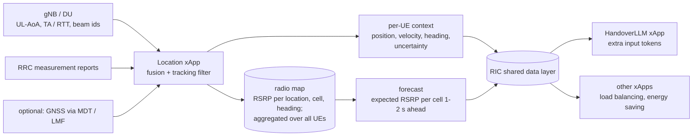

# Location-aware handover: concept, findings and plan

**Status: concept and evidence only; nothing in the code uses location yet.** This document
records the idea of feeding UE location to HandoverLLM, from triangulation / angle of arrival
and a helper "Location xApp" in the RIC. It also records a simulator experiment that estimates
the benefit, and a plan to validate it properly.

Related: `docs/DESIGN.md` (model, training), `docs/RAN_INTEGRATION.md` (xApp, RIC interfaces).

---

## 1. The question

> If measurement reports were accompanied by UE location (from triangulation and angle of
> arrival), would it help train the LLM and give better handover results? Can a helper xApp in
> the RIC deduce location and help fine-tune the AI-RAN?

## 2. Short answer

**Yes, but only if location brings information the measurement report does not already contain.**

* **Location computed *only* from the same RSRP reports adds almost nothing.** Everything such a
  helper could compute from those reports, the handover model could learn from the same
  reports. This is the data-processing inequality: processing a signal cannot add information
  about the label.
* **The gains come from two sources:**
  1. **New measurements** that RSRP cannot reveal: uplink angle of arrival (UL-AoA) at the gNB
     array, timing advance / round-trip time (TA, multi-RTT), beam indices, GNSS (MDT/LMF).
     These give **position and heading**: where the UE is going, not just how the signals
     are trending.
  2. **Memory across UEs:** a **radio map** learned from many past UEs ("at this spot, heading
     north-east, cell 7 always drops off sharply"). A per-UE model cannot know this. A Location
     xApp that aggregates thousands of UEs can, and can forecast each cell's RSRP along the
     UE's path.
* **Accuracy decides the value.** In simulation, position at 10–30 m gives a clear gain, while at
  100 m most of the gain is gone (§3).

## 3. Evidence from the simulator

### 3.1 What was measured

This is a **learnability** test, the same method as the label-smoothing study (`DESIGN.md`
§21.8). How well can a small neural network predict the look-ahead teacher's handover decision:

* from today's report features only, versus
* from the same features plus position-derived features, with realistic positioning error?

| Item | Setting |
|---|---|
| Data | 16 simulated drives × 32 UEs × 60 s, with the corpus's behaviour-policy mix (teacher, delayed teacher, random A3); 297 984 labelled reports |
| Labels | Teacher (`policies.label_decision`, defaults): "hand over to the strongest neighbour now" (6.7 % positive) and "hand over to any neighbour now" (8.3 %) |
| Report features (today) | For each of the 4 neighbours: latest neighbour − serving RSRP and its 800 ms change; serving RSRP trend and level; serving SINR; speed |
| Position features (added) | For each of the 4 neighbours, log distance ratio `log10(d_serving / d_neighbour)`. For the serving cell and each neighbour, radial speed `Δd / 0.8 s` (heading relative to each cell). All computed from the *estimated* position |
| Positioning error | 2-D Gaussian, σ = 0 (exact), 10, 30, 100 m. **Correlated in time** (AR(1), coefficient 0.9 per 100 ms, about 1 s memory), as tracking filters produce |
| Classifier | MLP 128-64-1 (ReLU), Adam 3e-3, 600 steps × 8192 samples. Trained on the first 80 % (earlier drives) and tested on the last 20 % (later drives) |
| Metrics | ROC AUC; recall at 50 % precision (how many teacher handovers are caught when half of the predicted handovers are right) |

### 3.2 Results

**Label: hand over to the strongest neighbour now**

| Features | AUC | Recall @ 50 % precision |
|---|---:|---:|
| Report only (today) | 0.915 | 0.569 |
| + position & heading, error σ = 100 m | 0.919 | 0.594 |
| + position & heading, error σ = 30 m | 0.925 | 0.631 |
| + position & heading, error σ = 10 m | 0.928 | 0.642 |
| + exact position & heading | 0.932 | 0.661 |

**Label: hand over to any neighbour now**

| Features | AUC | Recall @ 50 % precision |
|---|---:|---:|
| Report only (today) | 0.920 | 0.678 |
| + position & heading, error σ = 100 m | 0.922 | 0.694 |
| + position & heading, error σ = 30 m | 0.926 | 0.718 |
| + position & heading, error σ = 10 m | 0.930 | 0.735 |
| + exact position & heading | 0.934 | 0.753 |

### 3.3 Interpretation

* **Consistent, monotone gain.** At the same precision, position with 10–30 m error catches
  about **10–13 % more** of the teacher's handovers (0.57 → 0.63–0.64). Exact position gives
  about 16 %. At 100 m the gain shrinks to about 4 %.
* **Recall is the model's main weakness today** (`DESIGN.md` §19.3: it hands over late), so
  better recall is the gain that matters most.
* **This is a lower bound.** The simulator's shadowing is a random process along each UE's path.
  It is **not tied to places**, so two UEs at the same spot see unrelated shadowing. Location can
  therefore only help through geometry (distance and direction to the cells). In real deployments
  shadowing is tied to buildings and streets, so a radio map would add information that is absent
  here, likely the larger part of the benefit.
* **Not closed-loop KPIs.** These are prediction scores. Handover rate, ping-pong, RLF and
  throughput would need a retrained model with location tokens, evaluated with `evaluate`
  (plan in §7).
* **Not comparable to the §21.8 AUCs** (≈ 0.83) in `DESIGN.md`: that study used a smaller
  network, fewer features and a shorter training budget. Compare the rows within this table only.

## 4. Where location can come from in a real RAN

| Source | Measured at | Typical accuracy (order of magnitude) | Notes |
|---|---|---|---|
| Uplink angle of arrival (UL-AoA) | gNB antenna array / DU | A few degrees, so tens of metres at macro distances | Needs calibrated arrays and DU support. One cell gives a bearing; two or more give triangulation |
| Timing advance / multi-cell RTT (NR Rel-16 multi-RTT) | DU / gNB | Tens of metres (TA) down to metres (multi-RTT) | 2–3 cells give trilateration. Combined with AoA, one cell can give a usable fix |
| Beam indices (SSB / CSI-RS beam reports) | UE measurement report | Sector / beam footprint | Cheap. OAI's periodic reporting has `includeBeamMeasurements` |
| E-CID (cell id + RSRP + TA + AoA) | gNB / LMF | Tens to hundreds of metres | The classic fallback method |
| RSRP fingerprinting | xApp | Tens of metres | Useful **only** together with a radio map; on its own it duplicates the report |
| GNSS via MDT or the LMF (LPP/NRPPa) | UE / 5G core | Metres | Best accuracy; core-network path, consent and latency constraints |

Accuracy figures are indicative and depend heavily on deployment (macro vs small cells, outdoor
vs indoor, array size, bandwidth). Measure them on your own network.

## 5. The helper "Location xApp"

### 5.1 Architecture



### 5.2 Functions

1. **Fusion and tracking.** Combine AoA bearings, TA/RTT ranges, beam ids and (when available)
   GNSS in a Kalman or particle filter. Output position, velocity, heading and an **uncertainty**
   per UE, fresh every report period (100–200 ms). A filtered track matters more than
   individual fixes.
2. **Radio map.** Aggregate RSRP per (grid cell, cell id, direction of travel) over all UEs and
   time: the average, spread and trend at the next grid cells along the direction of travel. Store
   aggregates only, never per-subscriber tracks.
3. **Forecast.** For each UE, predict each reported cell's RSRP 1–2 s ahead along its track. This
   is the online analogue of the teacher's look-ahead, and the most directly useful input for the
   handover decision.
4. **Publish per-UE context** (not raw measurements) through the RIC's shared data layer, or as
   extra fields on the ran-bridge `meas_report`. Other xApps can reuse it.

### 5.3 How HandoverLLM would use it (conceptual)

* **New optional token families,** appended at the **end** of the vocabulary. This keeps
  checkpoint compatibility rules simple (`DESIGN.md` §22.1):
  * per neighbour: distance-ratio bin and radial-speed bin (the features tested in §3);
  * per neighbour: **forecast gain** bin (radio-map prediction − serving);
  * **position uncertainty** bin, so the model learns how much to trust the location tokens.
* **Graceful degradation.** Train with location dropped at random and with varying uncertainty.
  When location is missing or poor, the model behaves like today's report-only model, and the
  existing safety layers (threshold, A3 override, guard rails, RAN backstop) are unchanged.
* **Training and fine-tuning:**
  * location-tagged real traces make it possible to split and weight data by area and route,
    find where the model underperforms, and fine-tune per area;
  * the radio map can **generate realistic synthetic drives**, replacing the simulator's random
    shadowing with measured behaviour. That shrinks the sim-to-real gap, which is currently the
    project's largest risk;
  * the teacher itself is unchanged: offline, the future is known from the logs anyway.

## 6. Caveats and risks

| Topic | Risk | Mitigation |
|---|---|---|
| Privacy / regulation | UE location is personal data | Keep only aggregated radio maps; keep tracks in memory for seconds; anonymise ids; follow operator and legal policy; prefer RAN-internal measurements over subscriber GNSS |
| Accuracy where it matters | AoA and TA are typically worst at the cell edge, which is where handovers happen | Always carry an uncertainty token; the model and controller fall back to report-only behaviour |
| Hardware and E2 exposure | UL-AoA needs antenna arrays and DU support; OAI / OCUDU expose little of this over E2 today | Start with TA + beam ids + RSRP fingerprinting against a radio map; add AoA where the hardware supports it |
| Latency | Stale positions mislead a 100–200 ms decision loop | A tracking filter with prediction; drop inputs older than the report period |
| Distribution shift | A model trained with good location may over-trust it | Train with dropout and noisy location; monitor location error in shadow mode |
| Cost | A second xApp to run; a retrained model | Only worth it if §7 shows closed-loop gains |

## 7. Validation plan (not started)

1. **Simulator: tie shadowing to places.** Replace the per-UE shadowing process with a spatially
   correlated field shared by all UEs (e.g. a Gudmundson-correlated grid per cell). Without this,
   the radio-map benefit cannot be measured.
2. **Build the Location xApp offline,** first in the simulator:
   * position from noisy AoA and TA (σ as in §3);
   * a radio map learned from training drives;
   * a 1–2 s RSRP forecast.
3. **Train three models** and compare them in closed loop on the same benchmark drives (`evaluate`):
   (a) report-only (today); (b) report + position and heading; (c) report + radio-map forecast.
   Also test with realistic reporting (the fake gNB's `--realistic`).
4. **Decide.** Proceed only if (b) or (c) improves recall and outage without raising RLF or
   ping-pong.
5. **Testbed, shadow mode.** Run the Location xApp alongside the RAN, and measure position error
   (against GNSS or a survey) and forecast error. Then run the handover xApp with location
   tokens in shadow mode and compare its decisions with today's model.

## 8. Recommendation

Worth pursuing, **mainly for the radio map and forecast**. Raw position alone gives a moderate
gain at 10–30 m accuracy and little at 100 m. The cheapest informative next step is §7 steps 1–3
in simulation. It needs no RAN hardware and shows whether the radio-map effect is large enough
to justify a Location xApp.

---

## Appendix: experiment script

Run from the repository root with `PYTHONPATH=.`. It takes about 10–20 minutes on 4 CPU cores,
and uses only existing package functions.

```python
import numpy as np, torch
from ai_ran_llm.config import ObsConfig
from ai_ran_llm.simulator import generate_episode, run_policy
from ai_ran_llm.dataset import _behaviour_policy
from ai_ran_llm.policies import label_decision
torch.manual_seed(0)
rng = np.random.default_rng(5); o = ObsConfig()
SIGMAS = [0, 10, 30, 100]
F = {k: [] for k in ['base'] + [f'geo{s}' for s in SIGMAS]}; Y = []; Yany = []
for e in range(16):
    ep = generate_episode(32, 600, rng)
    errs = {}                      # positioning error: AR(1), ~1 s memory, per UE
    for s in SIGMAS:
        z = np.zeros((ep.n_ue, ep.n_steps, 2)); a = 0.9; x = rng.normal(0, s, (ep.n_ue, 2))
        for t in range(ep.n_steps):
            z[:, t] = x; x = a * x + np.sqrt(1 - a * a) * rng.normal(0, s, (ep.n_ue, 2))
        errs[s] = z
    _, _, seen = run_policy(ep, _behaviour_policy(rng, o), o, record=True)
    for t, obs in seen:
        if t < 8 or t + 10 >= 600: continue
        d = obs.nbr_hist - obs.serving_hist[:, None, :]
        base = np.concatenate([d[:, :, -1], d[:, :, -1] - d[:, :, 0],
                               (obs.serving_hist[:, -1] - obs.serving_hist[:, 0])[:, None],
                               obs.serving_hist[:, -1:] / 10 + 9, obs.sinr_db[:, None] / 10,
                               obs.speed_kmh[:, None] / 100], 1)
        F['base'].append(base)
        for s in SIGMAS:
            p_now = ep.pos[:, t] + errs[s][:, t]; p_old = ep.pos[:, t - 8] + errs[s][:, t - 8]
            cells = np.concatenate([obs.serving[:, None], obs.nbr_ids], 1)
            site = ep.sites[cells]
            dn = np.linalg.norm(p_now[:, None] - site, axis=-1) + 1
            do = np.linalg.norm(p_old[:, None] - site, axis=-1) + 1
            geo = np.concatenate([np.log10(dn[:, :1] / dn[:, 1:]), (dn - do) / 0.8 / 30], 1)
            F[f'geo{s}'].append(np.concatenate([base, geo], 1))
        tg, _ = label_decision(ep, t, obs, o); Y.append(tg == obs.nbr_ids[:, 0]); Yany.append(tg >= 0)

def auc(s, y):
    o_ = np.argsort(s); r = np.empty(len(s)); r[o_] = np.arange(len(s)); p = y.sum()
    return (r[y].sum() - p * (p - 1) / 2) / (p * (len(y) - p))

for lab, YY in [('HO to strongest nbr', Y), ('HO to any nbr', Yany)]:
    y = torch.tensor(np.concatenate(YY), dtype=torch.float32); n = len(y); tr = int(n * .8)
    print(f'== label: {lab}  (n={n}, positives {100 * y.mean():.1f}%)')
    for k, v in F.items():
        X = torch.tensor(np.concatenate(v), dtype=torch.float32)
        m = torch.nn.Sequential(torch.nn.Linear(X.shape[1], 128), torch.nn.ReLU(),
                                torch.nn.Linear(128, 64), torch.nn.ReLU(), torch.nn.Linear(64, 1))
        opt = torch.optim.Adam(m.parameters(), 3e-3)
        for i in range(600):
            idx = torch.randint(0, tr, (8192,))
            l = torch.nn.functional.binary_cross_entropy_with_logits(m(X[idx]).squeeze(1), y[idx])
            opt.zero_grad(); l.backward(); opt.step()
        with torch.no_grad(): p = torch.sigmoid(m(X[tr:]).squeeze(1)).numpy()
        yt = y[tr:].numpy().astype(bool)
        o_ = np.argsort(-p); tp = np.cumsum(yt[o_]); prec = tp / np.arange(1, len(p) + 1); rec = tp / yt.sum()
        r50 = rec[prec >= 0.5].max() if (prec >= 0.5).any() else 0
        print(f'   {k:8s} AUC {auc(p, yt):.3f}   recall@precision50 {r50:.3f}')
```
