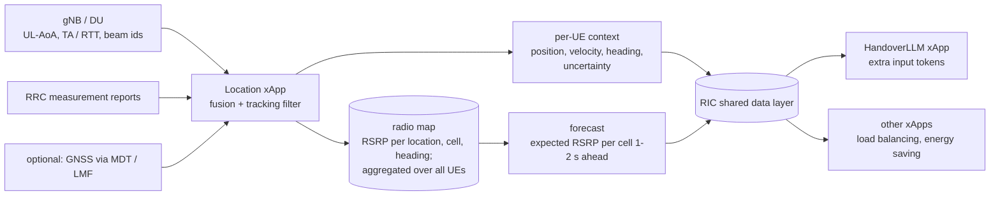

# Location-aware handover: concept, findings and plan

**Status: implemented as an opt-in model input (§12); in closed loop, location context cuts
handover failures by about half and outage by a third versus the same model without it (§13).** This
document records:
* the idea of feeding UE location to HandoverLLM, from triangulation / angle of arrival and a
  helper "Location xApp" in the RIC (§1–§6);
* the idea of adding trajectory mining / predictive tracking (§7);
* the simulator upgrades that make both measurable: the opt-in "city" model (§8);
* the learnability results (§3, §9) and the validation plan (§10);
* the implementation in the model (§12) and the closed-loop results (§13).

Related: `docs/DESIGN.md` (model, training), `docs/RAN_INTEGRATION.md` (xApp, RIC interfaces).

---

## 1. The question

> If measurement reports were accompanied by UE location (from triangulation and angle of
> arrival), would it help train the LLM and give better handover results? Can a helper xApp in
> the RIC deduce location and help fine-tune the AI-RAN?

## 2. Short answer

**Yes, but only if location brings information the measurement report does not already contain.**

* **Location computed *only* from the same RSRP reports adds almost nothing.** Everything such a
  helper could compute from those reports, the handover model could learn from the same
  reports. This is the data-processing inequality: processing a signal cannot add information
  about the label.
* **The gains come from two sources:**
  1. **New measurements** that RSRP cannot reveal: uplink angle of arrival (UL-AoA) at the gNB
     array, timing advance / round-trip time (TA, multi-RTT), beam indices, GNSS (MDT/LMF).
     These give **position and heading**: where the UE is going, not just how the signals
     are trending.
  2. **Memory across UEs:** a **radio map** learned from many past UEs ("at this spot, heading
     north-east, cell 7 always drops off sharply"). A per-UE model cannot know this. A Location
     xApp that aggregates thousands of UEs can, and can forecast each cell's RSRP along the
     UE's path.
* **Accuracy decides the value.** In simulation, position at 10–30 m gives a clear gain, while at
  100 m most of the gain is gone (§3).

## 3. Evidence from the simulator

### 3.1 What was measured

This is a **learnability** test, the same method as the label-smoothing study (`DESIGN.md`
§21.8). How well can a small neural network predict the look-ahead teacher's handover decision:

* from today's report features only, versus
* from the same features plus position-derived features, with realistic positioning error?

| Item | Setting |
|---|---|
| Data | 16 simulated drives × 32 UEs × 60 s, with the corpus's behaviour-policy mix (teacher, delayed teacher, random A3); 297 984 labelled reports |
| Labels | Teacher (`policies.label_decision`, defaults): "hand over to the strongest neighbour now" (6.7 % positive) and "hand over to any neighbour now" (8.3 %) |
| Report features (today) | For each of the 4 neighbours: latest neighbour − serving RSRP and its 800 ms change; serving RSRP trend and level; serving SINR; speed |
| Position features (added) | For each of the 4 neighbours, log distance ratio `log10(d_serving / d_neighbour)`. For the serving cell and each neighbour, radial speed `Δd / 0.8 s` (heading relative to each cell). All computed from the *estimated* position |
| Positioning error | 2-D Gaussian, σ = 0 (exact), 10, 30, 100 m. **Correlated in time** (AR(1), coefficient 0.9 per 100 ms, about 1 s memory), as tracking filters produce |
| Classifier | MLP 128-64-1 (ReLU), Adam 3e-3, 600 steps × 8192 samples. Trained on the first 80 % (earlier drives) and tested on the last 20 % (later drives) |
| Metrics | ROC AUC; recall at 50 % precision (how many teacher handovers are caught when half of the predicted handovers are right) |

### 3.2 Results

**Label: hand over to the strongest neighbour now**

| Features | AUC | Recall @ 50 % precision |
|---|---:|---:|
| Report only (today) | 0.915 | 0.569 |
| + position & heading, error σ = 100 m | 0.919 | 0.594 |
| + position & heading, error σ = 30 m | 0.925 | 0.631 |
| + position & heading, error σ = 10 m | 0.928 | 0.642 |
| + exact position & heading | 0.932 | 0.661 |

**Label: hand over to any neighbour now**

| Features | AUC | Recall @ 50 % precision |
|---|---:|---:|
| Report only (today) | 0.920 | 0.678 |
| + position & heading, error σ = 100 m | 0.922 | 0.694 |
| + position & heading, error σ = 30 m | 0.926 | 0.718 |
| + position & heading, error σ = 10 m | 0.930 | 0.735 |
| + exact position & heading | 0.934 | 0.753 |

### 3.3 Interpretation

* **Consistent, monotone gain.** At the same precision, position with 10–30 m error catches
  about **10–13 % more** of the teacher's handovers (0.57 → 0.63–0.64). Exact position gives
  about 16 %. At 100 m the gain shrinks to about 4 %.
* **Recall is the model's main weakness today** (`DESIGN.md` §19.3: it hands over late), so
  better recall is the gain that matters most.
* **This is a lower bound (since measured, §9).** The original simulator's shadowing is a random
  process along each UE's path.
  It is **not tied to places**, so two UEs at the same spot see unrelated shadowing. Location can
  therefore only help through geometry (distance and direction to the cells). In real deployments
  shadowing is tied to buildings and streets, so a radio map would add information that is absent
  here, likely the larger part of the benefit.
* **Not closed-loop KPIs.** These are prediction scores. Handover rate, ping-pong, RLF and
  throughput would need a retrained model with location tokens, evaluated with `evaluate`
  (plan in §7).
* **Not comparable to the §21.8 AUCs** (≈ 0.83) in `DESIGN.md`: that study used a smaller
  network, fewer features and a shorter training budget. Compare the rows within this table only.

## 4. Where location can come from in a real RAN

| Source | Measured at | Typical accuracy (order of magnitude) | Notes |
|---|---|---|---|
| Uplink angle of arrival (UL-AoA) | gNB antenna array / DU | A few degrees, so tens of metres at macro distances | Needs calibrated arrays and DU support. One cell gives a bearing; two or more give triangulation |
| Timing advance / multi-cell RTT (NR Rel-16 multi-RTT) | DU / gNB | Tens of metres (TA) down to metres (multi-RTT) | 2–3 cells give trilateration. Combined with AoA, one cell can give a usable fix |
| Beam indices (SSB / CSI-RS beam reports) | UE measurement report | Sector / beam footprint | Cheap. OAI's periodic reporting has `includeBeamMeasurements` |
| E-CID (cell id + RSRP + TA + AoA) | gNB / LMF | Tens to hundreds of metres | The classic fallback method |
| RSRP fingerprinting | xApp | Tens of metres | Useful **only** together with a radio map; on its own it duplicates the report |
| GNSS via MDT or the LMF (LPP/NRPPa) | UE / 5G core | Metres | Best accuracy; core-network path, consent and latency constraints |

Accuracy figures are indicative and depend heavily on deployment (macro vs small cells, outdoor
vs indoor, array size, bandwidth). Measure them on your own network.

## 5. The helper "Location xApp"

### 5.1 Architecture



### 5.2 Functions

1. **Fusion and tracking.** Combine AoA bearings, TA/RTT ranges, beam ids and (when available)
   GNSS in a Kalman or particle filter. Output position, velocity, heading and an **uncertainty**
   per UE, fresh every report period (100–200 ms). A filtered track matters more than
   individual fixes.
2. **Radio map.** Aggregate RSRP per (grid cell, cell id, direction of travel) over all UEs and
   time: the average, spread and trend at the next grid cells along the direction of travel. Store
   aggregates only, never per-subscriber tracks.
3. **Forecast.** For each UE, predict each reported cell's RSRP 1–2 s ahead along its track. This
   is the online analogue of the teacher's look-ahead, and the most directly useful input for the
   handover decision.
4. **Publish per-UE context** (not raw measurements) through the RIC's shared data layer, or as
   extra fields on the ran-bridge `meas_report`. Other xApps can reuse it.

### 5.3 How HandoverLLM would use it (conceptual)

* **New optional token families,** appended at the **end** of the vocabulary. This keeps
  checkpoint compatibility rules simple (`DESIGN.md` §22.1):
  * per neighbour: distance-ratio bin and radial-speed bin (the features tested in §3);
  * per neighbour: **forecast gain** bin (radio-map prediction − serving);
  * **position uncertainty** bin, so the model learns how much to trust the location tokens.
* **Graceful degradation.** Train with location dropped at random and with varying uncertainty.
  When location is missing or poor, the model behaves like today's report-only model, and the
  existing safety layers (threshold, A3 override, guard rails, RAN backstop) are unchanged.
* **Training and fine-tuning:**
  * location-tagged real traces make it possible to split and weight data by area and route,
    find where the model underperforms, and fine-tune per area;
  * the radio map can **generate realistic synthetic drives**, replacing the simulator's random
    shadowing with measured behaviour. That shrinks the sim-to-real gap, which is currently the
    project's largest risk;
  * the teacher itself is unchanged: offline, the future is known from the logs anyway.

## 6. Caveats and risks

| Topic | Risk | Mitigation |
|---|---|---|
| Privacy / regulation | UE location is personal data | Keep only aggregated radio maps; keep tracks in memory for seconds; anonymise ids; follow operator and legal policy; prefer RAN-internal measurements over subscriber GNSS |
| Accuracy where it matters | AoA and TA are typically worst at the cell edge, which is where handovers happen | Always carry an uncertainty token; the model and controller fall back to report-only behaviour |
| Hardware and E2 exposure | UL-AoA needs antenna arrays and DU support; OAI / OCUDU expose little of this over E2 today | Start with TA + beam ids + RSRP fingerprinting against a radio map; add AoA where the hardware supports it |
| Latency | Stale positions mislead a 100–200 ms decision loop | A tracking filter with prediction; drop inputs older than the report period |
| Distribution shift | A model trained with good location may over-trust it | Train with dropout and noisy location; monitor location error in shadow mode |
| Cost | A second xApp to run; a retrained model | Only worth it if §7 shows closed-loop gains |

## 7. Trajectory mining and predictive tracking

**Idea.** Machine-learning models analyse historical routes, dwell times and movement patterns to
anticipate where a device is going. This smooths out tracking lag and filters out temporary
tracking errors.

**Why it fits this problem.** The model's main weakness is that it hands over late. The teacher is
good because it knows the next second, and trajectory mining is a way to estimate that next second:

| Capability | What it gives the handover decision |
|---|---|
| **Smoothing / filtering** (Kalman or particle filter, snapping positions to roads) | Cleaner position and heading. In §3, reducing positioning error from 100 m to 30 m recovered most of the available gain |
| **Next-location / next-cell prediction** from historical routes | Hand over *before* the signal drops, which addresses the late-handover weakness |
| **Dwell-time prediction** | Skip a cell the UE will leave within a second (a small cell at a corner, a fast car at a cell edge). This reduces ping-pong and "too-short stay" handovers |
| **Combined with the radio map** | Predicted path + known signal along it = forecast of each cell's RSRP 1–2 s ahead: an online version of the teacher's look-ahead |

**A cheap version needs no location at all: mining handover sequences.** Operators already log
which cells UEs pass through, and in what order. A model of "after cell A then B, UEs usually go
to C (80 %), rarely D" predicts the next cell without GNSS, AoA or triangulation. On highways,
railways and main roads the next cell is often almost certain. Cell sequences are just tokens
(`C12 C7 → C4`), so this fits the same model. It also raises fewer privacy issues. §9 measures
it as the "trajectory prior".

**Where it helps, and where not.**
* Helps most: structured, repeated movement such as roads, railways, corridors, commutes and
  high-speed UEs. That is also where handover failures and ping-pong cluster.
* Helps little: random pedestrian movement, indoor environments, UEs seen for the first time,
  and junctions, where the prediction splits between branches. Predictions must carry an
  uncertainty, with fallback to today's behaviour.

**Where it runs (O-RAN).** Mining months of route and handover history is slow, offline work for
the **non-RT RIC / SMO**. The trained model is deployed to the near-RT RIC, and the
Location / trajectory xApp publishes per UE:
* the predicted next-cell distribution;
* the expected dwell time per candidate cell;
* a confidence value.

HandoverLLM reads these as optional input tokens.

**Caveats.**
* **Privacy is a bigger issue than with location alone:** routes and dwell times reveal home,
  work and habits. Mine *aggregated* road-segment and cell-transition statistics, never
  per-subscriber histories.
* **Confident wrong predictions** at junctions can cause bad early handovers. The existing
  safety layers (confidence threshold, A3 override, guard rails, RAN backstop) must stay.
* **Patterns go stale** with road works, events and new cells. The models need regular
  retraining, and their prediction accuracy should be monitored in shadow mode.

## 8. Simulator upgrades: the "city" model (implemented)

The original simulator cannot measure radio-map or trajectory benefits:
* UEs move randomly (Gauss-Markov), so there are no routes or habits to mine;
* shadowing is drawn along each UE's path, so there is no place-dependent signal to map.

Two opt-in upgrades fix this. They live in `ai_ran_llm/city.py` and are selected with
`SimConfig.mobility` / `SimConfig.shadowing`, or on the CLI with
`--mobility roads --shadowing spatial [--map-seed N]` (`gen-data`, `evaluate`, `export-raw`,
`fake-gnb`).

| Upgrade | Model | Parameters (defaults) |
|---|---|---|
| **Road mobility** (`mobility="roads"`) | A street grid plus highways inside the service area. `n_routes` fixed routes with Zipf popularity (the top 5 carry about half the UEs), so paths repeat like commutes. Route types: street (20–50 km/h), highway (70–120 km/h), walk (3–6 km/h), with shares 60 / 20 / 20 %. Street UEs stop at intersections (probability `stop_prob`, 2–20 s); walkers stop half as often. UEs turn back at route ends | `road_spacing_m` 150, `n_routes` 40, `stop_prob` 0.3 |
| **Spatial shadowing** (`shadowing="spatial"`) | One Gaussian random field per cell with σ = `shadow_sigma_db` and exponential spatial correlation over `shadow_decorr_m` (Gudmundson). Generated by circulant embedding on a 10 m grid (2.56 km square) and bilinearly interpolated at UE positions. The field depends only on the place, so every UE at the same spot sees the same shadowing, in every drive | σ 6 dB, 50 m |
| **The city** | Roads, routes, popularity and fields come from `map_seed` with their own random generator, independent of each episode's random stream. Every drive happens in the same city, like a real network | `map_seed` 1 |

**Checks:**
* **Defaults are untouched:** the committed corpus regenerates bit-for-bit, and
  `tests/test_city.py::test_default_simulator_unchanged` pins a fingerprint of the original
  simulator.
* **Field statistics:** measured standard deviation 5.99 dB (target 6); correlation 0.81 / 0.35 /
  0.12 at 10 / 50 / 100 m vs the exponential model's 0.82 / 0.37 / 0.14.
* **Mobility:** street UEs stay exactly on grid lines; about 11 % of UE-steps are stopped.

Baseline KPIs stay plausible in every combination (2 drives × 64 UEs):

| World | A3 2 dB: HO/UE/min, ping-pong, SE, outage | Teacher: HO/UE/min, ping-pong, SE, outage |
|---|---|---|
| Original | 9.8, 13 %, 2.97, 3.7 % | 7.7, 5 %, 3.05, 0.5 % |
| Roads only | 8.5, 12 %, 2.93, 3.0 % | 6.4, 5 %, 3.00, 0.5 % |
| Spatial shadowing only | 8.2, 10 %, 3.29, 1.8 % | 6.4, 4 %, 3.34, 0.2 % |
| City (both) | 7.6, 8 %, 2.80, 1.6 % | 6.1, 5 %, 2.84, 0.3 % |

**Simplifications:**
* Fields of different cells are independent (real obstacles affect several cells at once).
* Buildings do not block movement beyond the street grid.
* There are no traffic dynamics.
* Speeds do not vary within a route type.

## 9. Measured: location, radio map and trajectory mining in the city

**Method** (`experiments/location_trajectory_learnability.py`). For each world:
* **Drives:** 16 drives × 32 UEs × 60 s with the corpus's behaviour-policy mix.
* **Labels:** teacher labels; the target is "hand over to *this* neighbour now", for each of the
  4 reported neighbours. This captures both timing and target choice.
* **Split:** radio maps and handover-sequence statistics are learned from the **12 training
  drives only**, and scores come from the **4 held-out drives**.
* **Position:** estimated positions have 10 m, time-correlated error (as in §3).
* **Repeats:** 3 seeds (5, 6, 7), each with fresh drives in the same city.

Feature sets:
* **position & heading:** as in §3;
* **radio-map forecast:** RSRP map on a 20 m grid from the training drives' reports (serving + 8
  strongest cells). For each neighbour, map(neighbour) − map(serving) at the current position and
  at the position predicted 1 s ahead;
* **trajectory prior:** P(next serving cell = neighbour | previous cell, current cell), mined
  from the training drives' handover sequences, backing off to P(next | current). **It uses no
  location.**

**Results** (mean over 3 seeds; the range of the recall change across seeds in brackets):

*Original simulator (random movement, per-path shadowing):*

| Features | AUC per neighbour | AUC any handover | Recall @ 50 % precision | Change | Target-cell accuracy |
|---|---:|---:|---:|---:|---:|
| Report only (today) | 0.954 | 0.892 | 0.210 | — | 0.807 |
| + position & heading (σ = 10 m) | 0.962 | 0.908 | 0.292 | +53 % (+23…+111) | 0.832 |
| + radio-map forecast | 0.960 | 0.903 | 0.263 | +36 % (+2…+86) | 0.832 |
| + trajectory prior (no location) | 0.954 | 0.893 | 0.215 | +4 % (+0…+7) | 0.811 |
| All combined | 0.961 | 0.906 | 0.289 | +51 % (+23…+105) | 0.834 |

*City (road mobility + spatial shadowing):*

| Features | AUC per neighbour | AUC any handover | Recall @ 50 % precision | Change | Target-cell accuracy |
|---|---:|---:|---:|---:|---:|
| Report only (today) | 0.971 | 0.932 | 0.357 | — | 0.824 |
| + position & heading (σ = 10 m) | 0.975 | 0.941 | 0.451 | +27 % (+21…+34) | 0.848 |
| **+ radio-map forecast** | **0.983** | **0.957** | **0.618** | **+78 % (+63…+108)** | **0.894** |
| + trajectory prior (no location) | 0.973 | 0.936 | 0.409 | +16 % (+7…+22) | 0.854 |
| All combined | 0.983 | 0.958 | 0.635 | +83 % (+66…+111) | 0.902 |

**Interpretation:**
* **The reasoning in §2 holds.**
  * In the original simulator there is nothing place- or route-dependent to learn. The
    trajectory prior adds nothing, and the radio map helps only by encoding geometry, much like
    position does.
  * In the city, the **radio-map forecast is the strongest single input**: +78 % recall at the
    same precision, and target-cell accuracy up from 82 % to 89 %.
* **Trajectory mining pays off without any location.** Handover-sequence statistics alone add
  +16 % recall and raise target accuracy from 82 % to 85 %. This is the cheapest option: operators
  already have the data, and no new RAN measurements are needed.
* **Combining everything** gives +83 %. Most of that comes from the radio map, since the map
  forecast already contains much of the route information.
* **Absolute recall values vary by seed.** The 4 held-out drives differ in which behaviour
  policies drove them. The ranking of feature sets is the same in every seed, and the AUC and
  target-accuracy columns are stable.
* **These numbers are not comparable to §3.** That study used a different split (by sample
  order), a single binary output and different labels. Compare rows within one table only.
* **Still learnability, not closed-loop KPIs.** Proving handover-rate, ping-pong, RLF and
  throughput gains requires training HandoverLLM with the new tokens (§10).

## 10. Validation plan: status

1. **Done — simulator: tie shadowing to places** (§8). A spatially correlated field per cell,
   shared by all UEs and drives, plus road mobility with repeated routes.
2. **Partly done — build the Location xApp's pieces offline in the simulator.** The learnability
   study (§9) already uses:
   * noisy positions (10 m, time-correlated), standing in for AoA / TA fusion;
   * a radio map learned from training drives;
   * a 1 s RSRP forecast along the heading;
   * handover-sequence mining.

   Still open: deriving position from simulated AoA / TA measurements instead of adding noise to
   the true position.
3. **Done (§12–§13) — train the models** and compare them in closed loop on the same city benchmark drives
   (`evaluate --mobility roads --shadowing spatial`):
   (a) report-only (today); (b) + position and heading; (c) + radio-map forecast;
   (d) + trajectory prior. Also test with realistic reporting (the fake gNB's `--realistic`).
4. **Result (§13):** the "all" and radio-map models improve HOF, outage and handover count over
   the report-only model at equal budget, with lower RLF. Ping-pong stays high at the shipped
   model's threshold; thresholds need tuning per model and the models need more training.
5. **Testbed, shadow mode.** Run the Location xApp alongside the RAN, and measure position error
   (against GNSS or a survey) and forecast error. Then run the handover xApp with location
   tokens in shadow mode and compare its decisions with today's model.

## 11. Recommendation

Worth pursuing. The city measurements (§9) rank the options:

1. **Radio-map forecast**, which needs position: the largest gain (+78 % recall, target accuracy
   82 → 89 %).
2. **Position and heading alone:** a moderate gain (+27 %), which depends strongly on accuracy
   (§3).
3. **Trajectory prior from handover sequences:** a smaller gain (+16 %) but **no location
   needed**. It is the cheapest step for a real network.

**Next step:** train HandoverLLM with optional location / map / trajectory tokens on city
corpora, and measure closed-loop KPIs with `evaluate --mobility roads --shadowing spatial`
against today's model (§10, step 3).

---

## 12. Implementation: location context in the model

The model can now take location, radio-map and trajectory inputs as **optional context tokens**.
Everything is opt-in: with the flags off, the vocabulary (349 tokens), the prompt (41 tokens),
the shipped checkpoint and the committed corpus are unchanged (the corpus is verified
bit-identical).

### 12.1 Tokens

`ObsConfig.use_position`, `use_radio_map` and `use_trajectory` switch on context tokens. They are
appended to the vocabulary, so base token ids never move, giving 447 tokens with any flag on.
They are also inserted after the serving block and after every neighbour block:

```
<srv> C9 R… R… R… R… R…  [S N]  <nbr> C5 D… D… D… D… D…  [L S  M M  P]  <nbr> …  <ans>
       serving history    ^ctx         neighbour history    ^ctx per neighbour
```

| Token | Flag | Meaning | Bins |
|---|---|---|---|
| `S±n` after serving | position | radial speed to the serving cell (m/s, + = moving away) | 4 m/s, ±32 |
| `N0..N6` after serving | trajectory | how much handover history the next-cell estimate rests on | log2 of count |
| `L±n` per neighbour | position | log10(distance to serving / distance to neighbour) × 10 | 0.1 decade, ±1 |
| `S±n` per neighbour | position | radial speed to the neighbour | 4 m/s, ±32 |
| `M±n` `M±n` per neighbour | radio map | map RSRP(neighbour) − RSRP(serving) now and 1 s ahead along the heading | 1 dB, ±20 |
| `P0..P10` per neighbour | trajectory | P(next serving cell = this neighbour \| previous, current) | 10 % |
| `<unk>` | any | value unknown (no position, unmapped square, no history) | — |

With all flags on, the prompt is 63 tokens and corpus rows are 79 tokens long.

### 12.2 Where the values come from (`ai_ran_llm/location.py`)

| Component | Role | Simulator stand-in / real-RAN source |
|---|---|---|
| `position_track` | UE position estimate | true position + AR(1) error (10 m, ≈ 1 s memory) / AoA, TA/RTT, beam, GNSS fusion |
| `RadioMap` | mean reported RSRP per (cell, 20 m square) over past traffic | reports at estimated positions from history drives / RIC report logs |
| `TransitionModel` | next-cell probabilities from sequences of serving cells, backing off from (previous, current) to (current) | serving-cell sequences under A3 in history drives / handover logs |
| `LocationService` | map + statistics, saved as `radio_map.npz` + `service.json` | `ai_ran_llm build-location-service` |
| `compute_context` | all context values for one report | — |
| `LocationAwarePolicy` | runs a context model in closed loop (`run_policy`, `evaluate`) | — |

**No leakage.** The service is built from **separate history drives** (seed 777), never from the
drives used for training (seed 0) or evaluation (seed 10000), so no UE's own future appears in
its inputs.

**Robustness.** 10 % of training samples have their context hidden (all `<unk>`), so the model
also learns to decide without it. A model given no context degrades towards the report-only
behaviour instead of failing.

**Simplification.** Velocity and radial speed are differences of noisy positions over 0.8 s,
with no tracking filter. With 10 m error this is noisy (about ±14 m/s). A real Location xApp
would run a Kalman or particle filter.

### 12.3 Using it

```bash
# 1. learn the radio map + handover statistics from history drives (city model)
python -m ai_ran_llm build-location-service --mobility roads --shadowing spatial --out data/city/location_service
# 2. corpus with context (any combination of the three flags)
python -m ai_ran_llm gen-data --mobility roads --shadowing spatial --use-position --use-radio-map \
    --use-trajectory --location-service data/city/location_service --out data/city/corpus_all.npz
# 3. train (the corpus carries its ObsConfig; the checkpoint records it)
python -m ai_ran_llm train --data data/city/corpus_all.npz --out checkpoints/city_all.pt
# 4. closed-loop benchmark in the city
python -m ai_ran_llm evaluate --ckpt checkpoints/city_all.pt --mobility roads --shadowing spatial \
    --location-service data/city/location_service
# all of it, five variants: PYTHONPATH=. python experiments/location_closed_loop.py
```

**Real RAN.** A Location xApp adds the values to the report JSON (the xApp request and ran-bridge
report format). `report_to_observation` reads them; missing fields become `<unk>`:

```json
{"serving_cell": 9, "serving_rsrp": [...], "sinr_db": -1.0,
 "context": {"radial_speed": 6.5, "next_count": 40},
 "neighbors": [{"cell_id": 4, "rsrp": [...],
                "context": {"dist_ratio": 0.21, "radial_speed": -9.0, "map_gain_now": 2.5,
                            "map_gain_ahead": 5.0, "next_prob": 0.8}}]}
```

The RAN integration's tracker (`ai_ran_llm/ran`) does not fill these fields yet. Its reports
carry no context, so a context model there behaves like one with all context unknown.

## 13. Closed-loop results in the city

**Setup.** This is `experiments/location_closed_loop.py`.
* **Training:** five models trained on the **same** city drives and labels (40 drives × 32 UEs,
  368 624 samples), with the same architecture and budget (1 epoch). They differ only in context
  tokens.
* **Context source:** a location service learned from 20 separate history drives.
* **Benchmark:** unseen city drives (seed 10000, 5 × 64 UEs × 60 s = 5.3 UE-hours), with
  identical channels for every policy.
* **Raw results:** `experiments/results/location_closed_loop*.json`.

**Validation (teacher-forced, argmax):**

| Model | Prompt tokens | Decision acc | HO recall |
|---|---:|---:|---:|
| base (report only) | 41 | 0.914 | 0.341 |
| + position | 50 | 0.919 | 0.406 |
| + radio map | 49 | 0.927 | 0.488 |
| + trajectory prior | 46 | 0.918 | 0.392 |
| all | 63 | 0.927 | 0.482 |

**Closed loop, threshold 0.35 (the shipped model's operating point):**

| Policy | HO/UE/min | Ping-pong % | RLF/UE/min | HOF/UE/min | SE b/s/Hz | Outage % |
|---|---:|---:|---:|---:|---:|---:|
| A3 (1 dB, 200 ms) | 13.23 | 28.4 | 0.000 | 0.197 | 2.880 | 0.82 |
| A3 (2 dB, 300 ms) | 7.32 | 8.3 | 0.019 | 0.528 | 2.851 | 1.83 |
| A3 (3 dB, 500 ms) | 4.08 | 1.6 | 0.488 | 0.872 | 2.783 | 4.06 |
| Shipped model (original sim, 2 epochs) | 8.99 | 14.8 | 0.003 | 0.147 | 2.880 | 0.82 |
| City model: base | 11.34 | 31.9 | 0.062 | 0.428 | 2.864 | 1.41 |
| City model: + position | 10.17 | 32.7 | 0.013 | 0.419 | 2.868 | 1.28 |
| City model: + radio map | 8.91 | 27.3 | 0.009 | 0.219 | 2.879 | 0.87 |
| City model: + trajectory | 10.28 | 31.1 | 0.091 | 0.231 | 2.866 | 1.22 |
| City model: all | 8.63 | 28.8 | 0.034 | 0.163 | 2.879 | 0.83 |
| Teacher (non-causal) | 5.91 | 6.3 | 0.000 | 0.000 | 2.899 | 0.25 |

**Closed loop, higher thresholds** (the city models hand over too eagerly at 0.35):

| Policy | HO/UE/min | Ping-pong % | RLF/UE/min | HOF/UE/min | SE b/s/Hz | Outage % |
|---|---:|---:|---:|---:|---:|---:|
| City base, 0.5 | 7.59 | 18.9 | 0.078 | 0.228 | 2.867 | 1.18 |
| **City all, 0.5** | **6.19** | 17.1 | 0.038 | **0.109** | **2.876** | **0.78** |
| City base, 0.6 | 5.93 | 10.7 | 0.088 | 0.216 | 2.859 | 1.31 |
| City all, 0.6 | 5.17 | 10.3 | 0.069 | 0.066 | 2.871 | 0.85 |
| Shipped model, 0.5 | 5.80 | 5.4 | 0.044 | 0.425 | 2.852 | 1.68 |

**What this shows:**
* **Location context works in closed loop.** With identical data and training budget, the
  "all" model beats the report-only model at every threshold:
  * at 0.35: HOF −62 %, outage −41 %, handovers −24 %, RLF −45 %, higher SE;
  * at 0.5: HOF −52 %, outage −34 %, RLF −51 %, handovers −18 %.
* **The radio map carries most of the gain,** as the learnability study predicted (§9).
  Position alone mainly lowers RLF. The trajectory prior roughly halves HOF but raised RLF at
  0.35.
* **Against A3 at 2 dB,** "all" at threshold 0.5 makes 15 % fewer handovers, has 79 % fewer HOFs,
  57 % less outage and higher SE. It is worse on ping-pong (17 % vs 8 %) and RLF (0.038 vs 0.019).
  Against aggressive A3 at 1 dB, it has half the handovers, fewer ping-pongs and HOFs, and less
  outage at equal SE, but more RLF (0.038 vs 0).
* **Not a clean sweep.** The shipped model, trained on the original simulator with 3× the
  training steps, generalises well to the city. At 0.35 it is on par with "all" for SE and
  outage, with lower RLF (0.003) and ping-pong (14.8 %); "all" wins on HOF at 0.5 and 0.6. The
  city models are under-trained (1 epoch, chosen for time) and run at a threshold tuned for
  another model.
* **Caveats:**
  * one benchmark seed (5 drives);
  * one training run per variant;
  * simulated positions (10 m error, no tracking filter);
  * map and route statistics from simulated A3 history drives in the same simulated city.

**Next:**
1. Train the city models longer (2+ epochs, the full 60-drive corpus).
2. Tune the threshold per model.
3. Add a second benchmark seed.
4. Add model-side hysteresis against ping-pong.
5. Derive position from simulated AoA/TA with a tracking filter.

The ablation already shows the direction clearly: context tokens help.

### 13.1 Longer training (3 epochs)

**User:** *"train the city models longer"* (the first next step above). The same five corpora,
the same architecture and seed, **3 epochs** (4104 steps, 3× the budget above; checkpoints
`checkpoints/city_*_e3.pt`). Five parallel single-thread runs took about 1 h 50 min (the "all"
model about 2 h 20 min) on 4 CPU cores:

```bash
for v in base position radio_map trajectory all; do
  PYTHONPATH=. python experiments/location_closed_loop.py --epochs 3 --tag _e3 --only $v --threads 1 &
done; wait
PYTHONPATH=. python experiments/location_closed_loop.py --tag _e3 --bench-only                  # 0.35
PYTHONPATH=. python experiments/location_closed_loop.py --tag _e3 --bench-only --threshold 0.5
```

Run the benchmarks one at a time. Two benchmarks started in parallel, each with all torch
threads, stalled for over 2 hours; alone, each takes about 6 minutes. Raw results are in
`experiments/results/location_closed_loop_e3*.json`, logs in `experiments/logs/`.

**Validation after 3 epochs (teacher-forced, argmax):**

| Model | Answer loss | Decision acc | HO recall | (1 epoch) |
|---|---:|---:|---:|---:|
| base | 0.262 | 0.938 | 0.583 | 0.341 |
| + position | 0.258 | 0.940 | 0.565 | 0.406 |
| + radio map | 0.261 | 0.942 | 0.586 | 0.488 |
| + trajectory | 0.259 | 0.941 | 0.566 | 0.392 |
| all | **0.255** | **0.943** | **0.612** | 0.482 |

With more training the report-only model catches up offline: recall 0.34 → 0.58. Part of the
1-epoch gap was context making learning *faster*. Offline, "all" keeps only a small lead.

**Closed loop, 3-epoch models, threshold 0.5** (same drives as above):

| Policy | HO/UE/min | Ping-pong % | RLF/UE/min | HOF/UE/min | SE b/s/Hz | Outage % |
|---|---:|---:|---:|---:|---:|---:|
| A3 (1 dB, 200 ms) | 13.23 | 28.4 | 0.000 | 0.197 | 2.880 | 0.82 |
| A3 (2 dB, 300 ms) | 7.32 | **8.3** | 0.019 | 0.528 | 2.851 | 1.83 |
| Shipped model @ 0.35 (its operating point) | 8.99 | 14.8 | 0.003 | 0.147 | 2.880 | 0.82 |
| City base | 7.92 | 27.0 | 0.047 | 0.216 | 2.871 | 1.03 |
| City + position | 6.72 | 20.2 | 0.038 | 0.172 | 2.873 | 0.92 |
| **City + radio map** | 6.65 | 19.6 | **0.003** | 0.078 | **2.885** | **0.59** |
| City + trajectory | **6.56** | 18.2 | 0.031 | **0.075** | 2.876 | 0.72 |
| City all | 6.59 | 18.5 | 0.013 | 0.097 | 2.882 | 0.65 |
| Teacher (non-causal) | 5.91 | 6.3 | 0.000 | 0.000 | 2.899 | 0.25 |

At threshold 0.35 the 3-epoch city models are too eager (base: 12.1 HO/UE/min, 42 % ping-pong;
all: 9.2 and 34 %). 0.5 is their operating point.

**What changed with longer training:**
* **The closed-loop gain from context holds** even though the offline gap shrank. At 0.5,
  against the same-budget base model:
  * radio map: HOF −64 %, outage −43 %, RLF −94 %, handovers −16 %, ping-pong 27 → 20 %;
  * all: HOF −55 %, outage −37 %, RLF −72 %, handovers −17 %, ping-pong 27 → 19 %.

  Per-sample recall does not measure *which* handovers are right. Context mainly moves
  handovers to the right place and time.
* **The city models now beat the shipped model** where the 1-epoch ones did not. The radio-map
  model at 0.5, against the shipped model at 0.35: 26 % fewer handovers, 47 % fewer HOFs, 28 %
  less outage, equal RLF (0.003) and higher SE. Only ping-pong is worse (19.6 % vs 14.8 %).
* **Against A3 at 2 dB,** the radio-map model makes 9 % fewer handovers, with 85 % fewer HOFs,
  68 % less outage, 6× lower RLF and higher SE. Ping-pong is still worse (19.6 % vs 8.3 %).
* **The "all" model improved with training** (1 → 3 epochs at 0.5): HOF 0.109 → 0.097, outage
  0.78 → 0.65 %, RLF 0.038 → 0.013, SE 2.876 → 2.882.
* **The radio map alone is as good as "all" here,** and slightly better on RLF and outage. Adding
  the other context families did not add closed-loop value on top of the map at this budget. The
  trajectory prior alone gives the fewest handovers and HOFs, but higher RLF.
* **Ping-pong is now the main gap** to A3 at 2 dB and to the teacher (6 %). This is the case for
  model-side hysteresis or a ping-pong-aware label (§8 of `SESSION_HANDOFF.md`).
* **Caveats as above:** one benchmark seed, one training run per variant, simulated positions,
  and a location service built in the same simulated city.

**Next:**
1. Model-side hysteresis or a return-to-previous-cell penalty against ping-pong.
2. A second benchmark seed and a second training seed for the radio-map and "all" models.
3. A finer threshold sweep (0.45–0.6) per model.
4. Carry Location-xApp context through the RAN path (`ran/tracker.py`).
5. Position from simulated AoA / TA with a tracking filter.

## Appendix: experiment scripts

* `experiments/location_learnability.py`: the §3 position study (the script below).
* `experiments/location_closed_loop.py`: the §13 closed-loop study (service, 5 corpora, 5 models,
  benchmark). Resumable; it takes about 1.5 h on 4 CPU cores at 1 epoch. `--tag`, `--only`,
  `--bench-only`, `--threshold` and `--threads` support the longer §13.1 runs.
* `experiments/location_trajectory_learnability.py`: the §9 study (location, radio map and
  trajectory prior, original simulator vs city). Run with seeds 5, 6 and 7.

§3 script:

Run from the repository root with `PYTHONPATH=.`. It takes about 10–20 minutes on 4 CPU cores,
and uses only existing package functions.

```python
import numpy as np, torch
from ai_ran_llm.config import ObsConfig
from ai_ran_llm.simulator import generate_episode, run_policy
from ai_ran_llm.dataset import _behaviour_policy
from ai_ran_llm.policies import label_decision
torch.manual_seed(0)
rng = np.random.default_rng(5); o = ObsConfig()
SIGMAS = [0, 10, 30, 100]
F = {k: [] for k in ['base'] + [f'geo{s}' for s in SIGMAS]}; Y = []; Yany = []
for e in range(16):
    ep = generate_episode(32, 600, rng)
    errs = {}                      # positioning error: AR(1), ~1 s memory, per UE
    for s in SIGMAS:
        z = np.zeros((ep.n_ue, ep.n_steps, 2)); a = 0.9; x = rng.normal(0, s, (ep.n_ue, 2))
        for t in range(ep.n_steps):
            z[:, t] = x; x = a * x + np.sqrt(1 - a * a) * rng.normal(0, s, (ep.n_ue, 2))
        errs[s] = z
    _, _, seen = run_policy(ep, _behaviour_policy(rng, o), o, record=True)
    for t, obs in seen:
        if t < 8 or t + 10 >= 600: continue
        d = obs.nbr_hist - obs.serving_hist[:, None, :]
        base = np.concatenate([d[:, :, -1], d[:, :, -1] - d[:, :, 0],
                               (obs.serving_hist[:, -1] - obs.serving_hist[:, 0])[:, None],
                               obs.serving_hist[:, -1:] / 10 + 9, obs.sinr_db[:, None] / 10,
                               obs.speed_kmh[:, None] / 100], 1)
        F['base'].append(base)
        for s in SIGMAS:
            p_now = ep.pos[:, t] + errs[s][:, t]; p_old = ep.pos[:, t - 8] + errs[s][:, t - 8]
            cells = np.concatenate([obs.serving[:, None], obs.nbr_ids], 1)
            site = ep.sites[cells]
            dn = np.linalg.norm(p_now[:, None] - site, axis=-1) + 1
            do = np.linalg.norm(p_old[:, None] - site, axis=-1) + 1
            geo = np.concatenate([np.log10(dn[:, :1] / dn[:, 1:]), (dn - do) / 0.8 / 30], 1)
            F[f'geo{s}'].append(np.concatenate([base, geo], 1))
        tg, _ = label_decision(ep, t, obs, o); Y.append(tg == obs.nbr_ids[:, 0]); Yany.append(tg >= 0)

def auc(s, y):
    o_ = np.argsort(s); r = np.empty(len(s)); r[o_] = np.arange(len(s)); p = y.sum()
    return (r[y].sum() - p * (p - 1) / 2) / (p * (len(y) - p))

for lab, YY in [('HO to strongest nbr', Y), ('HO to any nbr', Yany)]:
    y = torch.tensor(np.concatenate(YY), dtype=torch.float32); n = len(y); tr = int(n * .8)
    print(f'== label: {lab}  (n={n}, positives {100 * y.mean():.1f}%)')
    for k, v in F.items():
        X = torch.tensor(np.concatenate(v), dtype=torch.float32)
        m = torch.nn.Sequential(torch.nn.Linear(X.shape[1], 128), torch.nn.ReLU(),
                                torch.nn.Linear(128, 64), torch.nn.ReLU(), torch.nn.Linear(64, 1))
        opt = torch.optim.Adam(m.parameters(), 3e-3)
        for i in range(600):
            idx = torch.randint(0, tr, (8192,))
            l = torch.nn.functional.binary_cross_entropy_with_logits(m(X[idx]).squeeze(1), y[idx])
            opt.zero_grad(); l.backward(); opt.step()
        with torch.no_grad(): p = torch.sigmoid(m(X[tr:]).squeeze(1)).numpy()
        yt = y[tr:].numpy().astype(bool)
        o_ = np.argsort(-p); tp = np.cumsum(yt[o_]); prec = tp / np.arange(1, len(p) + 1); rec = tp / yt.sum()
        r50 = rec[prec >= 0.5].max() if (prec >= 0.5).any() else 0
        print(f'   {k:8s} AUC {auc(p, yt):.3f}   recall@precision50 {r50:.3f}')
```
