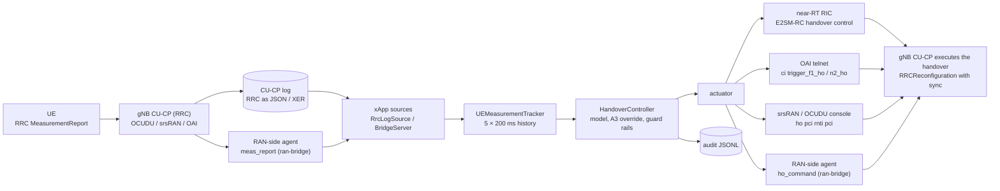
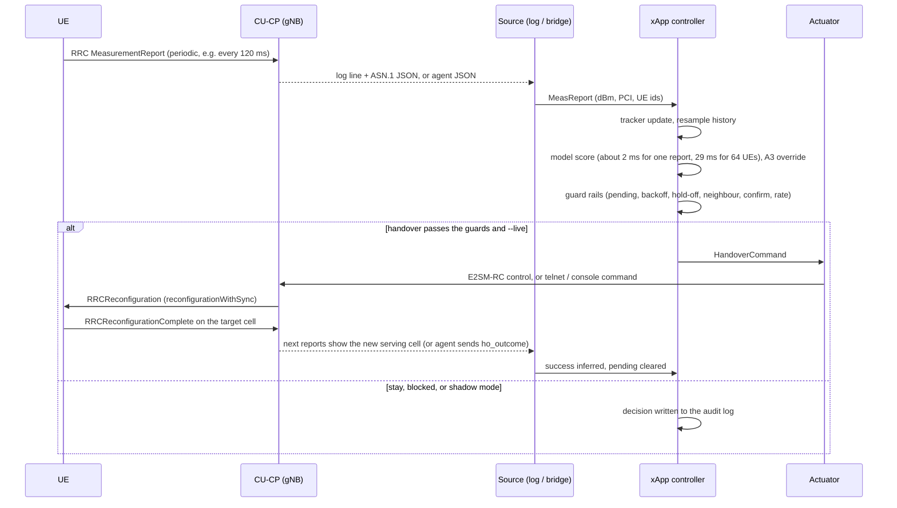
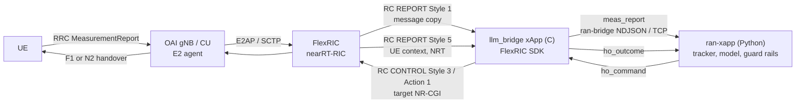
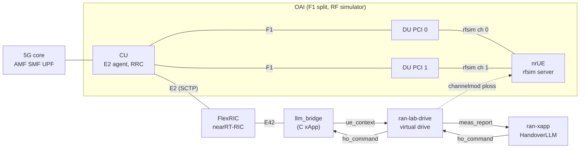

# Integrating HandoverLLM with a real RAN (OCUDU / srsRAN Project, OpenAirInterface, FlexRIC)

This guide explains how the HandoverLLM xApp connects to a live 5G RAN: which
messages it receives, how it parses them, how it decides, how it sends a
handover back, and the step-by-step setup for **OCUDU / srsRAN Project**,
**OpenAirInterface (OAI)** and the **FlexRIC** near-RT RIC (§9). Code lives in `ai_ran_llm/ran/` and `integrations/`.

> **Read first: what is verified.**
>
> * **Tested in this repository (CI, no radio):** the protocol, RRC parsing (JSON and XER),
>   the tracker, the controller and guard rails, every actuator against fake endpoints, and the
>   full network path against a simulator-backed fake gNB. With guard rails off, the network
>   path reproduces the offline benchmark **exactly**, with identical serving-cell trajectories.
> * **Based on upstream documentation and code (cited in §12):**
>   * OAI telnet commands `ci trigger_f1_ho` / `ci trigger_n2_ho` and OAI measurement config keys;
>   * srsRAN's E2SM-RC handover call `control_handover(...)` in its O-RAN SC RIC xApp framework;
>   * srsRAN / OCUDU mobility config keys and the `ho` console command;
>   * FlexRIC build and run steps, OAI's E2SM-RC support (message copy, On Demand, Handover
>     Control) and the behaviour of FlexRIC's `xapp_rc_handover` (§9).
> * **Designed but not implemented here:** the FlexRIC bridge xApp (§9.4).
> * **Not tested here:** a live OCUDU/srsRAN or OAI gNB with real UEs. Log header formats and some
>   config keys vary between versions. Run in **shadow mode** first and check with `ran-parse`
>   (§8).
> * **The model was trained in simulation.** Expect a domain gap on real radio. Retrain on your
>   own traces (`gen-data --from-drives`, README) before relying on it.

---

## 1. Architecture



Measurement paths (choose one or more):

| Path | Works with | RAN changes | Notes |
|---|---|---|---|
| **RRC log tail** (`--rrc-log`) | OCUDU / srsRAN (RRC JSON), OAI (asn1c XER dumps) | Logging config only | Quickest start; parses the real 3GPP MeasurementReport |
| **ran-bridge agent** (`--bridge`) | Anything | A small agent that emits JSON lines | Most flexible; see `integrations/bridge-agent/` |
| E2SM-RC REPORT Style 1 (message copy) | OAI + FlexRIC (§9); other E2 nodes that support it | A RIC xApp forwards reports to the bridge | Bridge xApp designed in §9.4, not in this repo; E2SM-KPM does not include per-UE neighbour RSRP |

Actuation paths:

| Actuator (`--actuator`) | RAN | Mechanism | Use |
|---|---|---|---|
| E2SM-RC (`integrations/oran-sc-ric`) | OCUDU / srsRAN (+ any E2SM-RC node) | RIC Control Request, Style 3 "Connected Mode Mobility", Action 1 "Handover Control", target NR-CGI | Production path |
| FlexRIC bridge xApp + `bridge` (§9) | OAI (+ any E2SM-RC node behind FlexRIC) | RC Control Style 3 / Action 1, target NR-CGI, sent by a small C xApp that speaks ran-bridge | E2 path for OAI |
| `command` | Any | Runs a command per handover (no shell), e.g. a script that takes the target from the command. FlexRIC's stock `xapp_rc_handover` does **not** fit: it picks its own target (§9.1) | Lab |
| `oai-telnet` | OAI | `ci trigger_f1_ho <cu-ue-id>` / `ci trigger_n2_ho <pci>,<rrc-ue-id>` | Lab |
| `console` | OCUDU / srsRAN | `ho <serving_pci> <rnti> <target_pci>` into the gnb console via a FIFO | Lab |
| `bridge` | Your agent | `ho_command` NDJSON | Custom RANs |
| `log` (default) | none | Logs only | Shadow mode |

---

## 2. Control loop



End-to-end latency budget: the model decides in milliseconds. The dominant delays are the
**reporting period** (120–240 ms) and the RAN's handover execution, both of which the xApp
does not control.

---

## 3. Messages and parsing

### 3.1 RRC MeasurementReport (3GPP TS 38.331)

What the UE sends and the CU-CP decodes. Only these fields are used:

```
MeasurementReport.criticalExtensions.measurementReport.measResults
  measId
  measResultServingMOList[]:  servCellId, measResultServingCell: MeasResultNR
  measResultNeighCells.measResultListNR[]: MeasResultNR
MeasResultNR: physCellId (optional for the serving cell),
              measResult.cellResults.resultsSSB-Cell { rsrp, rsrq, sinr }   (or resultsCSI-RS-Cell)
```

`ai_ran_llm.ran.rrc.parse_measurement_report()` finds `measResults` at any depth, so the
wrappers do not matter (`UL-DCCH-Message → message → c1 → measurementReport → …`). Supported
representations:

* **JSON**, as srsRAN/OCUDU CU-CP logs and `tshark -T json` print it;
* **XER**, asn1c's XML as used by OAI. Convert with `xer_to_dict`. SEQUENCE OF item wrappers
  such as `<MeasResultNR>` are handled.

Values are **report indices**, converted with the TS 38.133 mappings (lower bin edge):

| Quantity | Index n | Value | Range |
|---|---|---|---|
| SS-RSRP | 0..127 | `n − 157` dBm | −156 … −31 dBm (0 means < −156) |
| SS-RSRQ | 0..127 | `(n − 87) / 2` dB | −43 … 20 dB |
| SS-SINR | 0..127 | `(n − 47) / 2` dB | −23 … 40 dB |

In log files, `iter_asn1_blocks()` finds multi-line JSON objects (balanced braces) and
`<MeasurementReport>` / `<UL-DCCH-Message>` XER documents. Each block is paired with the
preceding log line (its **header**), from which the source extracts:

* **UE key:** `ue=<n>` → `ue_index`, `rnti=` / `c-rnti=` → `rnti` (`--id-regex KEY=REGEX` to change);
* **serving PCI when the report omits it:** `pci=<n>` (`--pci-regex`), or `--serv-cell-pci SERVCELLID=PCI`, or the last known value;
* **other identifiers from any other log line:** `--learn-id` with named groups, one of them
  named `ue`. For example, NGAP lines give `amf_ue_ngap_id` and F1AP lines give
  `gnb_cu_ue_f1ap_id`. These are what E2SM-RC control needs.

### 3.2 ran-bridge protocol (`ai-ran-llm/ran-bridge/1`)

NDJSON over TCP: one UTF-8 JSON object per line. The xApp listens (`--bridge HOST:PORT`,
default `127.0.0.1:7000`) and RAN-side agents connect. Commands for a UE go back on the
connection that last reported that UE.

**`hello`** (agent → xApp, optional): `{"type":"hello","node":"du-1","protocol":"ai-ran-llm/ran-bridge/1"}`

**`meas_report`** (agent → xApp):

```json
{"type": "meas_report", "ue_id": "du1/rnti=0x4601", "seq": 42, "timestamp_s": 1727600000.12,
 "serving": {"pci": 1, "nci": "0x66C000", "rsrp_dbm": -97.0, "sinr_db": 3.5},
 "neighbours": [{"pci": 2, "rsrp_dbm": -92.0}, {"pci": 3, "rsrp_dbm": -107.0, "rsrq_db": -13.5}],
 "ue_ids": {"rnti": 17921, "amf_ue_ngap_id": 5, "gnb_cu_ue_f1ap_id": 9, "cu_ue_id": 7},
 "speed_kmh": 60}
```

| Field | Req. | Meaning |
|---|---|---|
| `ue_id` | yes | Stable key for the UE, chosen by the agent |
| `serving`, `neighbours[]` | yes | Cells by `pci` and/or `nci` (int or `"0x…"` string); `rsrp_dbm` needed; `rsrq_db`, `sinr_db` optional |
| `timestamp_s` | recommended | Measurement time in seconds, any epoch but consistent. All guard timers use this clock |
| `ue_ids` | for actuation | Whatever the actuator needs: see §3.3 |
| `seq` | optional | Echoed in the `decision` |
| `speed_kmh` | optional | Defaults to 30 km/h in the model when missing |

**`ho_command`** (xApp → agent):

```json
{"type": "ho_command", "command_id": "7e3970fb5cea", "ue_id": "du1/rnti=0x4601",
 "ue_ids": {"rnti": 17921, "amf_ue_ngap_id": 5, "gnb_cu_ue_f1ap_id": 9},
 "source_cell": {"index": 0, "pci": 1, "nci": 6733824, "plmn": "00101", "gnb": "gnb-411", "e2_node_id": "gnbd_001_001_00019b_0"},
 "target_cell": {"index": 1, "pci": 2, "nci": 6733825, "plmn": "00101", "gnb": "gnb-411"},
 "confidence": 0.56, "rationale": "Hand over to cell 1 (PCI 2): ...", "decided_by": "llm",
 "issued_at": 1727600000.12, "dry_run": false}
```

**`ho_outcome`** (agent → xApp): `{"type":"ho_outcome","command_id":"7e3970fb5cea","ue_id":"…","status":"success","detail":""}`.
Status is one of `success`, `failure`, `rejected`, `timeout`. The outcome is optional: a
later report whose serving cell equals the target also counts as success, and no news within
`pending_timeout_s` counts as a timeout.

**`ue_release`** (agent → xApp): `{"type":"ue_release","ue_id":"…"}` drops the UE's state.

**`decision`** (xApp → agent, for every evaluated report):
`{"type":"decision","ue_id":"…","seq":42,"action":"HANDOVER|STAY|SKIP","reason":"llm|a3_fallback|a3_override|confirm|hold_off|pending|…","p_stay":…,"p_handover":{"1":0.56},"command_id":…}`.
Agents may ignore it; the fake gNB uses it for lockstep simulation.

**`error`** (xApp → agent): `{"type":"error","detail":"…"}` for a malformed line. The
connection stays open.

### 3.3 From HandoverCommand to a RAN action

| Actuator | Command fields used | Where they come from |
|---|---|---|
| E2SM-RC (`OranScRicActuator`) | `source_cell.e2_node_id`, `plmn`, `target_cell.nci`, `ue_ids.amf_ue_ngap_id`, `ue_ids.gnb_cu_ue_f1ap_id` | Cell map; `--learn-id` or the agent |
| `oai-telnet` F1 | `ue_ids.cu_ue_id` | OAI `nrRRC_stats.log` / agent |
| `oai-telnet` N2 | `target_cell.pci`, `ue_ids.rrc_ue_id` (or `cu_ue_id`) | Cell map; agent |
| `console` (srsRAN/OCUDU) | `source_cell.pci`, `ue_ids.rnti`, `target_cell.pci` | Report header (`rnti=`) |
| `command` | any of: `ue_id, rnti, rnti_hex, rnti_dec, serving_pci, target_pci, target_nci, target_nci_hex, plmn, e2_node_id, source_gnb, target_gnb`, every `ue_ids` key | |

---

## 4. Cell map (`--cells cells.json`)

The model knows cell **indices 0..63**; the RAN knows PCIs, NR cell ids, gNBs and E2 nodes. See
`integrations/ocudu/cells.example.json` and `integrations/oai/cells.example.json`:

```json
{"plmn": "00101", "cells": [
  {"index": 0, "pci": 1, "nci": "0x66C000", "gnb": "gnb-411", "e2_node_id": "gnbd_001_001_00019b_0", "neighbours": [1]},
  {"index": 1, "pci": 2, "nci": "0x66C001", "gnb": "gnb-411", "e2_node_id": "gnbd_001_001_00019b_0", "neighbours": [0]}]}
```

* Reports are resolved by NCI first, then PCI. PCIs must be unique within one map.
* `neighbours` is the neighbour relation table. With it, the controller only commands handovers
  to listed neighbours (`--no-neighbour-check` to disable).
* `gnb` decides F1 (same gNB) vs N2 (different gNB) for the OAI telnet actuator in `auto` mode.
* Unknown neighbour cells in reports are ignored and counted. An unknown **serving** cell skips
  the report. `--auto-add-cells` indexes unknown PCIs on the fly (lab only).

---

## 5. Measurement timing and the tracker

The model expects, per cell, 5 L3-filtered RSRP samples 200 ms apart (oldest first) plus
serving SINR and UE speed. Real RANs report at their own period and only list the strongest
neighbours. `UEMeasurementTracker` keeps a short time series per UE and cell and resamples it
by **sample-and-hold** at `t_last − 800, −600, −400, −200, 0 ms`. It left-pads cells seen for
less than 800 ms and drops neighbours not reported for 2 s.

Recommended RAN reporting:

* **Periodic reports every 120 ms (or 240 ms)** with RSRP (plus SINR if available) for serving
  and neighbours. Event-only reporting (A3) gives the model too few samples to see trends.
* **At least 4 neighbours per report** where the network has them (`maxReportCells`). With fewer
  neighbours, the input is padded, which the model has never seen in training.
* **Keep the RAN's own A3 handover as a backstop** with a conservative offset (e.g. 8 dB,
  TTT 480 ms). If the xApp is down, UEs still hand over.

---

## 6. Controller: decisions, safety and tuning

For each UE with enough data, the controller asks the model for P(stay) and P(handover to each
reported neighbour). It then:

1. **Threshold:** hand over to the best neighbour if its probability is at least `--ho-threshold`
   (0.35).
2. **Low-confidence fallback:** if the chosen action's probability is below `--min-confidence`
   (0.3), a conservative A3 rule decides.
3. **A3 override** (`--a3-override-db`, default 6 dB; negative disables): if the model says stay although a neighbour has beaten
   the serving cell by more than X dB in each of the last 3 samples, hand over anyway. This is a
   safety net for inputs outside the training distribution, where the model can be *confidently*
   wrong and the fallback does not trigger. In testing, a synthetic report with an 18 dB-stronger
   neighbour but an implausible +5 dB SINR got P(stay) = 0.998.
4. **Guard rails**, in order: `pending` (command in flight), `failure_backoff` (5 s after a
   failure), `hold_off` (`--hold-off-s` since the last handover, default 0), `not_neighbour` (NRT),
   `confirm` (`--confirm` identical recommendations in a row, default 1), `rate_limit`
   (`--max-commands-per-s`, network-wide).
5. **Shadow mode** is the default: decisions and would-be commands go to the audit log only.
   Add `--live` to actuate.

Audit log (`--audit ran_audit.jsonl`): one JSON line per decision, plus outcomes. It records
time, UE, action, reason, probabilities, target cell and the full command if one was issued.

**Measured trade-offs.** These come from the fake gNB over the full network path: the 5
benchmark drives, 64 UEs × 60 s each, the same drives as the README results.

| Setting | HO/UE/min | Ping-pong % | RLF/UE/min | HOF/UE/min | SE b/s/Hz | Outage % |
|---|---:|---:|---:|---:|---:|---:|
| A3 (2 dB, 300 ms), for reference | 10.36 | 13.2 | 0.016 | 1.22 | 2.919 | 3.76 |
| A: no guard rails, override off (= benchmark `evaluate`) | 13.34 | 21.4 | 0.006 | 0.53 | 2.969 | 1.92 |
| I: **defaults**: no guard rails, A3 override 6 dB | 13.35 | 21.4 | 0.003 | 0.53 | 2.969 | 1.92 |
| B: confirm 2 | 8.21 | 8.4 | 0.034 | 1.18 | 2.919 | 3.70 |
| C: hold-off 1 s | 10.95 | 10.0 | 0.341 | 0.76 | 2.926 | 3.56 |
| H: confirm 2, realistic reports (200 ms, 8 neighbours, RRC-quantised) | 6.21 | 4.2 | 0.263 | 1.45 | 2.869 | 5.46 |
| G: defaults, realistic reports (200 ms, 8 neighbours, RRC-quantised) | 11.03 | 16.4 | 0.016 | 0.85 | 2.944 | 2.79 |
| J: A3 override 8 dB instead of 6 dB | 13.35 | 21.4 | 0.003 | 0.53 | 2.969 | 1.92 |
| K: confirm 2 + A3 override 8 dB | 8.22 | 8.4 | 0.028 | 1.18 | 2.919 | 3.68 |
| D: confirm 2 + hold-off 1 s | 7.67 | 4.9 | 0.175 | 1.14 | 2.906 | 4.12 |
| F: confirm 2 + hold-off 1 s, realistic reports | 6.03 | 3.0 | 0.322 | 1.41 | 2.865 | 5.59 |

Reading:

* **The network path adds nothing.** A equals the offline benchmark exactly, and the 6 dB A3
  override (I) changes nothing measurable in-distribution. It only matters for inputs the model
  has never seen, so it is on by default.
* **Guard rails trade ping-pong for outage.** `--confirm 2` cuts ping-pong from 21 % to 8 %
  and handovers by 38 %, but doubles outage and HOF (it lands roughly on A3 at 2 dB, which it
  still matches or beats on every KPI except RLF). `--hold-off-s 1` is worse: RLF rises from
  0.006 to 0.34 per UE-minute because it blocks necessary second handovers. The defaults are
  therefore confirm 1 / hold-off 0. Use `--confirm 2` where signalling load or ping-pong
  matters more than throughput.
* **Realistic reporting costs little.** Reports every 200 ms with 8 neighbours and RRC
  quantisation (G vs I, H vs B, F vs D) cost 0.03–0.05 b/s/Hz and about 1–1.5 points of
  outage. With the defaults under realistic reporting (G), the model still beats A3 at
  2 dB and 3 dB on spectral efficiency, outage and HOF. It no longer beats aggressive A3 at
  1 dB on those (2.944 vs 2.959 b/s/Hz, 2.8 % vs 2.2 % outage), though A3 at 1 dB makes 62 %
  more handovers with 31 % ping-pong.
* **Combining guards** (D, F) gives the lowest ping-pong (3–5 %) at the highest RLF and outage.


---

## 7. OCUDU / srsRAN Project

OCUDU is the Linux Foundation continuation of srsRAN Project, with the same code base, so the
same steps apply to both. Key names below follow srsRAN's `configs/mobility.yml`; check them
against your version.

### 7.1 RAN configuration

Merge `integrations/ocudu/mobility.example.yml` into the CU-CP config:

* **Periodic report config (120 ms)** for serving and neighbour cells.
* **A3 backstop** at 8 dB / 480 ms, with `trigger_handover_from_measurements: true`.
* **`log.rrc_level: debug`**, so the CU-CP logs decoded RRC messages as JSON. Plus
  `ngap_level` / `f1ap_level: info` for the UE identifiers.
* **E2 agent enabled**, pointing at the near-RT RIC, for the E2 actuation path.

Make sure the cells can see each other: multi-cell setups need a shared reference clock, or
UEs never report the neighbour. srsRAN maintainers point this out for USRP labs.

### 7.2 Check the measurement input (no xApp yet)

```bash
python -m ai_ran_llm ran-parse /tmp/gnb.log --cells integrations/ocudu/cells.example.json \
    --learn-id 'ue=(?P<ue>\d+).*?amf_ue_id=(?P<amf_ue_ngap_id>\d+)' \
    --learn-id 'ue=(?P<ue>\d+).*?cu_ue_id=(?P<gnb_cu_ue_f1ap_id>\d+)'
```

This prints each MeasurementReport found as a `meas_report` line, the model cell index of every
cell (`?` means not in the cell map), and how many blocks were skipped. If reports are missing
or UE ids are empty, look at the header lines in your log and adjust `--id-regex`,
`--pci-regex` and `--learn-id`. Header formats differ between versions.

### 7.3 Run in shadow mode

```bash
python -m ai_ran_llm ran-xapp --cells integrations/ocudu/cells.example.json \
    --rrc-log /tmp/gnb.log --bridge off --audit ocudu_audit.jsonl \
    --learn-id 'ue=(?P<ue>\d+).*?amf_ue_id=(?P<amf_ue_ngap_id>\d+)' \
    --learn-id 'ue=(?P<ue>\d+).*?cu_ue_id=(?P<gnb_cu_ue_f1ap_id>\d+)'
```

Compare the audit log with what the CU-CP's A3 actually did: when the model would have acted,
how often, and to which cell.

### 7.4 Actuate

**Option A: E2SM-RC through srsRAN's O-RAN SC RIC** (`github.com/srsran/oran-sc-ric`).

* Quickest: the command actuator runs the repository's own example xApp for each handover.
  The arguments come from `simple_rc_ho_xapp.py`. This costs about a second per handover
  because the xApp starts each time.

  ```bash
  python -m ai_ran_llm ran-xapp ... --live --actuator command --command \
    "docker compose -f /path/to/oran-sc-ric/docker-compose.yml exec -T python_xapp_runner \
     ./simple_rc_ho_xapp.py --e2_node_id {e2_node_id} --plmn {plmn} \
     --amf_ue_ngap_id {amf_ue_ngap_id} --gnb_cu_ue_f1ap_id {gnb_cu_ue_f1ap_id} \
     --target_nr_cell_id {target_nci}"
  ```
* Proper: run `integrations/oran-sc-ric/handover_llm_xapp.py` inside the `python_xapp_runner`
  container (instructions in its docstring). It calls `e2sm_rc.control_handover(...)` directly,
  which is a RIC Control Request, E2SM-RC Style 3 / Action 1, with target NR-CGI = PLMN + NCI.

**Option B: gnb console (lab).** Start the gnb reading a FIFO, then point the actuator at it:

```bash
mkfifo /tmp/gnb_cmd; tail -f /tmp/gnb_cmd | sudo gnb -c gnb.yml
python -m ai_ran_llm ran-xapp ... --live --actuator console --console-fifo /tmp/gnb_cmd
# sends: ho <serving_pci> <rnti> <target_pci>   (check the RNTI format of your console; --console-template)
```

---

## 8. OpenAirInterface

### 8.1 Build and configure

```bash
./build_oai --ninja --gNB --nrUE --build-lib telnetsrv     # add --build-e2 for FlexRIC / E2
```

Add the neighbour list and measurement configuration to the CU/gNB config
(`integrations/oai/measurement.example.conf`: `Periodical.enable = 1`, and A3 with a high
offset as a backstop). Run with the telnet server:

```bash
./nr-softmodem -O cu.conf ... --telnetsrv --telnetsrv.shrmod ci --telnetsrv.listenaddr 127.0.0.1
```

### 8.2 Measurements

OAI decodes MeasurementReports with asn1c. Options:

* **Logs:** if your build prints decoded RRC messages as XER (asn1c debug output), the RRC log
  source reads them directly. Check with `ran-parse`. The OAI option that enables these dumps
  differs between versions.
* **Bridge agent (recommended):** in OAI's RRC MeasurementReport handling, send one
  `meas_report` JSON line per report to the xApp. The PCI and RSRP index per cell are already
  decoded there; convert with §3.1. Use `rrc_ue_id` as `ue_id` and put it and the CU UE id in
  `ue_ids`. `integrations/bridge-agent/example_agent.py` shows the protocol side.
* **E2 / FlexRIC:** OAI's E2 agent copies MeasurementReports to the RIC (E2SM-RC REPORT Style 1)
  and serves UE context and the neighbour relation table (Style 5). A FlexRIC bridge xApp
  forwards them to `ran-xapp` (§9).

### 8.3 Actuate

* **Telnet** (`--actuator oai-telnet --oai-telnet 127.0.0.1:9090`):
  * F1 handover (both cells under one CU): `ci trigger_f1_ho <cu-ue-id>`. OAI chooses the target
    DU itself, so this matches the model's choice only in a two-DU setup.
  * N2 handover (different gNBs): `ci trigger_n2_ho <target-pci>,<rrc-ue-id>`.
  * `--oai-mode auto` picks F1 or N2 from the cell map's `gnb` field. UE ids are listed in
    `nrRRC_stats.log` in the CU's working directory.
* **E2 via FlexRIC:** OAI + FlexRIC implement E2SM-RC Control Style 3 Handover Control. The
  example xApp `xapp_rc_handover` chooses its own target, so it cannot carry the model's
  decision. Use the bridge xApp of §9, which sends the model's target NR-CGI.

---

## 9. FlexRIC (OAI's near-RT RIC)

[FlexRIC](https://gitlab.eurecom.fr/mosaic5g/flexric) (EURECOM / Mosaic5G, mirrored at
`github.com/duranta-project/flexric`) is the near-RT RIC and xApp SDK that OAI's E2 agent is
developed against. This section shows how to put HandoverLLM behind it: measurements come in
over **E2SM-RC**, handovers go out as **E2SM-RC Handover Control**, and the model itself runs
unchanged in `ran-xapp`.

> **What is verified.** The FlexRIC and OAI facts below come from their documentation and
> example code (§12): OAI `openair2/E2AP/README.md` and `doc/handover-tutorial.md`, the FlexRIC
> README, `examples/xApp/c/rc_handover/xapp_rc_handover.c`, and the OAI merge request that added
> RC "On Demand" and "Handover Control". The E2 behaviour the bridge relies on was checked
> against OAI's E2 agent source (`openair2/E2AP/RAN_FUNCTION/O-RAN/ran_func_rc.c`).
>
> * **Built and tested offline:** the bridge xApp (`integrations/flexric/llm_bridge`, §9.4). It
>   compiles against FlexRIC `d7a71285` (the commit OAI pins) and passes its C tests.
> * **Tested against the real `ran-xapp`:** the lab drive (§9.7).
> * **Not yet run end to end:** the Docker testbed (§9.7) was written and its images built on a
>   machine without SCTP. Run `./run.sh` on a host with SCTP.

### 9.1 What FlexRIC and OAI provide

| Piece | What it is | Used for |
|---|---|---|
| `nearRT-RIC` | The RIC: terminates E2 (SCTP) from E2 nodes and serves xApps | Always |
| OAI E2 agent (`--build-e2`) | E2 node inside the OAI gNB / CU / DU | Always |
| **E2SM-RC v1.03** in OAI | REPORT Style 1 "Message copy" (the copied RRC messages include **MeasurementReport**; the copy itself carries no UE ID, §9.4), Style 4 (RRC state change), Style 5 "On Demand" (UE context, **neighbour relation table**); CONTROL Style 1 (QoS/DRB), **Style 3 "Connected Mode Mobility", Action 1 "Handover Control"** | Measurements in, handovers out |
| E2SM-KPM v2.03 / v3.00 | Cell and UE KPIs | Monitoring only: KPM does not carry per-UE neighbour RSRP |
| MAC / RLC / PDCP / GTP SMs | FlexRIC's own statistics models | Optional context |
| `xapp_rc_moni`, `xapp_kpm_moni` | Example monitoring xApps | Checking the setup |
| `xapp_rc_handover` | Example handover xApp | Checking that handover control works |

Three facts decide the design:

1. **Handover execution.** On an RC Handover Control request, OAI triggers an **F1** handover if
   the target is a cell of the same CU and an **N2** handover if it is a neighbour gNB. Xn is not
   used (upstream notes `xn_x2_established` as hard-coded false).
2. **UE identity.** The control message must carry the E2SM UE ID the E2 node reported:
   `GNB_UE_ID_E2SM` with `ran_ue_id` = the CU's RRC UE id (OAI `ran_func_rc.c` rejects anything
   else). The bridge stores it per UE from the Style 5 report.
3. **The stock `xapp_rc_handover` chooses its own target.** It subscribes to RC Style 5 once,
   takes the first UE, and hands it to the first DU that is not serving it (or the first
   neighbour NR-CGI), then exits. It has no argument for a target cell. It cannot carry the
   model's decision, so **`--actuator command` with `xapp_rc_handover` does not work**. Use it
   only to prove that E2 handover control works in your lab, then use the bridge xApp below.

### 9.2 Architecture



Why two processes:

* The model, tracker, controller, guard rails and audit log stay in Python, unchanged and tested.
  `ran-xapp --actuator bridge` already does everything above the E2 boundary.
* The E2 side needs the RC encoding and FlexRIC's C API. At the time of writing, FlexRIC's Python
  (SWIG) examples cover MAC/RLC/PDCP/GTP monitoring and slicing, and the RC examples are in C.
  A thin C xApp is the shortest path: `integrations/flexric/llm_bridge` (§9.4).
* The bridge protocol is already the contract for custom RANs (§3.2). The same Python process
  can serve several bridge xApps or RICs.

### 9.3 Build and run

The quickest way to run everything is the Docker testbed of §9.7. For your own OAI deployment:

**1. Dependencies.** FlexRIC's README asks for gcc-13 (gcc-11 is not supported); its own
Dockerfile builds with gcc-12. It also needs asn1c from the `mouse07410` fork.

```bash
sudo apt install -y gcc-13 g++-13 libsctp-dev cmake ninja-build libpcre2-dev bison flex autoconf automake libtool
git clone https://github.com/mouse07410/asn1c && cd asn1c && git checkout 940dd5fa9f3917913fd487b13dfddfacd0ded06e \
  && autoreconf -iv && ./configure --prefix /opt/asn1c && make -j && sudo make install && export PATH=/opt/asn1c/bin:$PATH
```

**2. FlexRIC + `llm_bridge`**, at the FlexRIC commit your OAI tree pins
(`git -C openairinterface5g ls-tree HEAD openair2/E2AP/flexric`) and with the **same E2AP and
KPM versions** as OAI (a mismatch fails at E2 Setup). OAI's Docker images use `E2AP_V3` and
`KPM_V3_00`.

```bash
git clone https://github.com/duranta-project/flexric && cd flexric && git checkout <pinned commit>
cp -r <this repo>/integrations/flexric/llm_bridge examples/xApp/c/llm_bridge
echo "add_subdirectory(llm_bridge)" >> examples/xApp/c/CMakeLists.txt
mkdir build && cd build && cmake -GNinja -DE2AP_VERSION=E2AP_V3 -DKPM_VERSION=KPM_V3_00 .. && ninja && sudo ninja install
./examples/xApp/c/llm_bridge/llm_bridge_test         # offline checks, no RIC needed
```

**3. OAI with the E2 agent** (the published `oaisoftwarealliance/oai-gnb` images already have it):

```bash
./build_oai --ninja --gNB --nrUE --build-lib telnetsrv --build-e2 \
    --cmake-opt -DE2AP_VERSION=E2AP_V3 --cmake-opt -DKPM_VERSION=KPM_V3_00
```

Add the E2 agent to the **CU** / gNB config (`integrations/flexric/e2_agent.example.conf`),
together with the neighbour list and periodic measurement configuration from
`integrations/oai/measurement.example.conf`:

```
e2_agent = {
  near_ric_ip_addr = "127.0.0.1";
  sm_dir = "/usr/local/lib/flexric/";
}
```

**4. Check each layer before adding the model:**

```bash
./build/examples/ric/nearRT-RIC                                   # terminal 1 (FlexRIC build dir)
./nr-softmodem -O cu.conf ...                                     # terminal 2: gNB/CU (+ DUs), E2 Setup must succeed
XAPP_DURATION=20 ./build/examples/xApp/c/monitor/xapp_rc_moni     # RC indications arrive
XAPP_DURATION=20 ./build/examples/xApp/c/rc_handover/xapp_rc_handover   # 2-DU lab: one handover happens
```

**5. Run HandoverLLM behind FlexRIC**, in shadow mode first:

```bash
python -m ai_ran_llm ran-xapp --cells integrations/flexric/cells.example.json \
    --bridge 127.0.0.1:7000 --actuator bridge            # shadow mode: decisions only
LLM_BRIDGE_XAPP=127.0.0.1:7000 ./build/examples/xApp/c/llm_bridge/llm_bridge   # reads FlexRIC's flexric.conf
# after checking the audit log (§11): add --live to ran-xapp
```

In shadow mode `ran-xapp` still sends every `decision` to the bridge but no `ho_command`, so the
RAN's own A3 (kept as a backstop, §8.1) makes all handovers. With OAI's software UE, which
sends no MeasurementReports, put `ran-lab-drive` between the two (§9.7).

The Python side was also checked with `integrations/flexric/cells.example.json` and a test
client standing in for `llm_bridge`:

* in shadow mode, the client gets `decision`s whose `target_cell` carries `pci`, `nci`, `plmn`
  and `e2_node_id`;
* with `--live`, it gets `ho_command`s with the `ue_ids` it sent unchanged, and
  `target_cell.nci` as an **integer**.

### 9.4 The bridge xApp (`llm_bridge`)

`integrations/flexric/llm_bridge/llm_bridge.c` (about 550 lines of C on the FlexRIC SDK) builds
inside a FlexRIC tree as `examples/xApp/c/llm_bridge`. It is derived from FlexRIC's
`xapp_rc_handover.c` (Handover Control encoding) and `xapp_rc_moni.c` (RRC message copy, NR RRC
decoding). What it does was checked against OAI's E2 agent (`ran_func_rc.c`):

| Direction | E2 | ran-bridge |
|---|---|---|
| UE context | RC REPORT **Style 5** "On Demand", UE Context Information. OAI answers each subscription once, immediately, with every UE (`GNB_UE_ID_E2SM`, `ran_ue_id` = RRC UE id) and its PCell NR-CGI. The bridge polls by re-subscribing every `LLM_BRIDGE_POLL_MS` (500 ms) | `ue_context` per UE, `ue_release` when a UE disappears |
| Measurements | RC REPORT **Style 1** "Message copy", UL-DCCH `measurementReport` (event condition 2). Decoded with FlexRIC's NR RRC ASN.1 library; SSB RSRP / RSRQ / SINR indices converted with TS 38.133 (§3.1) | `meas_report` (`source: "e2-msg-copy"`), serving NCI from the UE context |
| Handover | RC CONTROL **Style 3 / Action 1** Handover Control: the stored `GNB_UE_ID_E2SM` + Target Primary Cell ID = NR-CGI(`plmn`, `nci`) from the command. OAI runs **F1** if the target is one of the CU's cells, **N2** if it is a configured neighbour | from `ho_command`; `ho_outcome` `failure` / `rejected` if refused. Success is inferred from the next `ue_context` / report on the target cell |

Messages it sends (from the offline test, `llm_bridge_test`):

```json
{"type":"ue_context","ue_id":"rrc_ue_id=1@208-99/3584","timestamp_s":768.880,
 "ue_ids":{"ran_ue_id":1,"amf_ue_ngap_id":7,"e2_node":"208-99/3584"},"serving":{"nci":12345678,"plmn":"20899"}}
{"type":"meas_report","ue_id":"rrc_ue_id=1@208-99/3584","timestamp_s":768.890,"ue_ids":{"ran_ue_id":1,"e2_node":"208-99/3584"},
 "source":"e2-msg-copy","serving":{"pci":0,"nci":12345678,"rsrp_dbm":-97,"rsrq_db":-8.5,"sinr_db":-3.5},
 "neighbours":[{"pci":1,"rsrp_dbm":-91,"rsrq_db":-6.0,"sinr_db":1.5}]}
```

Details and limits:

* **UE attribution of copied reports.** OAI's message-copy indication carries **only the RRC
  message**, with no UE ID (`fill_rrc_msg_copy`). The bridge attributes a copied
  MeasurementReport only when exactly one UE is on that E2 node, and drops it otherwise (logged).
  Several UEs per CU need an OAI change that adds the UE ID to the indication.
* **Which nodes.** Only CU / gNB / CU-CP nodes that advertise RC Handover Control and the On Demand
  report are used, because the CU owns UE contexts and handovers. Nodes are named
  `MCC-MNC/nb_id` (e.g. `208-99/3584`); put that string in `cells.json` as `e2_node_id`.
* **Clock.** `timestamp_s` is the bridge's monotonic clock: all guard timers use it (§6).
* **Configuration.** `LLM_BRIDGE_XAPP=host:port` (default `127.0.0.1:7001`, the lab drive),
  `LLM_BRIDGE_POLL_MS`; FlexRIC's own options (`-c flexric.conf`) as for any FlexRIC xApp.
* **Tests.** `llm_bridge_test` runs without a RIC. It checks:
  * Style 5 → `ue_context`;
  * a UPER-encoded MeasurementReport → `meas_report` with the TS 38.133 conversions;
  * a real `ho_command` line → the Handover Control message, with the NR-CGI bytes checked
    against OAI's decoder;
  * dropping of unattributable reports, and `ue_release`.

  The Docker build (§9.7) runs it, and its JSON parses with the Python protocol classes.
* **Status.** Compiled and tested offline against FlexRIC `d7a71285`, the commit OAI pins. It
  has not yet run against a live nearRT-RIC: the machine used for development has no SCTP.
  `./run.sh` in §9.7 is the end-to-end test.

### 9.5 Other combinations

* **Measurements from FlexRIC, actuation over telnet:** the bridge xApp sends only
  `meas_report`s, and `ran-xapp --actuator oai-telnet` actuates (§8.3). This helps while RC
  control is not yet working in your build. Note that F1 `trigger_f1_ho` picks the target DU
  itself.
* **Measurements from logs, actuation through FlexRIC:** `ran-xapp --rrc-log` (OAI XER dumps,
  §8.2) with the bridge xApp handling only `ho_command`s.
* **No radio:** `fake-gnb` (§10) tests `ran-xapp` over the bridge. FlexRIC's emulated agents
  (`emu_agent_gnb`, `emu_agent_gnb_cu`, `emu_agent_gnb_du`) test the RIC side of the bridge xApp.
  Check whether your FlexRIC version's emulators implement RC Style 1 / Style 3.
* **KPM only:** not enough. E2SM-KPM reports cell and UE KPIs, not per-UE neighbour RSRP.

### 9.6 Troubleshooting

| Symptom | Likely cause |
|---|---|
| E2 Setup fails, or the RIC rejects the node | OAI and FlexRIC built with different `E2AP_VERSION` / `KPM_VERSION`; `sm_dir` not pointing at the installed service models |
| FlexRIC does not compile | gcc 11 or older (FlexRIC's Dockerfile uses gcc-12; README recommends 13); asn1c not the `mouse07410` fork |
| RC subscription accepted but no Style 1 indications | UE sends no MeasurementReports: enable periodic reporting and configure the neighbours (§8.1) |
| Control sent, no handover, no error | Wrong UE ID type (echo the one from the indication); target NR-CGI unknown to the gNB (check the NRT from Style 5 and the neighbour list); target not a CU cell or configured neighbour |
| Handover goes over N2 where F1 was expected | The target is not a cell of the same CU. OAI chooses F1 or N2 from that |
| `SKIP unknown_serving_cell` in `ran-xapp` | Serving PCI/NCI in the `meas_report` not in `cells.json`. OAI configs give `nr_cellid` in **decimal** (`12345678L`) |
| `llm_bridge`: "MeasurementReport not attributable" | More than one UE on the CU: OAI's message copy has no UE ID (§9.4) |
| `llm_bridge`: "no E2 node with RC Handover Control" | The xApp started before the CU's E2 Setup, or the E2 agent sits on the DU only: it must run on the CU |
| No reports at all with OAI's nrUE | Expected: `nr-uesoftmodem` sends no MeasurementReports. Use `ran-lab-drive` (§9.7) |

### 9.7 End-to-end testbed: OAI + FlexRIC + HandoverLLM in Docker

`integrations/flexric/testbed/` runs the whole chain on one Linux host with Docker:



* **The OAI part** is OAI's own F1 RF-simulator CI deployment
  (`ci-scripts/yaml_files/5g_f1_rfsimulator`): mini 5G core, one CU, two DUs (PCI 0 / NR cell
  12345678 and PCI 1 / NR cell 11111111), one nrUE. The published `oaisoftwarealliance/oai-gnb`
  and `oai-nr-ue` images are used (tag `2026.w39` by default; `OAI_TAG` to change). The configs
  come from OAI at a pinned commit (`fetch_oai_conf.sh`), and the CU config gets an `e2_agent`
  section.
* **Local images:**
  * `llm-lab/flexric`: nearRT-RIC, `llm_bridge` and FlexRIC's example xApps, built from FlexRIC
    `d7a71285` with E2AP v3 / KPM v3.00, like OAI's images. The build runs `llm_bridge_test`.
  * `llm-lab/ai-ran-llm`: `ran-xapp` and `ran-lab-drive` with the shipped model.
* **Why a lab drive.** OAI's software UE sends no MeasurementReports ("measurement reporting ...
  not completed at the UE", OAI `doc/handover-tutorial.md`). `ran-lab-drive` sits between
  `llm_bridge` and `ran-xapp`:
  * It moves a virtual UE back and forth along the line through the two cell sites (500 m apart,
    30 km/h by default) and computes RSRP / SINR per cell with the simulator's channel model.
  * It sends `meas_report`s for the **real** UE: its E2 identity and its **real serving cell**,
    both from `llm_bridge`'s `ue_context`.
  * It sets each DU's RF-simulator path loss on the nrUE to match (`channelmod modify <n> ploss
    <dB>` over the UE's telnet; 20 dB at −80 dBm, capped at `PLOSS_MAX_DB`, default 45). A late
    handover therefore degrades the real link.

  `--synthetic auto` stops synthesising for a UE as soon as real reports arrive, so the same relay
  also works with a UE that reports.
* **What is real:**
  * the E2 path (E2 Setup, RC subscriptions, RC CONTROL);
  * the handover itself: the CU runs an F1 handover to the target DU;
  * the serving-cell feedback over E2.

  Only the radio measurements are synthetic.

Run it on a Linux host with SCTP, Docker and Compose v2. It needs about 8 GB of RAM and 20 GB of
disk; the first build takes about 15 minutes.

```bash
sudo modprobe sctp
cd integrations/flexric/testbed
./run.sh all            # fetch configs, build, start in OAI's order (CU, UE, DU0, DU1), drive 240 s, check
./run.sh logs           # while it runs: bridge, lab drive, CU handover lines
./run.sh down
# variants: DURATION_S=600 SPEED_KMH=60 ./run.sh all;  LIVE= ./run.sh all (shadow mode);  PLOSS_MAX_DB=60 (harsh)
```

`./run.sh test` checks every hop and prints the handover timeline (logs in `testbed/out/`):

| Check | Evidence |
|---|---|
| CU connected to FlexRIC | nearRT-RIC log `E2 SETUP-REQUEST rx` |
| Bridge found the CU and the UE | `llm_bridge` log `using E2 node`, `UE ... attached` |
| Model saw reports and decided | lab drive summary: synthetic reports, `ho_commands` ≥ 1 |
| Handover Control sent and accepted | `llm_bridge` `Handover Control ...`; RIC `CONTROL ACKNOWLEDGE rx` |
| CU executed an F1 handover | CU log `RC Control: F1 Handover Control for UE`, then `Handover: trigger release on cell PCI` |
| UE seen on the new cell over E2 | lab drive `handovers_executed` ≥ 1 |
| UE still attached | `oaitun_ue1` has an IP |

**Status.** Written and statically checked on a machine without kernel SCTP:

* `docker compose config` passes;
* the images build;
* `llm_bridge_test` passes inside the image;
* the lab drive passes its tests against the real `ran-xapp`.

It has **not yet been run end to end**. The start order and the channel mapping follow OAI's CI.
Expect to adjust timings on a slow host.

## 10. Testing without a RAN

```bash
# terminal 1: the xApp, live, actuating over the bridge
python -m ai_ran_llm ran-xapp --cells sim --actuator bridge --live
# terminal 2: a simulated gNB (19 cells, 16 UEs, 60 s) speaking the protocol
python -m ai_ran_llm fake-gnb --ues 16 --steps 600 [--realistic]
# or a single synthetic UE through the example agent
python integrations/bridge-agent/example_agent.py --demo
```

`fake-gnb` prints the same KPIs as `evaluate`. `--realistic` uses 200 ms reports, 8 neighbours
and RRC-quantised values.

---

## 11. Rollout checklist and troubleshooting

1. `ran-parse` shows reports for every UE with all needed `ue_ids`, and every cell resolves in
   the cell map.
2. Shadow mode for days. Compare the audit log with the RAN's own handovers and KPIs.
3. Retrain on your traces (`export-raw`-style drives from your logs, then `gen-data --from-drives`).
4. `--live` on a few cells, with the A3 backstop and monitoring of HO success, RLF and
   ping-pong. Add `--confirm 2` if ping-pong or signalling load is the concern (§6).
5. Roll back by stopping the xApp. The RAN's A3 backstop keeps handovers working.

| Symptom | Likely cause |
|---|---|
| `SKIP unknown_serving_cell` | Serving PCI/NCI not in the cell map, or the report lacks the serving PCI (`--pci-regex`, `--serv-cell-pci`) |
| `SKIP not_enough_measurements` | No neighbour reported yet (neighbour cells not configured or not heard) |
| Never hands over, P(stay) ≈ 1 with strong neighbours | Out-of-distribution input (single neighbour, SINR inconsistent with RSRP): enable `--a3-override-db`, report ≥ 4 neighbours, retrain on real data |
| `actuation failed: E2SM-RC handover needs [...]` | Missing ids: add `--learn-id` patterns or put them in agent reports |
| Many `superseded_in_batch` | Reports for the same UE arrive faster than they are processed; harmless (the latest wins) |
| OAI F1 handover goes to the wrong cell | `trigger_f1_ho` picks the target DU itself; use N2 or E2 for more than two DUs |

---

## 12. References

* OAI handover tutorial: `doc/handover-tutorial.md` in openairinterface5g (F1/N2 handover, telnet
  `ci trigger_f1_ho`, `ci trigger_n2_ho <pci>,<rrc-ue-id>`, `nr_measurement_configuration`,
  `nrRRC_stats.log`, FlexRIC `xapp_rc_handover`).
* OAI E2 agent: E2SM-RC "On Demand" report and "Handover Control" (RC v1.03) merge request in the
  OAI repository (F1 or N2 handover depending on the target; UE ID echoed from the indication;
  Xn not used).
* OAI `openair2/E2AP/README.md`: build with `--build-e2`, `E2AP_VERSION` / `KPM_VERSION`, the
  `e2_agent` config block, E2SM-RC styles (REPORT 1 message copy incl. MeasurementReport, 4, 5;
  CONTROL 1, 3), example xApps.
* FlexRIC: `gitlab.eurecom.fr/mosaic5g/flexric` (mirror `github.com/duranta-project/flexric`),
  README (gcc-13, build options, install paths, nearRT-RIC, emulated agents, example xApps) and
  `examples/xApp/c/rc_handover/xapp_rc_handover.c` (RC Style 5 subscription, target selection,
  `gen_handover_ctrl`, `fill_target_primary_cell_id`).
* srsRAN `oran-sc-ric`: `xApps/python/simple_rc_ho_xapp.py` and `lib/e2sm_rc_module.py`
  (`control_handover` = `send_control_request_style_3_action_1`, target NR-CGI).
* srsRAN Project `configs/mobility.yml` (report_configs, A3, periodical, ncells) and the gNB
  handover tutorial (`ho` console command).
* OCUDU: `ocudu.org` and `docs.ocudu.org`. The continuation of srsRAN Project under the Linux
  Foundation (26.04 release: Xn and conditional handover, E2).
* 3GPP TS 38.331 (MeasurementReport, MeasResults, ReportInterval), TS 38.133 §10.1
  (RSRP/RSRQ/SINR report mapping).
* O-RAN WG3 E2SM-RC (Control Style 3 "Connected Mode Mobility", Action 1 "Handover Control").
