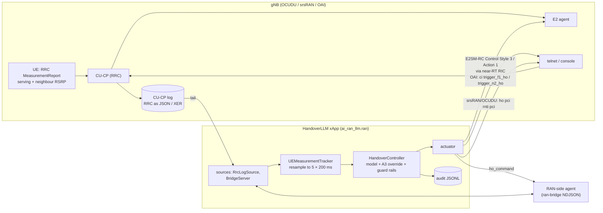
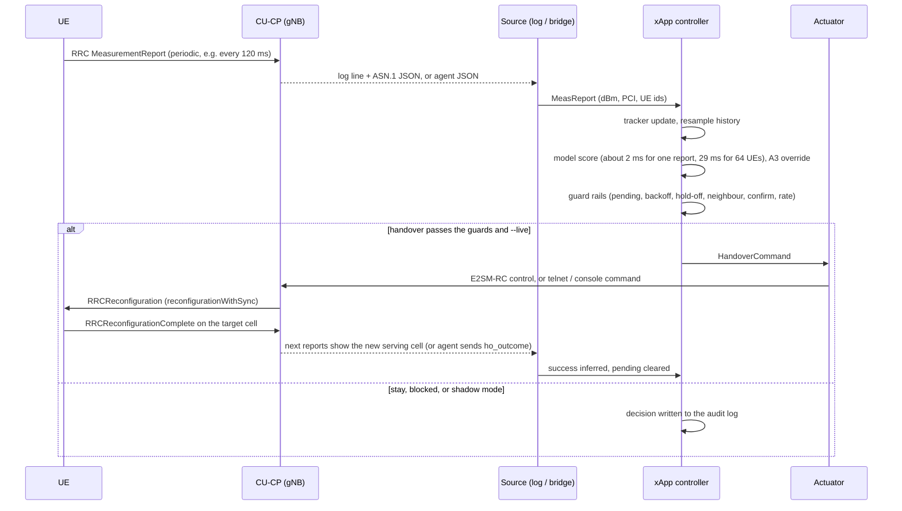

# Integrating HandoverLLM with a real RAN (OCUDU / srsRAN Project, OpenAirInterface)

This guide explains how the HandoverLLM xApp connects to a live 5G RAN: which
messages it receives, how it parses them, how it decides, how it sends a
handover back, and the step-by-step setup for **OCUDU / srsRAN Project** and
**OpenAirInterface (OAI)**. Code lives in `ai_ran_llm/ran/` and `integrations/`.

> **Read first: what is verified.**
>
> * **Tested in this repository (CI, no radio):** the protocol, RRC parsing (JSON and XER),
>   the tracker, the controller and guard rails, every actuator against fake endpoints, and the
>   full network path against a simulator-backed fake gNB. With guard rails off, the network
>   path reproduces the offline benchmark **exactly**, with identical serving-cell trajectories.
> * **Based on upstream documentation and code (cited in §11):**
>   * OAI telnet commands `ci trigger_f1_ho` / `ci trigger_n2_ho` and OAI measurement config keys;
>   * srsRAN's E2SM-RC handover call `control_handover(...)` in its O-RAN SC RIC xApp framework;
>   * srsRAN / OCUDU mobility config keys and the `ho` console command.
> * **Not tested here:** a live OCUDU/srsRAN or OAI gNB with real UEs. Log header formats and some
>   config keys vary between versions. Run in **shadow mode** first and check with `ran-parse`
>   (§8).
> * **The model was trained in simulation.** Expect a domain gap on real radio. Retrain on your
>   own traces (`gen-data --from-drives`, README) before relying on it.

---

## 1. Architecture



Measurement paths (choose one or more):

| Path | Works with | RAN changes | Notes |
|---|---|---|---|
| **RRC log tail** (`--rrc-log`) | OCUDU / srsRAN (RRC JSON), OAI (asn1c XER dumps) | Logging config only | Quickest start; parses the real 3GPP MeasurementReport |
| **ran-bridge agent** (`--bridge`) | Anything | A small agent that emits JSON lines | Most flexible; see `integrations/bridge-agent/` |
| E2SM-RC REPORT (message copy) | E2 nodes that support it | RIC xApp forwards reports to the bridge | Not built in; standard E2SM-KPM measurements do not include per-UE neighbour RSRP |

Actuation paths:

| Actuator (`--actuator`) | RAN | Mechanism | Use |
|---|---|---|---|
| E2SM-RC (`integrations/oran-sc-ric`) | OCUDU / srsRAN (+ any E2SM-RC node) | RIC Control Request, Style 3 "Connected Mode Mobility", Action 1 "Handover Control", target NR-CGI | Production path |
| `command` | Any | Runs a command per handover (no shell); e.g. srsRAN's `simple_rc_ho_xapp.py` or FlexRIC's `xapp_rc_handover` | Lab E2 without writing an xApp |
| `oai-telnet` | OAI | `ci trigger_f1_ho <cu-ue-id>` / `ci trigger_n2_ho <pci>,<rrc-ue-id>` | Lab |
| `console` | OCUDU / srsRAN | `ho <serving_pci> <rnti> <target_pci>` into the gnb console via a FIFO | Lab |
| `bridge` | Your agent | `ho_command` NDJSON | Custom RANs |
| `log` (default) | none | Logs only | Shadow mode |

---

## 2. Control loop



End-to-end latency budget: the model decides in milliseconds. The dominant delays are the
**reporting period** (120–240 ms) and the RAN's handover execution, both of which the xApp
does not control.

---

## 3. Messages and parsing

### 3.1 RRC MeasurementReport (3GPP TS 38.331)

What the UE sends and the CU-CP decodes. Only these fields are used:

```
MeasurementReport.criticalExtensions.measurementReport.measResults
  measId
  measResultServingMOList[]:  servCellId, measResultServingCell: MeasResultNR
  measResultNeighCells.measResultListNR[]: MeasResultNR
MeasResultNR: physCellId (optional for the serving cell),
              measResult.cellResults.resultsSSB-Cell { rsrp, rsrq, sinr }   (or resultsCSI-RS-Cell)
```

`ai_ran_llm.ran.rrc.parse_measurement_report()` finds `measResults` at any depth, so the
wrappers do not matter (`UL-DCCH-Message → message → c1 → measurementReport → …`). Supported
representations:

* **JSON**, as srsRAN/OCUDU CU-CP logs and `tshark -T json` print it;
* **XER**, asn1c's XML as used by OAI. Convert with `xer_to_dict`. SEQUENCE OF item wrappers
  such as `<MeasResultNR>` are handled.

Values are **report indices**, converted with the TS 38.133 mappings (lower bin edge):

| Quantity | Index n | Value | Range |
|---|---|---|---|
| SS-RSRP | 0..127 | `n − 157` dBm | −156 … −31 dBm (0 means < −156) |
| SS-RSRQ | 0..127 | `(n − 87) / 2` dB | −43 … 20 dB |
| SS-SINR | 0..127 | `(n − 47) / 2` dB | −23 … 40 dB |

In log files, `iter_asn1_blocks()` finds multi-line JSON objects (balanced braces) and
`<MeasurementReport>` / `<UL-DCCH-Message>` XER documents. Each block is paired with the
preceding log line (its **header**), from which the source extracts:

* **UE key:** `ue=<n>` → `ue_index`, `rnti=` / `c-rnti=` → `rnti` (`--id-regex KEY=REGEX` to change);
* **serving PCI when the report omits it:** `pci=<n>` (`--pci-regex`), or `--serv-cell-pci SERVCELLID=PCI`, or the last known value;
* **other identifiers from any other log line:** `--learn-id` with named groups, one of them
  named `ue`. For example, NGAP lines give `amf_ue_ngap_id` and F1AP lines give
  `gnb_cu_ue_f1ap_id`. These are what E2SM-RC control needs.

### 3.2 ran-bridge protocol (`ai-ran-llm/ran-bridge/1`)

NDJSON over TCP: one UTF-8 JSON object per line. The xApp listens (`--bridge HOST:PORT`,
default `127.0.0.1:7000`) and RAN-side agents connect. Commands for a UE go back on the
connection that last reported that UE.

**`hello`** (agent → xApp, optional): `{"type":"hello","node":"du-1","protocol":"ai-ran-llm/ran-bridge/1"}`

**`meas_report`** (agent → xApp):

```json
{"type": "meas_report", "ue_id": "du1/rnti=0x4601", "seq": 42, "timestamp_s": 1727600000.12,
 "serving": {"pci": 1, "nci": "0x66C000", "rsrp_dbm": -97.0, "sinr_db": 3.5},
 "neighbours": [{"pci": 2, "rsrp_dbm": -92.0}, {"pci": 3, "rsrp_dbm": -107.0, "rsrq_db": -13.5}],
 "ue_ids": {"rnti": 17921, "amf_ue_ngap_id": 5, "gnb_cu_ue_f1ap_id": 9, "cu_ue_id": 7},
 "speed_kmh": 60}
```

| Field | Req. | Meaning |
|---|---|---|
| `ue_id` | yes | Stable key for the UE, chosen by the agent |
| `serving`, `neighbours[]` | yes | Cells by `pci` and/or `nci` (int or `"0x…"` string); `rsrp_dbm` needed; `rsrq_db`, `sinr_db` optional |
| `timestamp_s` | recommended | Measurement time in seconds, any epoch but consistent. All guard timers use this clock |
| `ue_ids` | for actuation | Whatever the actuator needs: see §3.3 |
| `seq` | optional | Echoed in the `decision` |
| `speed_kmh` | optional | Defaults to 30 km/h in the model when missing |

**`ho_command`** (xApp → agent):

```json
{"type": "ho_command", "command_id": "7e3970fb5cea", "ue_id": "du1/rnti=0x4601",
 "ue_ids": {"rnti": 17921, "amf_ue_ngap_id": 5, "gnb_cu_ue_f1ap_id": 9},
 "source_cell": {"index": 0, "pci": 1, "nci": 6733824, "plmn": "00101", "gnb": "gnb-411", "e2_node_id": "gnbd_001_001_00019b_0"},
 "target_cell": {"index": 1, "pci": 2, "nci": 6733825, "plmn": "00101", "gnb": "gnb-411"},
 "confidence": 0.56, "rationale": "Hand over to cell 1 (PCI 2): ...", "decided_by": "llm",
 "issued_at": 1727600000.12, "dry_run": false}
```

**`ho_outcome`** (agent → xApp): `{"type":"ho_outcome","command_id":"7e3970fb5cea","ue_id":"…","status":"success","detail":""}`.
Status is one of `success`, `failure`, `rejected`, `timeout`. The outcome is optional: a
later report whose serving cell equals the target also counts as success, and no news within
`pending_timeout_s` counts as a timeout.

**`ue_release`** (agent → xApp): `{"type":"ue_release","ue_id":"…"}` drops the UE's state.

**`decision`** (xApp → agent, for every evaluated report):
`{"type":"decision","ue_id":"…","seq":42,"action":"HANDOVER|STAY|SKIP","reason":"llm|a3_fallback|a3_override|confirm|hold_off|pending|…","p_stay":…,"p_handover":{"1":0.56},"command_id":…}`.
Agents may ignore it; the fake gNB uses it for lockstep simulation.

**`error`** (xApp → agent): `{"type":"error","detail":"…"}` for a malformed line. The
connection stays open.

### 3.3 From HandoverCommand to a RAN action

| Actuator | Command fields used | Where they come from |
|---|---|---|
| E2SM-RC (`OranScRicActuator`) | `source_cell.e2_node_id`, `plmn`, `target_cell.nci`, `ue_ids.amf_ue_ngap_id`, `ue_ids.gnb_cu_ue_f1ap_id` | Cell map; `--learn-id` or the agent |
| `oai-telnet` F1 | `ue_ids.cu_ue_id` | OAI `nrRRC_stats.log` / agent |
| `oai-telnet` N2 | `target_cell.pci`, `ue_ids.rrc_ue_id` (or `cu_ue_id`) | Cell map; agent |
| `console` (srsRAN/OCUDU) | `source_cell.pci`, `ue_ids.rnti`, `target_cell.pci` | Report header (`rnti=`) |
| `command` | any of: `ue_id, rnti, rnti_hex, rnti_dec, serving_pci, target_pci, target_nci, target_nci_hex, plmn, e2_node_id, source_gnb, target_gnb`, every `ue_ids` key | |

---

## 4. Cell map (`--cells cells.json`)

The model knows cell **indices 0..63**; the RAN knows PCIs, NR cell ids, gNBs and E2 nodes. See
`integrations/ocudu/cells.example.json` and `integrations/oai/cells.example.json`:

```json
{"plmn": "00101", "cells": [
  {"index": 0, "pci": 1, "nci": "0x66C000", "gnb": "gnb-411", "e2_node_id": "gnbd_001_001_00019b_0", "neighbours": [1]},
  {"index": 1, "pci": 2, "nci": "0x66C001", "gnb": "gnb-411", "e2_node_id": "gnbd_001_001_00019b_0", "neighbours": [0]}]}
```

* Reports are resolved by NCI first, then PCI. PCIs must be unique within one map.
* `neighbours` is the neighbour relation table. With it, the controller only commands handovers
  to listed neighbours (`--no-neighbour-check` to disable).
* `gnb` decides F1 (same gNB) vs N2 (different gNB) for the OAI telnet actuator in `auto` mode.
* Unknown neighbour cells in reports are ignored and counted. An unknown **serving** cell skips
  the report. `--auto-add-cells` indexes unknown PCIs on the fly (lab only).

---

## 5. Measurement timing and the tracker

The model expects, per cell, 5 L3-filtered RSRP samples 200 ms apart (oldest first) plus
serving SINR and UE speed. Real RANs report at their own period and only list the strongest
neighbours. `UEMeasurementTracker` keeps a short time series per UE and cell and resamples it
by **sample-and-hold** at `t_last − 800, −600, −400, −200, 0 ms`. It left-pads cells seen for
less than 800 ms and drops neighbours not reported for 2 s.

Recommended RAN reporting:

* **Periodic reports every 120 ms (or 240 ms)** with RSRP (plus SINR if available) for serving
  and neighbours. Event-only reporting (A3) gives the model too few samples to see trends.
* **At least 4 neighbours per report** where the network has them (`maxReportCells`). With fewer
  neighbours, the input is padded, which the model has never seen in training.
* **Keep the RAN's own A3 handover as a backstop** with a conservative offset (e.g. 8 dB,
  TTT 480 ms). If the xApp is down, UEs still hand over.

---

## 6. Controller: decisions, safety and tuning

For each UE with enough data, the controller asks the model for P(stay) and P(handover to each
reported neighbour). It then:

1. **Threshold:** hand over to the best neighbour if its probability is at least `--ho-threshold`
   (0.35).
2. **Low-confidence fallback:** if the chosen action's probability is below `--min-confidence`
   (0.3), a conservative A3 rule decides.
3. **A3 override** (`--a3-override-db`, default 6 dB; negative disables): if the model says stay although a neighbour has beaten
   the serving cell by more than X dB in each of the last 3 samples, hand over anyway. This is a
   safety net for inputs outside the training distribution, where the model can be *confidently*
   wrong and the fallback does not trigger. In testing, a synthetic report with an 18 dB-stronger
   neighbour but an implausible +5 dB SINR got P(stay) = 0.998.
4. **Guard rails**, in order: `pending` (command in flight), `failure_backoff` (5 s after a
   failure), `hold_off` (`--hold-off-s` since the last handover, default 0), `not_neighbour` (NRT),
   `confirm` (`--confirm` identical recommendations in a row, default 1), `rate_limit`
   (`--max-commands-per-s`, network-wide).
5. **Shadow mode** is the default: decisions and would-be commands go to the audit log only.
   Add `--live` to actuate.

Audit log (`--audit ran_audit.jsonl`): one JSON line per decision, plus outcomes. It records
time, UE, action, reason, probabilities, target cell and the full command if one was issued.

**Measured trade-offs.** These come from the fake gNB over the full network path: the 5
benchmark drives, 64 UEs × 60 s each, the same drives as the README results.

| Setting | HO/UE/min | Ping-pong % | RLF/UE/min | HOF/UE/min | SE b/s/Hz | Outage % |
|---|---:|---:|---:|---:|---:|---:|
| A3 (2 dB, 300 ms), for reference | 10.36 | 13.2 | 0.016 | 1.22 | 2.919 | 3.76 |
| A: no guard rails, override off (= benchmark `evaluate`) | 13.34 | 21.4 | 0.006 | 0.53 | 2.969 | 1.92 |
| I: **defaults**: no guard rails, A3 override 6 dB | 13.35 | 21.4 | 0.003 | 0.53 | 2.969 | 1.92 |
| B: confirm 2 | 8.21 | 8.4 | 0.034 | 1.18 | 2.919 | 3.70 |
| C: hold-off 1 s | 10.95 | 10.0 | 0.341 | 0.76 | 2.926 | 3.56 |
| H: confirm 2, realistic reports (200 ms, 8 neighbours, RRC-quantised) | 6.21 | 4.2 | 0.263 | 1.45 | 2.869 | 5.46 |

<!-- more rows -->

Reading:

* **The network path adds nothing.** A equals the offline benchmark exactly, and the 6 dB A3
  override (I) changes nothing measurable in-distribution. It only matters for inputs the model
  has never seen, so it is on by default.
* **Guard rails trade ping-pong for outage.** `--confirm 2` cuts ping-pong from 21 % to 8 %
  and handovers by 38 %, but doubles outage and HOF (it lands roughly on A3 at 2 dB, which it
  still matches or beats on every KPI except RLF). `--hold-off-s 1` is worse: RLF rises from
  0.006 to 0.34 per UE-minute because it blocks necessary second handovers. The defaults are
  therefore confirm 1 / hold-off 0. Use `--confirm 2` where signalling load or ping-pong
  matters more than throughput.
* **Realistic reporting costs little.** Reports every 200 ms with 8 neighbours and RRC
  quantisation (H vs B) cost about 0.05 b/s/Hz and some outage. The model tolerates coarser
  input.


---

## 7. OCUDU / srsRAN Project

OCUDU is the Linux Foundation continuation of srsRAN Project, with the same code base, so the
same steps apply to both. Key names below follow srsRAN's `configs/mobility.yml`; check them
against your version.

### 7.1 RAN configuration

Merge `integrations/ocudu/mobility.example.yml` into the CU-CP config:

* **Periodic report config (120 ms)** for serving and neighbour cells.
* **A3 backstop** at 8 dB / 480 ms, with `trigger_handover_from_measurements: true`.
* **`log.rrc_level: debug`**, so the CU-CP logs decoded RRC messages as JSON. Plus
  `ngap_level` / `f1ap_level: info` for the UE identifiers.
* **E2 agent enabled**, pointing at the near-RT RIC, for the E2 actuation path.

Make sure the cells can see each other: multi-cell setups need a shared reference clock, or
UEs never report the neighbour. srsRAN maintainers point this out for USRP labs.

### 7.2 Check the measurement input (no xApp yet)

```bash
python -m ai_ran_llm ran-parse /tmp/gnb.log --cells integrations/ocudu/cells.example.json \
    --learn-id 'ue=(?P<ue>\d+).*?amf_ue_id=(?P<amf_ue_ngap_id>\d+)' \
    --learn-id 'ue=(?P<ue>\d+).*?cu_ue_id=(?P<gnb_cu_ue_f1ap_id>\d+)'
```

This prints each MeasurementReport found as a `meas_report` line, the model cell index of every
cell (`?` means not in the cell map), and how many blocks were skipped. If reports are missing
or UE ids are empty, look at the header lines in your log and adjust `--id-regex`,
`--pci-regex` and `--learn-id`. Header formats differ between versions.

### 7.3 Run in shadow mode

```bash
python -m ai_ran_llm ran-xapp --cells integrations/ocudu/cells.example.json \
    --rrc-log /tmp/gnb.log --bridge off --audit ocudu_audit.jsonl \
    --learn-id 'ue=(?P<ue>\d+).*?amf_ue_id=(?P<amf_ue_ngap_id>\d+)' \
    --learn-id 'ue=(?P<ue>\d+).*?cu_ue_id=(?P<gnb_cu_ue_f1ap_id>\d+)'
```

Compare the audit log with what the CU-CP's A3 actually did: when the model would have acted,
how often, and to which cell.

### 7.4 Actuate

**Option A: E2SM-RC through srsRAN's O-RAN SC RIC** (`github.com/srsran/oran-sc-ric`).

* Quickest: the command actuator runs the repository's own example xApp for each handover.
  The arguments come from `simple_rc_ho_xapp.py`. This costs about a second per handover
  because the xApp starts each time.

  ```bash
  python -m ai_ran_llm ran-xapp ... --live --actuator command --command \
    "docker compose -f /path/to/oran-sc-ric/docker-compose.yml exec -T python_xapp_runner \
     ./simple_rc_ho_xapp.py --e2_node_id {e2_node_id} --plmn {plmn} \
     --amf_ue_ngap_id {amf_ue_ngap_id} --gnb_cu_ue_f1ap_id {gnb_cu_ue_f1ap_id} \
     --target_nr_cell_id {target_nci}"
  ```
* Proper: run `integrations/oran-sc-ric/handover_llm_xapp.py` inside the `python_xapp_runner`
  container (instructions in its docstring). It calls `e2sm_rc.control_handover(...)` directly,
  which is a RIC Control Request, E2SM-RC Style 3 / Action 1, with target NR-CGI = PLMN + NCI.

**Option B: gnb console (lab).** Start the gnb reading a FIFO, then point the actuator at it:

```bash
mkfifo /tmp/gnb_cmd; tail -f /tmp/gnb_cmd | sudo gnb -c gnb.yml
python -m ai_ran_llm ran-xapp ... --live --actuator console --console-fifo /tmp/gnb_cmd
# sends: ho <serving_pci> <rnti> <target_pci>   (check the RNTI format of your console; --console-template)
```

---

## 8. OpenAirInterface

### 8.1 Build and configure

```bash
./build_oai --ninja --gNB --nrUE --build-lib telnetsrv     # add --build-e2 for FlexRIC / E2
```

Add the neighbour list and measurement configuration to the CU/gNB config
(`integrations/oai/measurement.example.conf`: `Periodical.enable = 1`, and A3 with a high
offset as a backstop). Run with the telnet server:

```bash
./nr-softmodem -O cu.conf ... --telnetsrv --telnetsrv.shrmod ci --telnetsrv.listenaddr 127.0.0.1
```

### 8.2 Measurements

OAI decodes MeasurementReports with asn1c. Options:

* **Logs:** if your build prints decoded RRC messages as XER (asn1c debug output), the RRC log
  source reads them directly. Check with `ran-parse`. The OAI option that enables these dumps
  differs between versions.
* **Bridge agent (recommended):** in OAI's RRC MeasurementReport handling, send one
  `meas_report` JSON line per report to the xApp. The PCI and RSRP index per cell are already
  decoded there; convert with §3.1. Use `rrc_ue_id` as `ue_id` and put it and the CU UE id in
  `ue_ids`. `integrations/bridge-agent/example_agent.py` shows the protocol side.
* **E2 / FlexRIC:** a FlexRIC xApp subscribing to E2SM-RC reports can forward measurements to the
  bridge. OAI recently added E2SM-RC report style 5 (UE context, neighbour relation table) and
  handover control.

### 8.3 Actuate

* **Telnet** (`--actuator oai-telnet --oai-telnet 127.0.0.1:9090`):
  * F1 handover (both cells under one CU): `ci trigger_f1_ho <cu-ue-id>`. OAI chooses the target
    DU itself, so this matches the model's choice only in a two-DU setup.
  * N2 handover (different gNBs): `ci trigger_n2_ho <target-pci>,<rrc-ue-id>`.
  * `--oai-mode auto` picks F1 or N2 from the cell map's `gnb` field. UE ids are listed in
    `nrRRC_stats.log` in the CU's working directory.
* **E2 via FlexRIC:** OAI + FlexRIC implement E2SM-RC Control Style 3 Handover Control, with the
  example xApp `xapp_rc_handover`. Use `--actuator command` with a wrapper around it, or port
  `OranScRicActuator` to FlexRIC's SDK.

---

## 9. Testing without a RAN

```bash
# terminal 1: the xApp, live, actuating over the bridge
python -m ai_ran_llm ran-xapp --cells sim --actuator bridge --live
# terminal 2: a simulated gNB (19 cells, 16 UEs, 60 s) speaking the protocol
python -m ai_ran_llm fake-gnb --ues 16 --steps 600 [--realistic]
# or a single synthetic UE through the example agent
python integrations/bridge-agent/example_agent.py --demo
```

`fake-gnb` prints the same KPIs as `evaluate`. `--realistic` uses 200 ms reports, 8 neighbours
and RRC-quantised values.

---

## 10. Rollout checklist and troubleshooting

1. `ran-parse` shows reports for every UE with all needed `ue_ids`, and every cell resolves in
   the cell map.
2. Shadow mode for days. Compare the audit log with the RAN's own handovers and KPIs.
3. Retrain on your traces (`export-raw`-style drives from your logs, then `gen-data --from-drives`).
4. `--live` on a few cells, with the A3 backstop and monitoring of HO success, RLF and
   ping-pong. Add `--confirm 2` if ping-pong or signalling load is the concern (§6).
5. Roll back by stopping the xApp. The RAN's A3 backstop keeps handovers working.

| Symptom | Likely cause |
|---|---|
| `SKIP unknown_serving_cell` | Serving PCI/NCI not in the cell map, or the report lacks the serving PCI (`--pci-regex`, `--serv-cell-pci`) |
| `SKIP not_enough_measurements` | No neighbour reported yet (neighbour cells not configured or not heard) |
| Never hands over, P(stay) ≈ 1 with strong neighbours | Out-of-distribution input (single neighbour, SINR inconsistent with RSRP): enable `--a3-override-db`, report ≥ 4 neighbours, retrain on real data |
| `actuation failed: E2SM-RC handover needs [...]` | Missing ids: add `--learn-id` patterns or put them in agent reports |
| Many `superseded_in_batch` | Reports for the same UE arrive faster than they are processed; harmless (the latest wins) |
| OAI F1 handover goes to the wrong cell | `trigger_f1_ho` picks the target DU itself; use N2 or E2 for more than two DUs |

---

## 11. References

* OAI handover tutorial: `doc/handover-tutorial.md` in openairinterface5g (F1/N2 handover, telnet
  `ci trigger_f1_ho`, `ci trigger_n2_ho <pci>,<rrc-ue-id>`, `nr_measurement_configuration`,
  `nrRRC_stats.log`, FlexRIC `xapp_rc_handover`).
* OAI E2 agent: E2SM-RC "On Demand" report and "Handover Control" (RC v1.03) merge request in the
  OAI repository.
* srsRAN `oran-sc-ric`: `xApps/python/simple_rc_ho_xapp.py` and `lib/e2sm_rc_module.py`
  (`control_handover` = `send_control_request_style_3_action_1`, target NR-CGI).
* srsRAN Project `configs/mobility.yml` (report_configs, A3, periodical, ncells) and the gNB
  handover tutorial (`ho` console command).
* OCUDU: `ocudu.org` and `docs.ocudu.org`. The continuation of srsRAN Project under the Linux
  Foundation (26.04 release: Xn and conditional handover, E2).
* 3GPP TS 38.331 (MeasurementReport, MeasResults, ReportInterval), TS 38.133 §10.1
  (RSRP/RSRQ/SINR report mapping).
* O-RAN WG3 E2SM-RC (Control Style 3 "Connected Mode Mobility", Action 1 "Handover Control").
